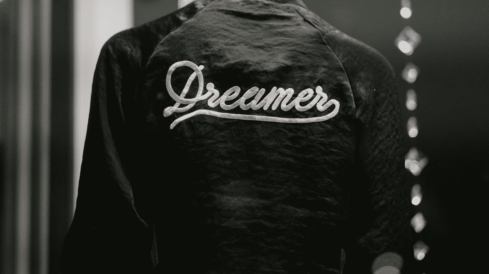

# 我作为创始人的经历

> 原文：<https://medium.com/swlh/my-experiences-as-a-founder-275460d143ae>

> 重要的不是结果，而是经历。记下我过去几年的一些心得。

# **梦者**

Photo by [rob walsh](https://unsplash.com/@robertwalsh0?utm_source=medium&utm_medium=referral) on [Unsplash](https://unsplash.com?utm_source=medium&utm_medium=referral)

在我的学生时代，我唯一想做的事就是成为一名宇航员。是的，我真的想飞到星星上去。但后来，随着生活的发展，我意识到我想建造东西，我在创造东西中找到了快乐。当我加入我的大学…