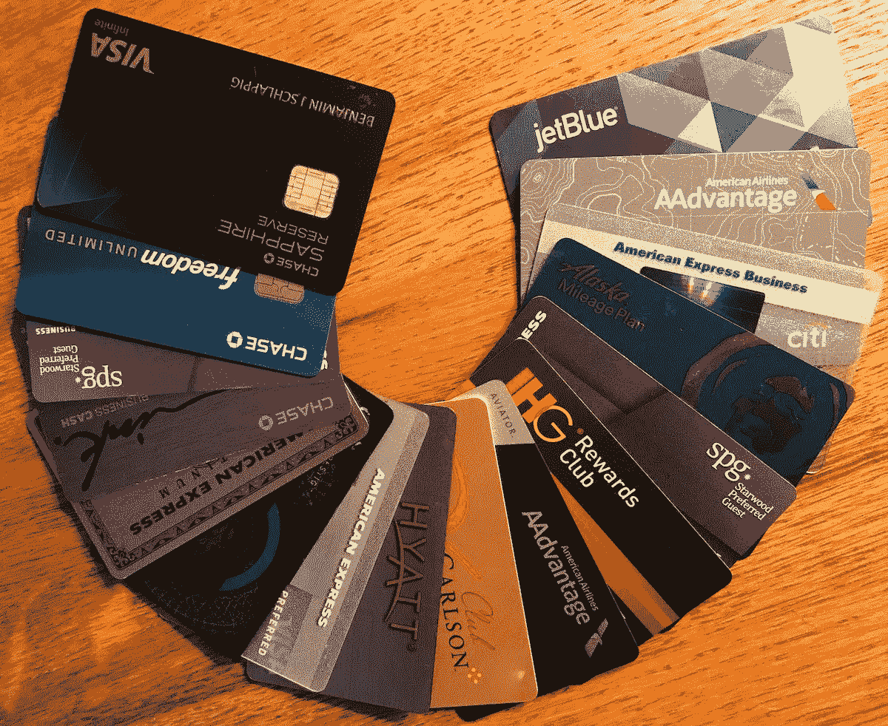

# 我坠入地狱深渊的财务之旅

> 原文：<https://medium.com/swlh/my-financial-journey-into-the-depths-of-hell-d561316c0c8d>

# 螺旋式下降

我 17 岁时就独立了。在我高中的最后一年，我妈妈给了我一张支票，我可以用它来买食品杂货和汽油。我开着她搬到另一个州时留下的备用车。我被邀请去，但是 17 岁的孩子会选择和陌生人一起毕业吗？所以我留下了。我一年大部分时间都在做兼职…