# 我的五分钟成名时刻

> 原文：<https://medium.com/swlh/my-five-moments-of-5-minute-fame-6fae65f39bbe>

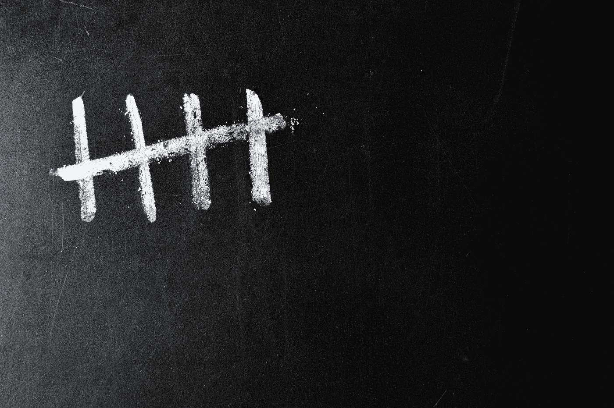

## Twitter 联合创始人 Ev Williams 评论我的故事的时候

任何值得做的事都不容易，而且要花很多时间。如果很容易，每个人都会做。

以下是我一生中五次觉得自己的努力和干劲有了回报的时候。我经常回顾这些故事来寻找灵感和动力。感觉是在看别人的故事。

我明白了，如果一件事不容易得到，那是两件事之一；它不值得做，因为它不适合我——或者说——它非常值得做，因为只有少数人能完成艰难的事情。

> 当我决定某事值得去做，因为它很难，好事就会发生。

# 1.我的想法

我[从悉尼到卧龙岗](/this-happened-to-me/my-skate-of-mind-6970a7b48906)滑了 85 公里，12 个小时。在真正开始旅行之前，我考虑并“计划”了几年。

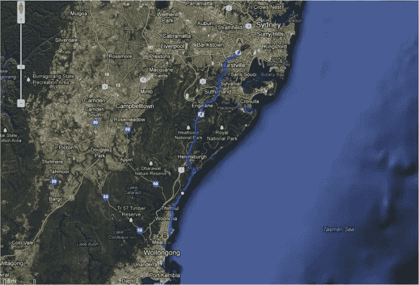

我总是能找到借口把它推掉。通常它与人们会怎么想或怎么说有关。我接受了自己永远不会做这件事的想法，但有一天，这件事在我脑海里萦绕了太久，我在凌晨 3 点起身离开了。

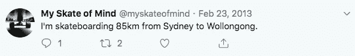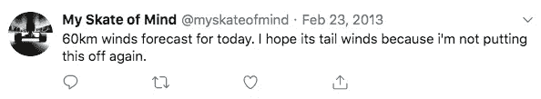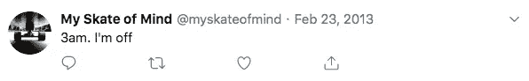

第二天，我在博客和媒体上发布了我的故事。这成了我有史以来阅读量最大的帖子。在接下来的 3 天里，有超过 20，000 人准备了我的故事，其中有一个人让我感到非常惊讶和鼓舞。

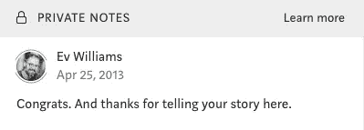

这是我被倾听、被赞美和追寻梦想的重要时刻。这篇报道登上了黑客新闻 Reddit 的头版，并被 [Gizmodo](https://www.gizmodo.com.au/2013/02/this-guy-probably-had-a-crazier-weekend-than-you-did/) 转载。

这段经历告诉我，开始是最难的部分。开始一件事没有完美或好的时机，如果某件事让你害怕又让你兴奋，这可能意味着你应该去做。

# 2.电影

我做了一个名为 movies 的网站，被 CNET 评为“澳大利亚最好的新电影网站”。

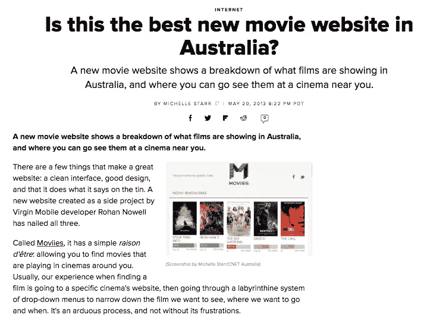

我想要一个网站，看看现在正在上映和即将上映的电影，没有所有的广告和额外的内容。我找不到一个，所以我决定自己制作它，并把它叫做电影。

该项目登上了 Reddit 和黑客新闻的头版。在接下来的几个月里，成千上万的人浏览并使用了这个网站，我收到了很多积极的反馈。

这个网站已经不存在了，但是如果你感兴趣的话，你可以关注[movies](https://twitter.com/moviies)寻找新的电影预告片，也可以阅读 [CNET](https://www.cnet.com/news/is-this-the-best-new-movie-website-in-australia/) 上的文章。

这个经历告诉我，当你相信某样东西能解决一个真正的问题时，就更容易快速有效地构建它。它改变了我对待工作和生活的方式。我更清楚我对自己正在做的事情有多少信心，以及我的动力水平。

# 3.画了一年

我一年来每天都画画。我总是想能够画画，但像每个人一样，我不想付出努力。我知道如果我真的想画画，我最终会找到时间去画，但是巨大的努力阻止了我。

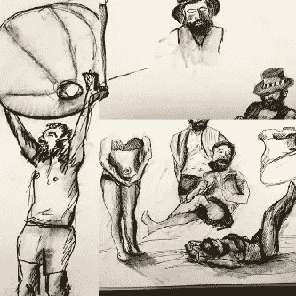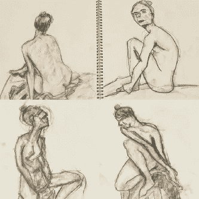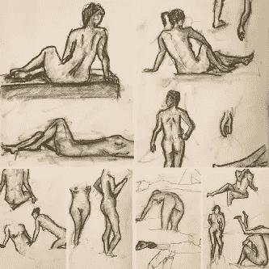

我能够摆脱恐惧的方法是消除期望和目标。我告诉自己，我会为了画画而画画。每天都是。理论上。无缘无故。就画吧。

我每天都这样做了一年，然后决定[分享我的故事](https://byrslf.co/drawing-for-a-year-819c51d8621d)。超过 26，000 人阅读了它，许多人以某种方式伸出援手，经常感谢我激励他们在生活中再给绘画一次机会。

这次经历告诉我，如果我愿意投入时间和精力，我可以学习新的技能。这也证明了好事不会来得很快或很容易，任何值得做的事情往往都很难。我已经走了 3 年了，但我仍然很难相信自己的绘画技巧。

画画是一种需要学习和保持的技能，需要花费大量的时间。

# 4.小冒险家

我给一本名为《小冒险家去日本》的儿童读物配了插图。

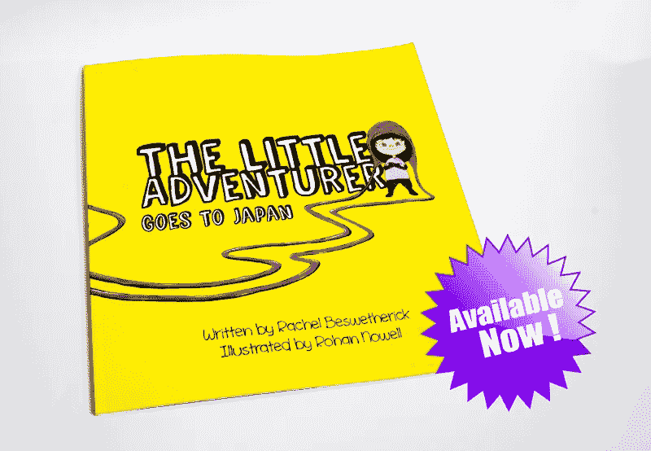

画画是一项来之不易并需要保持的技能。我已经花了几年时间试图提高我的技能，2017 年，我决定挑战我的第一本儿童书籍插图。

我觉得自己还没有完全准备好，担心如果我开始，我会完不成，但从过去的经验来看，我知道我想这样做，尝试并不可耻。

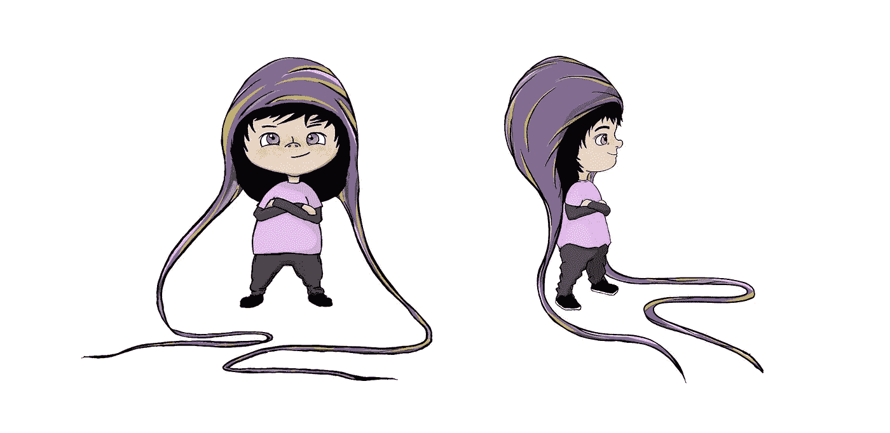

My favourite part of the process was designing the character, The Little Adventurer

看到我的绘画技能变成了有形和真实的东西，我很兴奋。我们决定通过 Lulu.com 自助出版这本书,并且已经看到了数百本书的销售，它在第一周就在 Lulu 上登上了儿童书籍的榜首。

现实是，我的插图现在在世界各地出版，并在未来几年里放在书架上，握在小手里，激励孩子们勇敢和尝试新事物，这令人鼓舞。

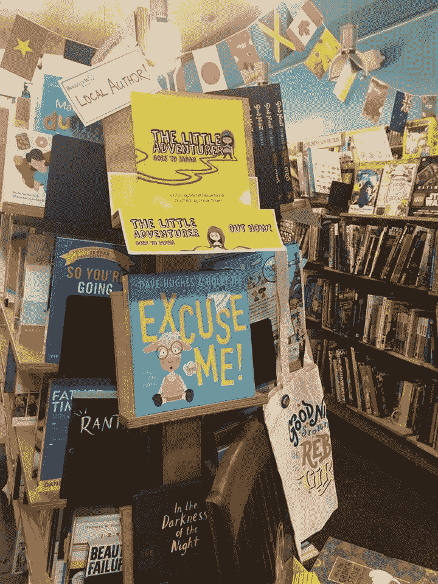

这次经历让我看清了残酷的现实:画画的最佳时间恰恰是我想什么都不做的时候。

# 5.在阿姆斯特丹骑自行车去 Deliveroo

我辞去了做了 10 年网页开发员的工作，搬到了海外，并骑自行车去了 Deliveroo。

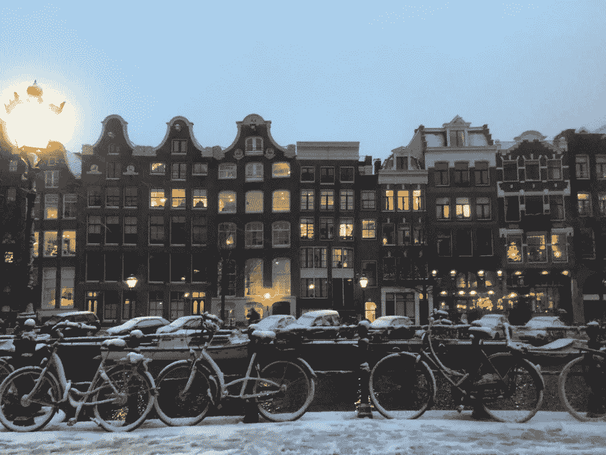

从 2017 年 9 月到 2018 年 7 月，我在阿姆斯特丹骑行了 4090 多公里。

我已经做了 10 多年的网页开发员，我准备尝试一些不同的东西。我不知道那会是什么。我在一个地下厨房做了几个星期的助理厨师，然后意识到它属于“不适合我”的硬东西类别。

事实证明，加入 Deliveroo 对我在阿姆斯特丹的生活来说是一个很好的想法和经历。我一直都在户外，我变得非常健康，我对城市和郊区了如指掌。我们有 15 个月的时间去探索，我可以边工作边探索。

这一直是我最喜欢的工作之一，在国外生活是一生中难得的经历。在那里生活的 15 个月里，我们游历了欧洲很多地方，在回澳大利亚的路上，我们又在东南亚旅行了 5-6 个月。

我[写了](/swlh/i-cycled-for-deliveroo-in-amsterdam-efd6bc045a98)我在阿姆斯特丹为 Deliveroo 骑车的经历，分享了我赚了多少钱，我在那段时间里骑了多远。

在国外的生活、骑自行车旅行和长期的旅行经历让我对自己如何看待他人和工作进行了一次现实的检验。我对厨师和在酒店工作的人有了新的尊重。这也证实了金钱不是一切，满足和健康真的很重要。

这是我一生中经历过的最有成就感和认可的五次。他们提醒我，我可以做我想做的事情，并把它们做好。我只需要开始，当事情变得难以记忆时，大多数人会停止。如果我能坚持完成最难的部分——我将成为少数派，并有一个故事可以分享。

我阅读自己的故事来获得动力。我一直试图记住从这些经历中得到的重要教训。大多数时候我没有动力。这些故事提醒我，只要我记得**困难的事情对我来说重要，就值得去做，我过去是，现在是，将来也是。**

*本帖提到的故事:*

**我的心灵滑板:**[https://medium . com/this-happed-to-me/My-Skate-of-Mind-6970 a7b 48906](/this-happened-to-me/my-skate-of-mind-6970a7b48906)

**画画一年:**[https://byrslf.co/drawing-for-a-year-819c51d8621d](https://byrslf.co/drawing-for-a-year-819c51d8621d)

**图文并茂我的第一本童书:**[https://medium . com/p/图文并茂-我的第一本童书-cbc3b08ec182](/p/illustrating-my-first-childrens-book-cbc3b08ec182)

**阿姆斯特丹骑自行车送外卖:**[https://medium . com/swlh/I-cycled-for-deliver oo-in-Amsterdam-EFD 6 BC 045 a 98](/swlh/i-cycled-for-deliveroo-in-amsterdam-efd6bc045a98)