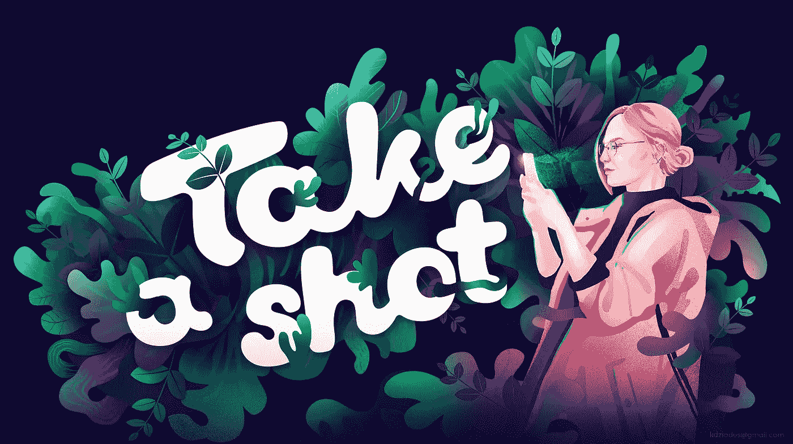

# 我成为数码插画师的旅程&我学到了什么

> 原文：<https://medium.com/swlh/my-journey-of-becoming-a-digital-illustrator-what-ive-learned-c2b64b0e1114>

## 可以帮助任何有创造力的人的提示和技巧

[dribbble.com/kate_dziadus](https://dribbble.com/kate_dziadus)

# 我如何成为一名插画师

我还记得我第一次在沙盒里画画和谈论插图的时候，我和我的邻居争论要不要在涂色书上划线，以及这样做的后果。我那时四五岁，不喜欢这种书。(我一直没办法给奶奶送的这一叠涂色书涂上颜色。)对我来说，一张白纸总是更令人兴奋。

> 好吧，但是当你知道画画很酷，并且你可以在生活中继续做一些事情的时候，该怎么办呢？

在我整个航母期间，我不得不在这么多选项中做出选择。我很高兴我有足够的时间去探索，所以我不会说这是浪费时间。但是如果我从我的故事中学到一些要点，为什么不与你分享。

# 倾听你内心的声音

> 当你内心的声音在对你说，你不想这样做的时候，就去听它，不要这样做！

当初是我的问题。有时我只是因为钱(你知道，不是为了好的钱，而是为了谋生)而接受一些工作，我觉得这不是一条正确的道路。即使有时它是好东西，最后我也不想把它放在我的投资组合里。想法？只有在生死攸关的情况下，才接受这种工作——否则，你就是在浪费时间。现在我知道更重要的是用你想做的东西来建立你的投资组合。当你内心的声音对你说，你不想这样做，就听它，不要做无用的工作。

[dribbble.com/kate_dziadus](https://dribbble.com/kate_dziadus)

# 不要因为别人做事，你就去做

有多少次你尝试做一些新的事情，仅仅是因为它受欢迎，你可以得到很好的钱，或者“你将来会有一份工作”？我来自一个小镇，那里的人们总是试图保持安全，所以他们的选择也是安全的。别误会，这没什么不好的。有时候，走另一条路也不错。即使你想选择流行的东西，这也应该是你明智的、完全有意识的决定。

# 寻找你的风格是一项持续的工作，没有实践是不会有的

作为一名艺术家，你总是想拥有自己独特的风格，想成为设计界的摇滚明星。我知道这是很多插图画家、艺术家、设计师的共同问题。我真的很钦佩那些能够轻易坚持一种风格的人，他们创造出令人惊叹的东西。对我来说，这是不断的寻找和探索风格和媒介。几个月前，我非常确定我想为游戏创造 3d 角色，但在那之后，我用我在 Ipad 上的令人敬畏的生殖应用程序回到了 2d 插图。当然，有时我会使用 3d 元素作为我的插图的基础，但这只是一种媒介，是我表达想法的方式。对我来说，学习新的东西并把它们作为一种工具来使用比仅仅保持我的艺术不变更重要。

# 想想你的投资组合

你已经在创作的项目是你真正想放在你的作品集里的吗？这是你真正想分享的东西吗？是你将来想做的事情吗？如果没有——不要浪费你的时间，更好地专注于你真正想要创造的东西，以及你下一步真正想要做的事情。在雇佣你之前，你的客户会检查你的投资组合。你猜怎么着…他们不会雇用你，因为你确信你能做到这一点，他们想看到的例子。所以……得到你梦想中的工作的最好方法是先做这件事，然后把它放在你的文件夹里。

[dribbble.com/kate_dziadus](https://dribbble.com/kate_dziadus)

# 仅仅因为你喜欢某人的风格，并不意味着你必须做同样的事情

当你模仿别人的风格时，这是学习新东西的好方法。但请记住，复制只是复制某人的愿景。了解其他艺术家如何工作是很好的，但是把它作为一个工具来找到你的工作方式，你的工作流程。

拥有你最喜欢的艺术家、灵感和基准是非常重要的。只要记住灵感和抄袭之间只有一线之隔。所以非常明智地使用你的参考。

# 日常习惯真的有帮助

当你想成为一名插画师、设计师或任何其他类型的视觉艺术家时，拥有自己的可以提高技能的习惯是很好的。也许是画早晨的例行公事，或者是在地铁里画人物素描，或者是尝试探索这个城市并拍照。设置你的计时器——甚至可以是 15 分钟——并尝试做一些可以改善你的视觉库的事情。百分百专注于任务。作为一名艺术家，这对你很有好处，也会帮助你喜欢正念，我真的推荐这种有创意的方式。

# 与人交谈

如果你还在读这篇文章，你可能正在试图理解创造性的工作是否适合你。好方向！

> 然而，有时候你必须离开舒适区，去和其他有创造力的人交谈。

听听别人的故事，看看采访，看看文章。开始听播客，挑选一个能激励你的。在脸书找一个小组，或者继续在你的城市进行鼓舞人心的聚会。为您的作品获得一些反馈！与人交谈总是好的，尤其是与和你有相似激情的人。记住，改变主意永远不会太迟。尝试新事物，新领域，找到最适合你的。

我希望我的说明性总结没有让你感到厌烦，我的建议对你会有用。对我来说，成为一名插画师已经成为一项使命。在我的旅途中，我遇到了一个人，他向我展示了插图的重要性和影响力。我最喜欢插图的地方是它能解决产品问题。但是我下次会告诉你更多的！

## 这篇文章发表在 [The Startup](https://medium.com/swlh) 上，这是 Medium 最大的创业刊物，拥有+415，678 名读者。

## 在这里订阅接收[我们的头条新闻](http://growthsupply.com/the-startup-newsletter/)。

