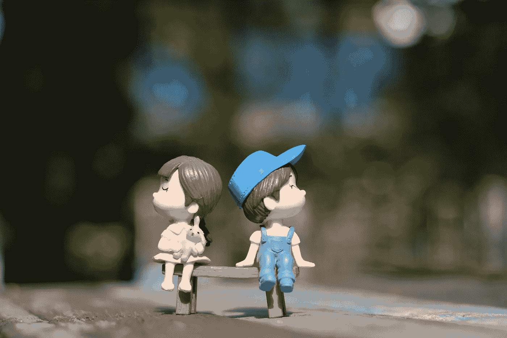

# 作为一名作家，我拥抱童年梦想和“发现自我”的旅程

> 原文：<https://medium.com/swlh/my-journey-to-embracing-my-childhood-dream-and-finding-myself-as-a-writer-adf75e1e6508>

Photo by June Intharoek on Pexels

从小到大，我知道我想写作。我是一个如饥似渴的读者，一天之内如饥似渴地阅读小说，发现新世界。

在巴基斯坦的童年和少年时代，没有什么是有意义的。宗教以铁腕统治理性。有人告诉我，我的未来是注定的。我会完成学业，然后结婚——嫁给一个可能比我大的男人……