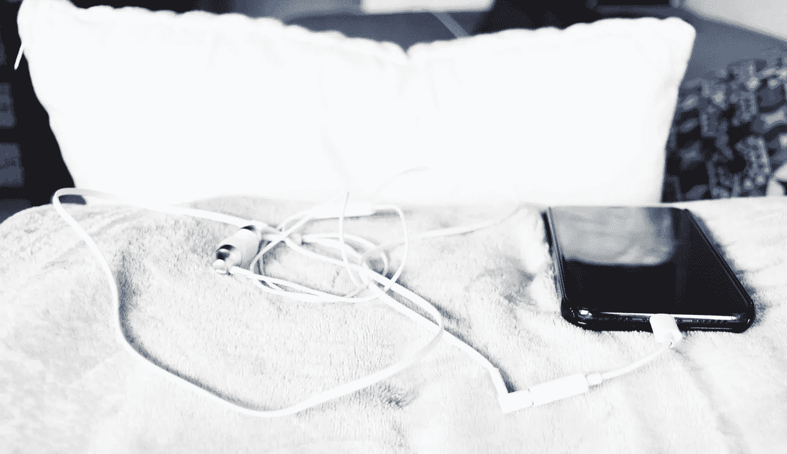

# 我冥想前的生活

> 原文：<https://medium.com/swlh/my-life-before-meditation-19df236eb718>

我住在一个非常密集的城市外围的一个舒适的单间公寓里。持续的“喧嚣”意味着没有安静时间的空间。噪音从早上到晚上再到早上相互叠加，就像城市的声音一样。

早上，我睁开眼睛，让手机里传来的“阳光明媚”的起床声打个盹儿。很快，这个城市就进入了我的耳朵。我半睡半醒地躺在我的大毯子下，感觉到了一个接一个的噪音。附近建筑的钻孔声，垃圾车低沉的抱怨声和嘶嘶声，一只欢迎早晨到来的海鸥，大厅里邻居咚咚咚的脚步声，人行道上一个男人不可理解的叫喊声，街道清洁车的呼呼声。

我翻过身去拿手机:

*工作中的三条闲置信息，来自《华盛顿邮报》的一篇新闻文章，来自妈妈的一条短信，“这部 iPhone 已经三周没有备份了”，一个 LinkedIn 请求，一个朋友在脸书群发的帖子……*

我把手机放在身边，盯着天花板。还有——暴跌！—我的胃在下沉。一股熟悉的刺痛焦虑的浪潮冲刷着我的身体。然后我开始想:

*我昨天忘记看那份文件了。我的第一次会议是什么时候？呃，我昨晚应该早点睡觉的。我要给妈妈回短信。我今天有这么多事要做。这次我真的应该下班后去跑步。哦，但是有一个快乐时光我说过我会去…*

我现在大开眼界了。我打开手机，在 Instagram 上浏览了几分钟。现在我感到更加不安…我想，*为什么我要这样对自己？*

我甚至还没有起床，我的焦虑已经赢得了我的一天。

我最近才开始冥想。不是因为我最近才发现它，而是因为我太绝望了，我终于允许自己让它进入我的生活。我需要冷静。我上面描述的场景每天都在发生。每一天我都是这样战胜焦虑的。

我提到的来自我妈妈的视频是一个引导冥想的视频。这可能是我妈妈发给我的关于这个话题的第 50 个视频。她每天都冥想，然而出于某种原因(直到最近)，即使我看到她从练习每日冥想中获得了多少快乐，我告诉自己我不需要它。

然后我决定迈出这一步:我应该试试冥想。我会失去什么？

我开始从 App Store 购买 Headspace 应用程序(是的，我确实付了钱)。第一天早上，我一起床，就开始了雄心勃勃的 15 分钟训练。很艰难。我觉得自己很蠢。为什么我不能只关注我的呼吸？15 分钟结束了，我想我只“冥想”了大约 10 秒钟…唉。我摘下耳机，准备上班。

第二天早上，尽管之前失败了，我还是再试了一次。第二个疗程只比我之前的疗程稍微好一点点。第二天，*的情况稍微好了一点。第二天，*最微弱的*改善，等等。*

我很自豪地说——到今天为止——我已经冥想了 14 次！总计整整 4 个小时。坦率地说，即使在 14 次会议之后，我也没有感觉到一点*整体* 的不同…但是我要告诉你。自从我开始冥想，我的同事和朋友告诉我一些事情，比如，“你今天看起来很平静”，“你保持得很好”，“你看起来很开心”。呵呵，这个东西*在*工作。

也许我没有感觉到很大的不同，因为我冥想练习的递增阶梯只以最微妙的方式出现。我的肩膀慢慢地从我的耳朵下来。我的下巴正在学着松开它对我牙齿的控制。我的大脑对我周围的环境有了更多的意识，这让我更容易在我周围呼啸而过的对话和信息中保持漂浮。

多么简单的事情。有意识地，呼吸一些空气可能是你再次感觉良好所需要的。如此简单。

冥想需要时间，但是值得花时间和精力。现在，在早上查看手机之前，我会有意识地努力冥想。这是我这一年为自己做的最好的事情。我真的只希望我没有那么固执，早点让日常冥想进入我的生活。

如果你觉得你的焦虑总是能战胜你，我真的希望你允许自己敞开心扉去冥想。