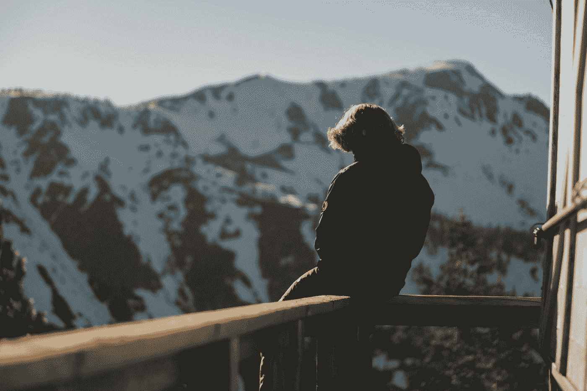

# 光是我的时间就改变了我在国外的一学期

> 原文：<https://medium.com/swlh/my-time-alone-shaped-my-semester-abroad-3f6f63ca36ae>

## 让我认识了比以前更多的人。

Photo by [Levi Bare](https://unsplash.com/@levibare1?utm_source=medium&utm_medium=referral) on [Unsplash](https://unsplash.com?utm_source=medium&utm_medium=referral)

人们似乎对我在国外一学期中独自度过的时间感到震惊。我几乎每天下课后都一个人在巴塞罗那街头闲逛。我参加了几次周末单独旅行和几次混合旅行，有一些朋友和独处的时间。当我的项目结束时，我独自在克罗地亚呆了五天，然后去了英国几天。

我参加了一个美国交流项目，据我所知，我是唯一一个独自旅行的人。我发现独自旅行在国际学生中很常见，在美国学生中很少见。在国外学习的美国学生倾向于在喧闹和令人讨厌的人群中呆在一起；我们想知道我们的名声是怎么来的！

我们把彼此作为避难所，而不是在我们周围的新鲜事物中寻找安慰。我们旅行是为了尝试新鲜事物，同时用我们舒适区的边界来保护自己远离完全陌生的事物。我们在自己的泡泡里创造体验，却错过了边界另一边的机会。我们在新的地方陷入旧的常规。我们会鞭策自己；只要我们有其他人可以依靠。

我独自登上了我的航班:纽约到巴塞罗那。那是我 21 岁生日的晚上——我自信、热切、雄心勃勃。我伸开四肢，呼出我的压抑，抓起我没有标记的日志。

我开始写一份目标清单。

*   坚持写博客
*   读一本西班牙语的书
*   参加绘画班
*   不要为了舒适的选择而牺牲我的梦想

这个清单继续列出更多的成功和失败。如果我完成了前三个中的任何一个，我也会写下它们的！现在，我将集中讨论最后一点。

这些目标是有期限的。我知道在四个月内，它们将简单地完成或不完成。我的脑子里充满了未知的东西——我日记中的空白很快就会被填满。我不知道具体是什么，但我知道我想让它怎么读。

我独自踏上了这段旅程，并打算让我在国外的时间成为我的时间。在飞机上，我很容易说服自己，着陆后我会毫不费力地拥抱独立。我独自一人，我的信心像滚雪球一样，随着新的开始而来的兴奋而消失。但我了解自己。在很短的一段时间内，我可能会有一群人，如果我选择离开他们做任何事情，他们会给我留下严重的 FOMO 病例。

我把最后一个目标的实现归功于我对我知道会面临的障碍的准备。我允许自己在那架飞机上幻想，但也强迫自己把未来当成现实。我梦想成为自发和独立的人，但如果没有真正的牺牲，那是不可能的。

我把这一点灌输到我顽固的头脑中——一个想独自享受甜蜜梦想的头脑。

在我项目的第一天，朋友团体疯狂而积极地形成——带着一种饥饿游戏式的绝望感。上帝禁止我们等着和别人交朋友，而不仅仅是因为害怕孤独！

那天晚上我强迫自己和一群陌生人共进晚餐，不久之后，我有了朋友。每个人都想去旅行，所以在用餐结束时，我们已经在谈论旅行了。我们在第*天*见了面，并且已经在计划下周末的旅行。我喜欢我遇到的人，但整个团队奇迹般地一致同意的第一个目的地不在我的名单上。我考虑放弃我清单上的某个地方，和他们一起去——毕竟这是在 T2 的第一个周末。这是诱人的；但我知道我必须做什么。

为了避免损害自己的遗愿清单，我最终放弃了最初的几次周末旅行。这学期开始的大部分时间里，我都在说服自己不要有社交焦虑。

我害怕:错过，似乎对人们而不是他们的计划不感兴趣，孤独，被认为是周末消失的怪人，等等！这些焦虑都是合理的，我确实比其他人花了更长的时间来确立我在团队中的地位。我不断提醒自己我的个人目标——在我被团队的目标所蒙蔽之前，我就已经确立了这些目标。他们让我专注于我知道我想要的。当我最终在这个团体中变得舒适时，我惊讶地被同龄人对我独立性的羡慕所折服。

我的信心爆炸了。

通过旅行，我对自己的能力变得更加自信，不仅仅是处理，而是在面对不可预见的冒险时茁壮成长。我不断追求自发性，并享受这样做的刺激。当我独自度过周末回来时，我的朋友们迫不及待地想听我讲他们知道我会有的故事。通过这些人，我对自己的能力变得更加自信，不仅是处理问题的能力，也是在社会环境中茁壮成长的能力。

当我回来时，我的独立性无意中成了经常讨论的话题。

“你只是一直做你想做的事情，这太酷了。”

"我希望我能那样做，但是我不能一个人呆那么久。"

“你太自信了。我太紧张了，一个人去不了任何地方。”

但是我做的任何事他们都做得到。在我去西班牙之前，我最大的一次独处是在一个为期两周的露宿营地。我没有带着自给自足的历史开始我的旅程。我不是一个独自旅行的人；但我确实一个人订了机票并上了飞机。

我喜欢我自己的公司。老实说，我觉得我很有趣——这可能是我独处时不太无聊的原因。虽然从独自出发和返回的意义上来说，这是一次“独自旅行”，但我常常希望自己有更多的独处时间。

我的旅行的特点是我在旅途中遇到的人。我住在旅馆里，遇到的人比我和别人一起旅行遇到的人还多。我和陌生人一起度过了日日夜夜；有些人成为了永久的朋友，有些人将永远成为“罗马酒吧里的那个家伙”接受一些人仅仅因为一次共同的经历而变得重要是令人不舒服的。我现在意识到，有些人会和你喝一杯，并没有提供更大的价值；这就够了。事实上，这些是我最珍惜的记忆。

当我第一次开始独自旅行时，我假装对每一个新认识的人都有更深刻的理解。我以为所有的人和事都在改变我的生活。我强迫每一次新的经历都得到启示。遇见来自不同国家的人令我着迷。现在依然如此，但我现在意识到，国际化和无趣是有可能的！

团体旅游很棒；这学期我最美好的回忆是和我项目的朋友们在一起。但是个人成长——那是在你自己的公司里发生的。