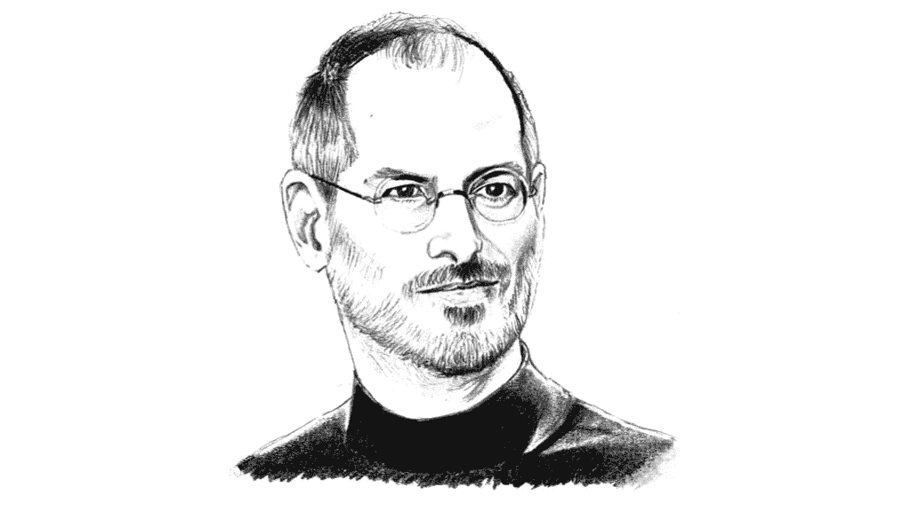

# 我最糟糕的一天:史蒂夫·乔布斯

> 原文：<https://medium.com/swlh/my-worst-day-steve-jobs-c249e28c539a>

Illustration by sketch_mockup

## 一个偶像的过早陨落，以及我们可以从他们爬回巅峰中学到的 5 个教训。

《我最糟糕的一天》是一个双周专栏，致力于讲述巨大的失败和非凡的成功。通过采访、传记和历史记录的梳理，我们考察了社会上最伟大的成就者——既有现代的也有历史的——并深入审视了他们认为一切都会崩溃的那些日子。通过研究这些偶像如何度过他们最糟糕的日子，我们都可以学习我们需要在生活中做得更多，做得更多，取得更多成就的技能。

> *“你不能向前看，把点点滴滴连接起来——你只能向后看，把它们连接起来。”——史蒂夫·乔布斯*

# **1985 年 9 月 16 日**

他知道这一天已经来了几个月了…

事实上，它已经酝酿了一年多。这是一位 46 岁的经验丰富的公司首席执行官和世界上发展最快的计算机公司的一位非常聪明的 30 岁的联合创始人之间无休止的权力斗争的结果。这家公司在短短九年内从加州洛斯拉图斯的一个车库成长为市值数十亿美元的上市公司。

首席执行官是约翰·斯卡利。那创始人呢？

他的名字叫乔布斯。

就在 10 个月前，这两个人还满面笑容地出现在 1984 年 11 月《商业周刊》的封面上，封面上用醒目的粗体字印着“苹果的活力二人组”。

但是在过去的六个月里，史蒂夫·乔布斯知道他的日子屈指可数了。斯卡利接任苹果电脑公司首席执行官后不久，乔布斯意识到他们在领导风格和企业愿景上的差异将成为一个巨大的争论点。以至于担心斯卡利执掌的年轻公司的未来，乔布斯在 1985 年初制定了一个详细的计划，让他离开苹果董事会。

但是只有一个问题。斯卡利得知了乔布斯的秘密计划，并以此为杠杆，在他和董事会之间增加了大量股份。

乔布斯对斯卡利的恐惧不是没有道理的。在他的高性能个人电脑 *Lisa* 在商业上失败后，乔布斯被任命为公司低成本部门的负责人。正是在这段时间里，他变得坚决反公司，甚至在苹果总部他们部门的空间里悬挂海盗旗。更糟糕的是，尽管 Macintosh 取得了巨大成功，但它一直在努力寻求盈利，单位成本高，初期销售缓慢，原因是乔布斯不愿在个人电脑愿景上妥协。

在董事会要求“遏制”乔布斯的压力下，斯卡利开始剥夺他在苹果电脑公司的权力，包括解除他作为麦金塔团队负责人的职务。再加上在苹果电脑总部偏远地区的新办公室，乔布斯称之为“西伯利亚”，他实际上已经被驱逐出了这家他九年前在父母车库里创立的公司。

来自斯卡利和董事会的信息很明确:*如果你不好好表现，就别想打球。*

经过一个艰苦的夏天的战斗和思考，乔布斯终于意识到他的手被束缚住了。1985 年 9 月 16 日——在与斯卡利和董事会斗争了特别混乱的一周后——史蒂夫·乔布斯走投无路，被迫做了一件他从来不认为自己必须做的事情:**辞去苹果电脑公司的职务。**

最后一次走出门外，乔布斯不仅仅是向一家公司告别。他正在向定义他的本质说再见。他的个性和灵魂与生意如此紧密地交织在一起，以至于离开时感觉自己的一部分正在死去。

他不确定自己能否从死亡中恢复过来。

# **零工**

杂志封面故事、秘密董事会会议、引人注目的高管冲突以及华尔街无休止的猜测，很难想象苹果电脑公司(Apple Computer)在 1976 年成立时还是一家处于相对婴儿期的公司，距离事故发生仅 9 年时间。乔布斯和他的联合创始人史蒂夫·沃兹尼亚克(Steve Wozniak)和罗纳德·韦恩(Ronald Wayne)在加州洛斯阿尔托斯克里斯特大道(Crist Drive)乔布斯童年住所的车库里创办了这家公司，这个故事后来成为了硅谷的民间传说。

乔布斯创立苹果电脑公司的道路显然不是一帆风顺的。乔布斯于 1955 年 2 月 24 日出生在加州旧金山，他的生母乔安妮·席布尔(Joanne Schieble)立即将他送人收养。在她第一次选择的收养家庭退出后，史蒂夫被安置在年轻的蓝领夫妇保罗·乔布斯和克拉拉·乔布斯身边，席布尔在法庭上抗议这种安置，担心她的孩子不会得到她想要的抚养。最终，她妥协了，在一个条件下签署了收养文件:乔布斯家人必须承诺史蒂夫将接受大学教育。

在举家搬迁到加州山景城后，史蒂夫·乔布斯的童年与许多后来成为梦想家的人没有什么不同。乔布斯有着极高的智力，这让他在课堂上感到无聊，再加上怪癖和不同的兴趣，这让他很难建立一个强大的社交圈，他经常造成干扰，并受到严重的欺凌——特别是在跳过五年级后，这让他在 Crittendale 中学孤独地度过了 10 岁。

最终，这种欺凌发展到了乔布斯告诉他父母要么让他重新安置，要么让他退学的地步。带着他们对乔布斯生母许下的承诺，保罗和克拉拉汇集了他们一生的积蓄，在加州洛斯阿尔托斯的克里斯特大道 2066 号买了一栋小型独栋住宅。

乔布斯对电子产品的热爱正是从这里开始形成的。在一个遍布硅谷科技员工的社区，乔布斯一家是街上为数不多的零工程背景的人之一。为了纠正这一点，史蒂夫报名参加了一个名为“电子 I”的高中选修课。虽然乔布斯会继续与他的导师发生冲突，但他发现这个主题很吸引人。正是通过这门课，他在附近交到了第一个真正的朋友——一个名叫比尔·赫尔南德斯的电子爱好者。

随着两人对电子产品的热爱不断加深，埃尔南德斯特意将工作介绍给一位邻居，这位邻居比他们提前从霍姆斯特德高中毕业，正在加州大学伯克利分校学习计算机科学和电子工程。

邻居吗？一个名叫史蒂夫·沃兹尼亚克的年轻人。

# **苹果从树上落下**

乔布斯很快和沃兹尼亚克成了朋友，经常去伯克利看他，在那里他第一次真正了解了大学生活。虽然他与正规教育的关系一直不太好，但在加州大学伯克利分校(以及附近的斯坦福)的生活给了乔布斯所需的动力，让他兑现了生母和养父母之间的承诺，高中毕业后就读于俄勒冈州波特兰市的里德学院。

虽然他的目的是获得学位，但乔布斯在里德学院面临着与他在小学教育时类似的问题——最明显的是缺乏由他的智力驱动的兴趣。再加上学费远远超出了他家的承受能力，他很快就做出了退学的决定。然而，作为一个终身学习者，乔布斯确实以非学生身份在校园里呆了一段时间，旁听他感兴趣的课程。最值得注意的是，他走进并爱上了一门书法课——这一举动将在多年后的苹果公司对他大有裨益。

1973 年，回到旧金山地区，乔布斯和沃兹尼亚克在一起的时间越来越多。沃兹尼亚克是一位工程大师，他会向乔布斯展示他所有最新最伟大的发明。这包括他自己版本的雅达利电子游戏 *Pong* ，乔布斯很快就把它带到了雅达利的总部，并借此为自己找到了一份技术员的工作……*公司里从来没有人停下来问乔布斯是否真的自己开发了这款游戏。*

这种循环一直重复到 1976 年，当时沃兹尼亚克向乔布斯展示了他的最新发明:一台他称之为*苹果 I 电脑*的设备。

乔布斯立刻感觉到了机会，建议他们制造并销售这款设备。个人电脑市场在美国开始成形，乔布斯认为像 IBM 这样的先行者正在错过一个主要的细分市场。用他自己的话说:

> 我们不仅买不起市场上的电脑，而且这些电脑对我们来说也不实用。我们需要一辆大众汽车。大众汽车不如其他旅行方式快捷舒适，但大众车主可以想去哪里就去哪里，想什么时候去就去，想和谁去就和谁去。大众车主可以亲自控制他们的汽车。”

1976 年 4 月 1 日，乔布斯、沃兹尼亚克和罗纳德·韦恩正式成立苹果电脑公司。虽然乔布斯 41 岁的雅达利同事韦恩很快临阵退缩，仅仅 12 天后就卖回了他在苹果公司的 10%股份，但这并不重要。*乔布斯和沃兹尼亚克准备将他们的大众版本推向市场。*

是时候推出第一款*苹果手机*了。

# **崛起**

1976 年 7 月，苹果 I 型电脑向公众出售。该产品的生产资金来自零部件融资的巧妙组合，以及个人物品的销售，包括乔布斯的大众汽车和沃兹尼亚克的 HP-65 计算器。经过多年的摸索，两人已经很清楚电子元件并不便宜。然而，这是他们第一次真正了解大规模生产计算机产品所需的费用。

为了建立一家能够改变个人电脑世界的公司，他们的下一步很明确:他们需要筹集更多的资金。

随着沃兹尼亚克已经将目光投向了他们第一台电脑的更大改进，乔布斯开始四处寻找资金。虽然苹果一代为这家新兴公司净赚了一笔可观的利润，但这远远不够大规模生产沃兹尼亚克设计的技术领先的苹果二代(T21)。

年轻、不修边幅、鲁莽的乔布斯努力与传统的银行信贷员和硅谷风险投资家建立联系。然而，与风险投资的主要人物之一唐·瓦伦丁的一次失败的会面，导致了与百万富翁投资者迈克·马尔库拉的命运相遇。

马库拉在英特尔(Intel)和飞兆半导体(Fairchild Semiconductor)工作时，通过股票赚了数百万美元，他明白苹果的愿景。以至于他成为了公司的合伙人，并帮助公司合并，于 1977 年 1 月 3 日成为苹果电脑公司。凭借 8 万美元的股权投资和 17 万美元的银行贷款，马库拉与乔布斯和沃兹尼亚克成为了苹果公司 33%的平等合伙人，该公司拥有他们所需的资金来启动令人难以置信的增长浪潮。

苹果电脑公司刚刚获得资金，开始生产沃兹尼亚克的苹果 II 型电脑，并于 1977 年 4 月 16 日在*西海岸电脑展*上向公众展示。这款电脑是对 T4 苹果 I 型电脑以及当时大多数其他个人电脑的彻底改进，并最终售出近 600 万台。

到 1980 年，苹果电脑公司已经成为个人电脑的大众公司。

虽然马库拉领导的几轮融资帮助该公司实现了令人印象深刻的年同比增长，现在有两个主要的新产品正在追逐 IBM 和商业市场——最近推出的 *Apple III* 和乔布斯称之为 *Lisa* 的神秘新设备——是时候让这家年轻的公司转变为一个严肃的成年公司了。

苹果公司在 1980 年 12 月 12 日就这么做了，首次公开募股筹集了自 1956 年福特汽车公司首次公开募股以来最多的资金。25 岁时，史蒂夫·乔布斯拥有一家数十亿美元公司超过 10%的股份，个人净资产超过 2 亿美元。

他是硅谷和个人电脑界的神童。但是他很快就会知道，高处不胜寒。

# **秋天**

接下来的三年在苹果公司过得很快。在公司上市后不久被任命为首席执行官的马库拉的指导下，乔布斯在这十年的头几年专注于他的 *Lisa* 项目，这是一台商业超级计算机，也是第一台使用图形用户界面的计算机(就像我们今天认为理所当然的那种)。

在丽莎·T21 于 1983 年 1 月上市前不久，乔布斯和马库拉已经开始寻找新的潜在首席执行官候选人。马库拉希望从公司的日常管理中退休，而董事会仍然认为乔布斯缺乏经验，无法亲自管理整个公司，他们需要一个理解他们愿景的人，并能引导下一波增长。

两人最终锁定了一位名叫约翰·斯卡利的候选人，他当时是百事可乐的总裁，在百事可乐，他因帮助推出标志性的“百事挑战”而获得了巨大的声誉和对其营销能力的赞誉。感觉到他最初对加入苹果的犹豫，乔布斯对斯卡利打趣道:

> *“你是想一辈子卖糖水，还是想跟我走，改变世界？”*

斯卡利选择了后者，并于 1983 年 4 月 8 日接任苹果电脑公司首席执行官。

当他没有讨好斯卡利加入苹果时，乔布斯在 1982 年转变为*丽莎*后，将剩余时间花在了一个名为*麦金塔*的新项目上。 *Macintosh* 是苹果公司对 1981 年推出的 IBM 个人电脑的回应，并迅速在个人和商业环境中获得成功。

1984 年 1 月 22 日，随着标志性的雷德利·斯科特执导的超级碗广告 *1984* 、*、*面世，两天后 *Macintosh* 上市销售，立即在评论家中引起轰动。虽然最初的销售在 1984 年商业广告的支持下表现强劲，但数字在夏季放缓，并给了斯卡利作为首席执行官的第一个重大考验:如何在增长个人电脑市场的同时保持公司的运转。

乔布斯完全致力于把麦金塔和图形用户界面作为计算机的未来，因此毫不奇怪，他对花费在这个部门之外的时间和资源感到不满。正是在这里，他开始与斯卡利发生冲突，斯卡利花费了大量时间，专注于发展仍然非常有利可图的 Apple II 产品线。结果，乔布斯的麦金塔部门与苹果其他部门的距离越来越远，加深了他与首席执行官之间的裂痕。

斗争最终在 1985 年春天达到高潮，当时斯卡利在董事会的支持下，策划了一项计划，将乔布斯从麦金塔部门完全移除，让他负责“新产品开发”，这实质上让乔布斯失去了权力。为了对抗这次重组，乔布斯制定了自己的秘密计划进行报复:**解雇斯卡利。然而，计划的细节很快就被泄露了，乔布斯因为他的叛国行为而面临指控。**

随着首席执行官和董事会与他反目成仇，他的联合创始人也不再支持他(沃兹尼亚克在 1985 年初离开，他也对公司目前的方向有疑问)，乔布斯无处可去。在经历了一个令人难以置信的紧张的夏天和自我反省之后，乔布斯终于要翻过这一页了。

1985 年 9 月 16 日，他递交了辞职信。苹果的史蒂夫·乔布斯时代结束了。

至少现在是这样。

当乔布斯最后一次离开苹果电脑公司总部时，他拐上了加州库比蒂诺的马里亚尼大道，开始了他 20 分钟的回家之路。但在此之前，他有一个快速绕道。乔布斯需要去国务卿办公室一趟。

*他有公司章程要归档……*

# **接下来是什么**

NeXT 电脑是在他离开苹果公司后立即成立的，它将成为乔布斯在硅谷的第二个行动。随着几名备受瞩目的苹果员工跟随乔布斯出门来到他的新公司，团队开始设计他们的第一款产品:*下一台电脑*。

尽管他自己在几个月内就从里德学院辍学，但乔布斯对高等教育的迷恋从未减弱。几年前，乔布斯在一次活动中偶然遇到了斯坦福大学教授、诺贝尔奖获得者保罗·贝格，这让他对电脑在课堂上的潜力产生了浓厚的兴趣。在苹果公司，他帮助启动了公司的大学计划，向世界各地的学生、教师和机构提供打折电脑。但是，根据伯格的反馈，目前的计算机在教育能力方面的表现是有限的。真正的机会在于超级计算机，它可以弥合教科书学习和成本高昂的实验室时间之间的差距，伯格声称学生永远不会得到足够的实验室时间。

乔布斯在苹果公司为《T2》中的丽莎工作时，一直痴迷于高性能机器的想法。现在，根据伯格的反馈，以及从与其他机构的会议中收集的信息，乔布斯围绕面向教育市场的高性能机器制定了 NeXT 的公司战略。但 NeXT 的真正魅力在于价格。苹果公司的*丽莎*零售价为 9995 美元(超过今天的 25000 美元)。虽然下一代电脑*功能强大，但乔布斯和他的公司也希望它能让学生买得起。正如他后来所说:*

> *“我希望斯坦福的某个孩子能够在宿舍里治愈癌症。”*

**下一台电脑*1988 年 10 月 12 日推出，1989 年初上市。紧接着，第二代车型*next station*于 1990 年首次亮相。虽然乔布斯希望的 NeXT 电脑的商业成功从未实现——部分原因是未能降低成本以满足大众市场销售——但也有一线希望:为这些机器开发的强大的 NeXTSTEP 操作系统令人难以置信地领先于时代。*

*虽然乔布斯并不知道，但 NeXTSTEP 已经引起了计算机界一位重量级人物的注意，他接到等待多年的电话只是时间问题。*

*谢天谢地，等待并不难，因为乔布斯有很多时间可以打发。为了在后苹果时代对计算机行业的颠覆上加倍努力，乔布斯投资了一家鲜为人知的从卢卡斯影业剥离出来的计算机图形公司。*

*当时，该公司被简称为图形集团。但很快，在乔布斯担任首席执行官后，它更名为我们今天所熟知和喜爱的公司。*

****皮克斯。****

# ***回程***

*到 1995 年，就业形势非常乐观。离开苹果仅仅 10 年，但他现在是好莱坞最有前途的动画公司的首席执行官。11 月 22 日，皮克斯发布了其第一部长篇故事片:*玩具总动员*——这部电影立即获得了评论界和商业上的成功，最终总票房接近 4 亿美元。借着《玩具总动员》的成功亮相，皮克斯在一周后就上市了。*

*1995 年 11 月 29 日交易结束时，史蒂夫·乔布斯已经成为亿万富翁。*

*与此同时，乔布斯仍然有时间运行 NeXT。在最初几个部门失败后，该公司关闭了硬件部门，选择专注于软件和操作系统。凭借其多样化的应用范围，NeXT 为全球各公司和机构的各种计算机程序提供支持。硬件公司来敲乔布斯的门寻找新的武器只是时间问题。*

*敲门声音最大的公司？ ***苹果电脑公司****

*1996 年 12 月 20 日——在史蒂夫·乔布斯第一次走出门外的 11 年零 91 天后——苹果电脑公司公开了收购 NeXT 的交易，并借此欢迎乔布斯回来。当时的首席执行官吉尔伯特·阿梅里奥向媒体解释说:*

> **“今天，苹果迎来了它最有才华的梦想家，史蒂夫·乔布斯。他可以激励新一代客户和软件开发人员，并展示苹果仍然是创新和激动人心的行业之家。”**

*到 1997 年 2 月，交易完成。乔布斯拒绝参与任何现金交易。他想回到游戏中。因此，他带走了 150 万股苹果电脑公司的股票。*

*是时候从他停下的地方继续了。是乔布斯开创苹果新时代的时候了。*

# ***遗留问题***

*史蒂夫·乔布斯几乎没花多少时间就夺回了苹果的控制权。1997 年 7 月，首席执行官吉尔伯特·阿梅里奥离职。到 9 月份，乔布斯被任命为临时首席执行官——此后不久，“临时”一职就被取消了。随之而来的是历史上最不可思议的公司转变之一。在这个新的史蒂夫·乔布斯时代，苹果成为了一个创新的发电站。*

*首先，苹果在 1998 年发布了 iMac T1，重新定义了个人电脑。然后是 1999 年的 *iBook* 。然后在 2001 年 10 月 23 日，苹果公司推出了 *iPod，重新定义了我们消费音乐的方式。*到 2003 年，*ipod*开始加载直接从苹果 *iTunes* 商店下载的歌曲，这些歌曲在新一代的 *iMac 的*、 *iBook 的*和*powerbook*上运行。从 2004 年到 2006 年，出现了几个新的流行版本的 iPod，以及现在无处不在的 MacBook。*

*2007 年 6 月 29 日，随着 *iPhone* 的推出，世界永远改变了。*

*当然，剩下的就是历史了。1997 年史蒂夫·乔布斯接任首席执行官时，苹果电脑公司的年销售额为 70 亿美元。到 2007 年——iPhone 发布的那一年——这个数字已经膨胀到 270 亿美元。到了 2011 年，乔布斯卸任首席执行官，专注于日益增长的健康问题，这一数字飙升至 1210 亿美元。*

*2018 年，苹果实现了 2650 亿美元的收入。也是在这一年，他们成为历史上第一家实现万亿美元估值的公司。*

*不幸的是，史蒂夫·乔布斯没有看到这些令人难以置信的壮举，在与胰腺癌的长期斗争后，他的生命悲惨地缩短了。他于 2011 年 10 月 5 日去世，年仅 56 岁。*

*当乔布斯在 1976 年创立苹果电脑公司时，他对市场的愿景非常清晰。“我们需要一辆大众汽车，”他宣称。每人一台电脑。他从未忘记这个愿景。即使在动荡的 20 世纪 80 年代，当他被迫离开自己的公司时，乔布斯内心深处仍然知道，他为每个人创造电脑的使命终有一天会实现。*

*1997 年乔布斯回到苹果后，大众甲壳虫成为有史以来最畅销的汽车。为了不被自己的比喻所超越，当乔布斯与苹果玩完的时候，他也可以宣称取得了类似的成就。截至今天， *iPod* 牢牢占据了有史以来最畅销便携式音乐设备的头衔， *iPhone* 成为有史以来最畅销智能手机已经有几年了。*

*这花了 35 年——苹果用了 24 年，苹果用了 11 年——但史蒂夫·乔布斯去世时实现了他的愿景。在这个过程中，创造了一个永远不一样的世界。*

# ***课文***

*史蒂夫·乔布斯令人难以置信的故事提供了许多人生教训。尽管你可能不打算发起下一次技术革命，但仍然有许多可以应用到我们生活中的东西。*

*以下是五个最重要的因素:*

***1。明确你的愿景和目标***

*当乔布斯 1985 年离开苹果时，他的选择真的是无穷无尽的。他年仅 30 岁，才华横溢，声名显赫，身价数亿美元。生活本可以变成没完没了的聚会、度假、豪宅、游艇等等。他本可以无忧无虑，无忧无虑，无忧无虑地度过一生。*

*对许多人来说，这似乎是一条理想的道路。投入疯狂的时间和精力的全部意义在于最终兑现并过上“美好的生活”。但是乔布斯不是被金钱所驱动的——至少不完全是。金钱是做他喜欢的事情的副产品，并以不懈的热情追求它。正如他后来详述他在 1985 年离开时的感受:*

> *“我甚至想过逃离这个山谷。但是我开始慢慢明白了一些事情。我仍然热爱我所做的事情。苹果事件的转折丝毫没有改变这一点。所以，我决定重新开始。”*

*1985 年离开苹果时，乔布斯已经巩固了他作为硅谷先驱的地位。但他内心知道这还不够。他对计算机行业的愿景远未实现，在这个愿景实现之前，他无法休息。他专注于创造“计算机大众”——所以他放弃了强制提前退休，而是马上回到 NeXT 工作。*

*正是*在 NeXT 的这份*工作，以及他对自己愿景和激情的不懈追求，最终打开了重返苹果的大门，并让他作为有史以来最具标志性的远见卓识者之一开始了他的统治。*

*乔布斯给我们的教训是，一旦你确定了自己的愿景和目标，*你就必须忠实于它们。因为当时局变得艰难时(他们*会*变得艰难)，正是这些价值观会让你的船朝着正确的方向航行，并为你度过最黑暗的日子提供动力。**

***2。向前移动**来连接这些点*

*在他臭名昭著的 2005 年斯坦福毕业典礼演讲中，乔布斯告诉毕业生:*

> **“你不能向前看把点点滴滴连接起来——你只能向后看把它们连接起来。所以你必须相信这些点在你的未来会以某种方式连接起来。你必须相信某些东西——你的勇气、命运、生活、因果报应等等。这种方法从未让我失望，它让我的生活变得完全不同。”**

*在每个人的一生中，都有对某些事件莫名其妙的时候。对乔布斯来说，这是被迫离开他在车库里创办的公司。尽管他不明白为什么会这样，但他知道如果他勇往直前，总有一天当他回头看时，一切都会变得有意义。*

*他确信自己走的是正确的道路吗？当然不是——你永远不可能 100%确定。但是只要你继续向前走，发现新的道路，你最终会回头看，意识到所有错误的转弯和弯路都让你走上了人生最精彩的道路。*

*如果没有乔布斯在 1985 年的离职，他永远不会像在 NeXT 那样拥有完全的创作自由。这种自由让他能够拓展计算领域的可能性，并创造出一个操作系统——一旦被苹果收购——将成为现在全球数百万人使用的标志性 MacOS 操作系统的基础。*

*尽管他的离开被自我描述为“难吃的药”，但回头看，所有的点最终都联系起来了。他只需要继续前进…*

***3。热爱你所做的事情***

> **“你的工作将占据你生活的很大一部分，唯一能让你真正满意的方法就是做你认为伟大的工作。做伟大工作的唯一方法是热爱你的工作。如果你还没找到，继续找。不要和解。就像所有与心灵有关的事情一样，当你找到它时，你就会知道。”**

*30 岁时，史蒂夫·乔布斯身价超过 2 亿美元。40 岁的时候，他身价十亿。然而如上所述，他不断回来。他就是不能放弃创新或寻找创造性的问题来解决。这是他的基因。*

*在外界看来，只有一个看似合理的解释:**史蒂夫·乔布斯*热爱自己的工作。****

*作为地球上最富有的人之一，他可以在任何一天，任何一秒离开，过上大多数人只能梦想的生活。然而，他日复一日地回到工作岗位，全力以赴。无论是在 NeXT，皮克斯，还是苹果，史蒂夫·乔布斯都停不下来。*

*他完全爱上了他试图解决的问题。*

*你热爱你的工作吗？即使你身家数十亿，你还会回来吗？如果不是，你需要重新评估你把时间花在哪里了。因为正如乔布斯向我们展示的那样，做真正重要的工作的唯一方式是热爱你所做的事情。*

***4。让好奇心驱动你的学习***

*不幸的是，如今我们的正规教育体系大多围绕着一个问题“这会在考试中出现吗？”心态。但是史蒂夫·乔布斯向我们展示了当你敞开心扉，让好奇心驱动你的学习时，美好的事情就会发生。*

*还记得里德学院退学后旁听的书法课乔布斯吗？很多年以后，在制作麦金塔电脑的时候，乔布斯回想起他在课堂上学到的所有有趣而漂亮的脚本，并以它们为灵感，为电脑制作了一整本字体书——这是第一本这样的书，至今仍存在于每一台电脑上。*

*如果不是他的好奇心驱使他去上那堂课，他永远也不会有激发这个想法所需的背景知识，也永远不会改变我们与计算机互动的方式。*

*让你的好奇心不时地引导你——它可能会带你去一些不可思议的地方。*

***5。发现并抓住出现的机会***

*成功是一个由两部分组成的等式:*当机遇出现时发现机遇，* ***并抓住机遇。****

*在他的一生中，乔布斯对机会有着惊人的洞察力。但最重要的是，他抓住了他看到的机会。当他的家人搬到硅谷技术工程师的社区时，他没有用他的蓝领父母作为不学习当地贸易的借口；他选择在高中选修“电子 I”——这一举动使他成为同学比尔·赫尔南德斯的朋友，并最终成为苹果联合创始人史蒂夫·沃兹尼亚克的朋友。*

*当大多数电子发烧友满足于将在家组装自己的电脑作为一种爱好时，乔布斯认识到了快速增长的个人电脑市场，并利用他的密友沃兹尼亚克的技能创办了一家可以大规模制造电脑的公司。*

*当苹果需要资金来生产第二代苹果电脑时，乔布斯参加了一次又一次失败的会议。他没有认输，而是继续前进。最终，正是这些失败的会议中的一次让他来到了迈克·马尔库拉，并最终获得了创建计算机时代第一个大规模成功故事所需的资金。这一成功让乔布斯成为了百万富翁。*

*尽管 20 世纪 80 年代后期的电脑动画制作成本太高，无法制作一部完整长度的故事片，但乔布斯知道快速发展的技术将会赶上，最终允许电影完全由电脑制作。所以他对一家小公司进行了早期投资，这家公司后来成为了皮克斯。一项最终使他成为亿万富翁的投资。*

*这个清单还在继续…*

*乔布斯的每一项主要成就都是发现机会和采取行动的结合。它提醒我们所有人: ***仅仅看到机会是不够的……我们还必须抓住它。****

# ***我最糟糕的一天***

*2005 年，乔布斯分享了他被迫离开苹果那天的一些想法:*

> *“…30 岁时，我就出局了。而且非常公开。我整个成年生活的重心已经不在了，这是毁灭性的……*
> 
> *我当时没看出来，但事实证明，被苹果解雇是发生在我身上最好的事情。成功的沉重被再次成为初学者的轻松所取代，对一切都不那么确定。它解放了我，让我进入了一生中最有创造力的时期之一。”*

*对于史蒂夫·乔布斯来说，1985 年 9 月 16 日的生活是一张空白的画布。他几乎可以画任何他想要的画。谢天谢地——对他和我们都是如此——他选择完成这幅他内心深处知道自己注定要创作的画。*

*正如史蒂夫·乔布斯的兴衰和救赎教导我们的那样，永远记住，在你最黑暗的日子里，你仍然是那个拿着画笔的人。即使你不得不重新开始，也不要害怕描绘你生来注定要描绘的画面。*

# *参考*

*沃尔特.伊萨克森。史蒂夫·乔布斯。西蒙舒斯特，2011 年。*

*西格尔，乔尔。"当史蒂夫·乔布斯被苹果公司解雇时."*美国广播公司新闻，2011 年 10 月 6 日。[https://abcnews . go . com/Technology/Steve-jobs-fire-company/story？id=14683754](https://abcnews.go.com/Technology/steve-jobs-fire-company/story?id=14683754) 。**

*卡尼利安德。“1985 年 9 月 16 日:乔布斯离开苹果 1997 年 9 月 16 日:乔布斯重返苹果” *Wired* ，2010 年 9 月 16 日。[https://www.wired.com/2010/09/0916jobs-out-in-apple/](https://www.wired.com/2010/09/0916jobs-out-in-apple/)。*

*"“你必须找到你喜欢的东西，”乔布斯说。"2005 年 6 月 14 日，斯坦福新闻。[https://news.stanford.edu/2005/06/14/jobs-061505/](https://news.stanford.edu/2005/06/14/jobs-061505/)*

*温伯格，马特。“这就是史蒂夫·乔布斯被苹果解雇的原因，也是他回来拯救公司的原因。”*商业内幕，*2017 年 7 月 31 日。[https://www . business insider . com/Steve-jobs-apple-fired-returned-2017-7](https://www.businessinsider.com/steve-jobs-apple-fired-returned-2017-7)。*

*沃克戴安娜。"私底下:戴安娜·沃克尔拍摄的史蒂夫·乔布斯的照片."*时间，*2011 年 10 月 6 日。https://time . com/3781557/in-a-private-light-Diana-walkers-photos-of-Steve-jobs/。*

*威廉加拉格尔。"回顾史蒂夫·乔布斯的 NeXT 公司——有史以来最成功的失败."*苹果内幕，*2018 年 9 月 12 日。https://appleinsider . com/articles/18/09/12/looking-back-at-Steve-jobss-next-Inc-the-most-success-failure-ever。*

*苹果电脑公司“苹果电脑公司同意收购 NeXT 软件公司”。*苹果电脑公司新闻稿，【1996 年 12 月 20 日。[http://product . info . apple . com/pr/press . releases/1997/Q1/961220 . pr . rel . next . html](http://product.info.apple.com/pr/press.releases/1997/q1/961220.pr.rel.next.html)。**

*多梅尔卢克。"苹果历史上的今天:皮克斯首次公开募股让史蒂夫·乔布斯成为亿万富翁."*Mac 邪教，【2018 年 11 月 29 日。[https://www.cultofmac.com/456126/steve-jobs-billionaire/](https://www.cultofmac.com/456126/steve-jobs-billionaire/)。**

*里克特，菲利克斯。"苹果公司自 20 年前重新雇佣史蒂夫·乔布斯以来的增长."2016 年 12 月 21 日。[https://www . statista . com/chart/7330/apple-revenue-since-1997/](https://www.statista.com/chart/7330/apple-revenue-since-1997/)。*