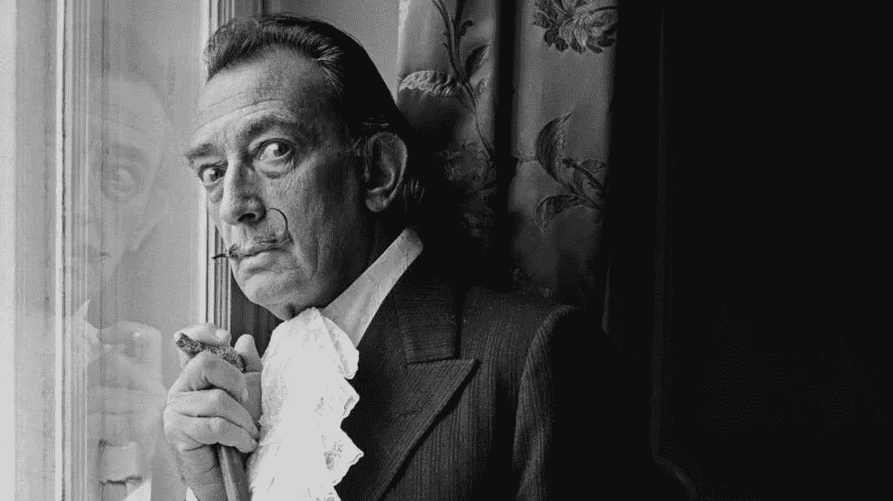

# 像萨尔瓦多·达利一样打盹

> 原文：<https://medium.com/swlh/nap-like-salvador-dali-46689881d366>

## 提高创造力的小睡技巧

[Image source](http://mentalfloss.com/article/500759/25-outrageous-quotes-salvador-dali)

超现实主义画家萨尔瓦多·达利有一个产生新创意的非常有趣的技巧。下午，他会坐在椅子上，一只手搭在椅子边上，手里拿着一把钥匙。在那把钥匙下面，有一个倒置的盘子。从那以后，我们会让他自己慢慢消失，直到他…