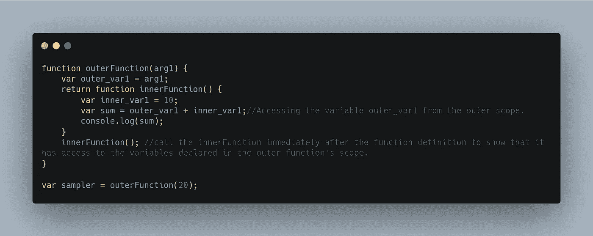
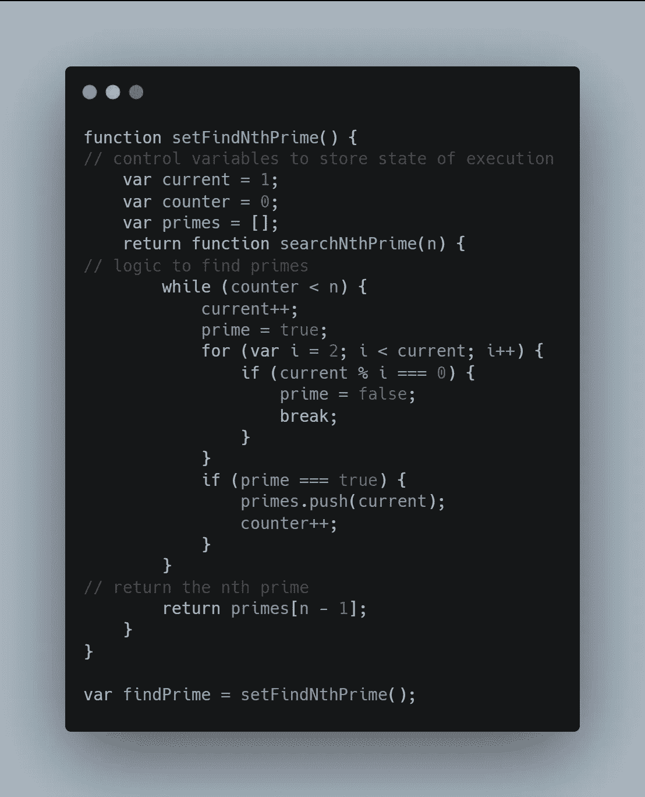

# 浏览 JavaScript 的最深处——闭包[1/10]

> 原文：<https://medium.com/swlh/navigate-the-deepest-parts-of-javascript-closures-1-10-a4214680b6f5>

作为初学者，我是如何破解困难的 JS 概念的。

我过去常常想知道 JavaScript 是什么(我现在仍然想知道！).几年前，当我开始我的程序员职业时，首先是 PHP 开发人员，然后是 Python 程序员，我只从前端人员那里听说过 JavaScript。最终，在我的眼皮底下，JavaScript 摆脱了所有的架构限制，我也阅读了关于它如何被用于服务器端编码的博客。然后 JavaScript 突然无处不在——无所不在，从网站到灯泡——就像 Java 曾经那样，在丑陋的甲骨文出现并吞噬它之前。我经常想知道为什么这是一个悖论——同时是世界上最受欢迎和最受讨厌的语言；存在于黑白相交的灰色区域内。

几年后，我现在在这里，冒险进入 JavaScript，写下一些主题，我希望在我开始的时候已经得到了关于这些主题的建议和课程。我不得不查阅大量资料来理解一些概念。来自贫困家庭；但是除了大学里的一些项目之外，我没有真正的 Java 经验，我很难平静地理解基于原型的 JavaScript 应用程序的结构。我写下这些来帮助任何正在经历同样旅程的人。这不是火箭科学，但我希望它能帮助你。

我假设阅读它的人对 JavaScript 有基本的了解。

现在让我们冒险进入闭包。

在正式开始使用闭包之前，我希望你理解什么是 *Scop* e，什么是 JavaScript 中的*垃圾收集*。

# 范围。

作用域是指程序中可以看到或使用变量的区域。换句话说，变量的可见性。范围的重要性增加了，因为 JavaScript 引擎必须有一种有效管理内存的方法。显然，它可以让用户销毁不再使用的物品。但是它怎么能信任人类呢？我们会忘记，无知对我们来说是福。

雪上加霜的是，与 C 语言不同，ECMAScript 缺少访问内存管理的特定接口。这意味着没有 API。这意味着程序中的内存管理权限被传递给引擎本身。这意味着，如果我们搞砸了，再多的程序员黑魔法也救不了我们。

我们搞砸的结果？分配的对象记录下内存，就像陷入交通堵塞的纽约市车道。无论你试图挤多少辆车，车道都会停下来，然后你会有一个像《权力的游戏》婚礼一样红的控制台。

*你有一个堆内存不足的场景。*

## **什么是垃圾收集？**

该程序不能记录整个内存堆，因为它将未使用的变量或对象保存在内存中。这意味着，它需要有一个聪明的方法来删除超出范围的变量。这就是垃圾收集器的用武之地，它的工作是跟踪内存分配，以便发现何时不再需要一块已分配的内存。但这是最难的部分。在所有的高级和低级语言中，这个过程不过是一种近似；因为一般的问题是算法无法判定的。这个问题要么通过收集不存在引用的所有对象来解决，要么通过标记和清除算法来解决，该算法将清除所有不可到达的分配。在引擎盖下，每个引擎都有自己的垃圾收集试探法，但它们基本上都在做其中之一，或者两者都做。V8 JavaScript 优化引擎的组件——为 V8 提供动力的全代码和曲轴——从那时起变得更加智能，使用其他更智能的方法来收集垃圾。(完整的 codeGen 和曲轴已被前一年的*点火和涡轮风扇*取代，V8 的新解释器和优化编译器。他们在去年推出了 V8 5.9)

但是，当我们通过不让垃圾收集器收集某些超出范围的对象而显著提高效率时，会发生什么呢？

这就是终结的由来。

让我们想象以下场景。

这里，函数调用结束后，调用栈弹出函数语句。垃圾车都进来了，准备拖走你的孤儿对象，函数中声明或使用的任何对象都将被杀死和收集，然后释放到堆池中，供其他变量生存和发展。

但是嘿，停下来想想函数结束后 *outer_var1* 的状态？你可能会问，你为什么在乎？它只是一个函数范围内的变量，在*外部函数*运行后，它在哪里？没关系。反正不能用。反正对我们没用。但是让我们稍微修改一下代码，看看这会把我们引向何方。

如果你打印出存储在 sampler 中的对象的类型，你会得到类型是" function"。那又怎样？你可能会问。函数是 JavaScript 中的一级公民，可以被传递或从函数返回。但是这里需要注意的是，当内部函数返回时，它创建了一个新的作用域——一个 ***闭包作用域*** ，它允许我们在函数退出后访问一个函数作用域的变量。您可以调用 sampler 函数，它可以访问变量 *outer_var1* ，**，即使 *outerFunction* 已经存在。**

那么垃圾车会怎么样呢？让我们看看下面会发生什么。

1.  调用*外部函数()*。

2.它创建一个新的执行上下文，并将其绑定到“this”。

3.它将函数作用域变量 *outer_var1* 声明为 10。

4.它返回 *innerFunction()* ，存储在 sampler 变量中。

5.从调用堆栈中弹出*外部函数*。

6.垃圾车来拖走了*外部函数*的剩余部分，并且变量 *outer_val1* 也将被收集。

但是，令人遗憾的是，舒舒服服地坐在内部函数中是对外部变量的引用，防止它被收集。

*var sum = outer _ var 1+inner _ var 1；*

**在现实生活中，我们可能需要在哪些地方使用闭包？**

众所周知，JavaScript 是一种动态类型的函数式编程语言。当运行在强大的引擎上时，比如 Google 的 V8，比如 node.js 和 React，JavaScript 变得非常强大。说它是纯功能性的是错误的。在闭包的帮助下，这种语言已经超越了无数的规范；我们可以在 JavaScript 中模拟面向对象的行为。闭包主要用于，

1.  通过封装函数和变量来模拟 JavaScript 中的类行为——模块模式。

2.功能工厂。

3.记忆化。

# #1:记忆化:案例研究。

让我们考虑下面的例子。目标是写一个函数，接受一个数 n，并输出第 n 个质数。这不是一个理想的例子，因为这种情况不会在日常生活中出现。但这个例子是一个完美的例子，但当它发生时，你不需要站在黑暗的一边。

变量 current 保存我们当前正在检查是否是质数的数字。变量计数器保存我们到目前为止发现的素数的总数。质数数组是找到的质数的实际列表。

在这种情况下，如果您注意到，变量 current、counter 和 prime 在***search nth prime***函数的词法范围内。它们是控制主回路状态的控制变量。当函数存在时，这些控制变量被垃圾收集器收集走。

你说“谢天谢地”。

现在，随着 n 值的增加，计算量会逐渐变大。

尝试调用 searchNthPrime(10000)，它给出 104729，这是第 10000 个素数。

现在再次调用该函数，但这次传递 10001，如 searchNthPrime(10001)

输出数字 104743 仍然需要几秒钟。

## 有点不对劲。

即使我们计算第 10000 个质数，像 *searchNthPrime(10000)* 一样，下一次我们越过 *searchNthPrime(10001)* 时，函数会从头迭代一遍。所以你们问自己。*不！JavaScript 引擎必须足够聪明，能够理解我们可能不需要从头开始。不管怎样，它必须足够聪明，以便为下一次记忆控制变量。*

是啊。他们知道了。这就是他们创建闭包作用域的原因。

现在让我们重写代码如下。

现在，尝试运行 *findPrime(10000)* 。它将打印出 104，729。
尝试调用 *findPrime(10001)* 。它在十亿分之一秒内打印 104，743。

## 瞧啊。！

我们已经成功地使用闭包来创建控制变量的记忆。这里发生的是，外部函数将内部函数和控制变量封装到一个*闭包范围*中，然后连同这个范围一起返回函数。这个内部函数 *searchNthPrime(10000)* 可以访问控制变量，不在 *setNthPrime* 函数的范围内。也就是外部函数。所以当你第一次运行这个函数，计算第 10000 个质数时，这些变量会获得一个值。这个值不会被垃圾收集，因为返回的函数仍然从外部引用它；从 *findPrime* 变量内部，该变量现在包含一个函数。当我们运行第二个函数调用时，控制变量从它们的当前值恢复...也就是说，它们将从对应于第 10000 个质数的值开始。不是 1。

闭包在另外两种情况下使用:

1.  创建一个函数工厂。
2.  创建模块设计模式。

这些将在我的下一篇博客中从头开始探讨。闭包还导致了世界著名的内存泄漏，我将在接下来的几天里写下来。敬请关注。感谢您的阅读。！！

## 这篇文章发表在 [The Startup](https://medium.com/swlh) 上，这是 Medium 最大的创业刊物，拥有+426，678 名读者。

## 订阅接收[我们的头条新闻在这里](https://growthsupply.com/the-startup-newsletter/)。

