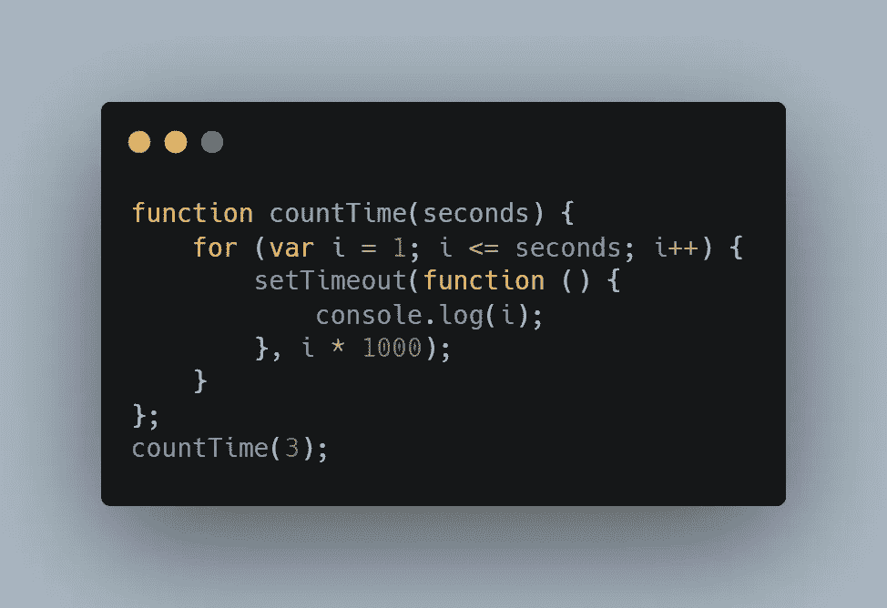
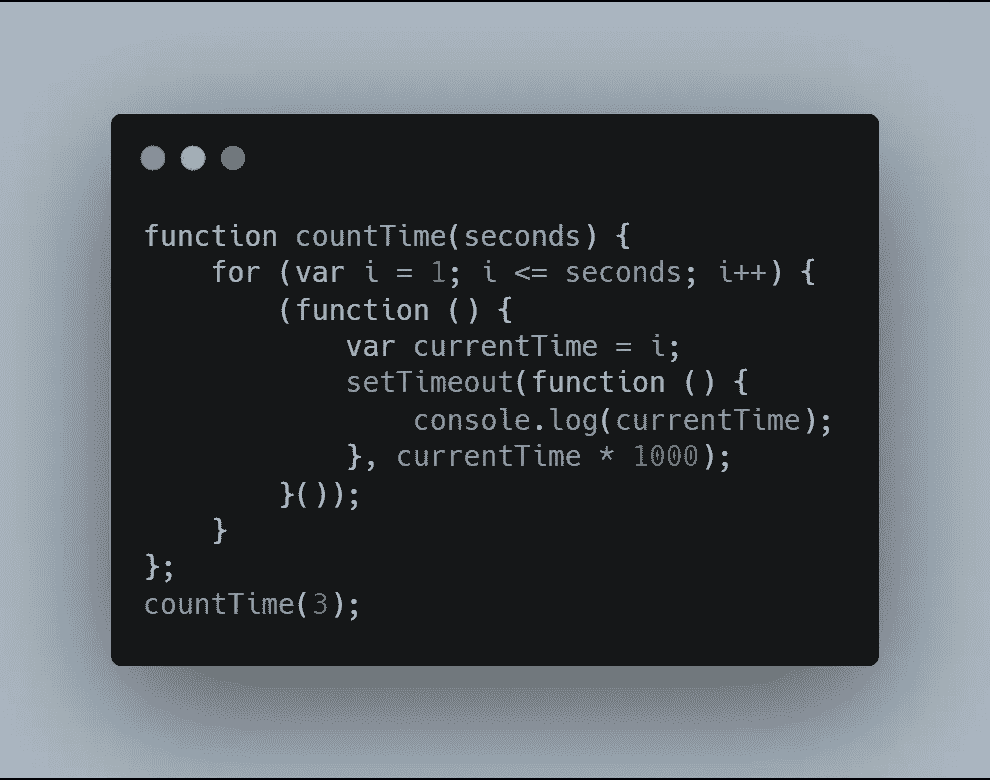
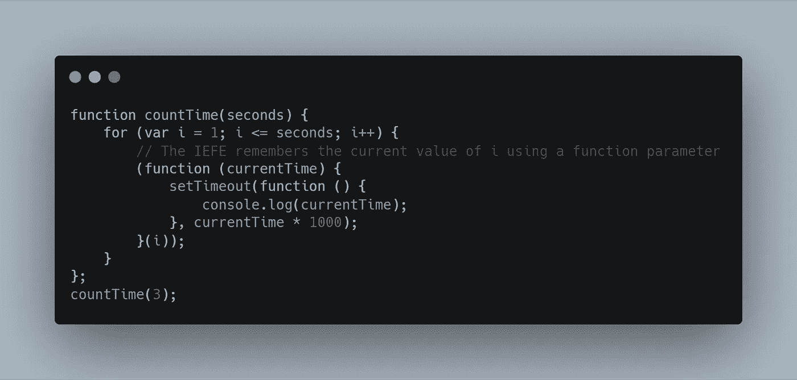
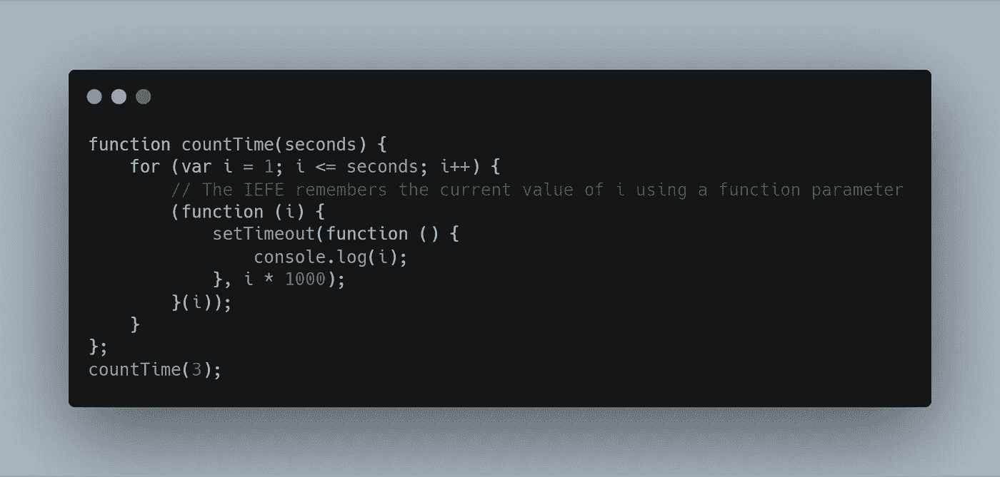

# 浏览 JavaScript 的最深处——闭包[2/10]

> 原文：<https://medium.com/swlh/navigate-the-deepest-parts-of-javascript-closures-2-10-b7deac267d1>

这是一个关于中级 JavaScript 主题的连续系列。如果你还没有看过我的第一篇博客，请回头看看之前的文章(这也恰好是第一篇！)

 [## 浏览 JavaScript 的最深处——闭包[1/10]

### 作为初学者，我是如何破解困难的 JS 概念的。

medium.com](/swlh/navigate-the-deepest-parts-of-javascript-closures-1-10-a4214680b6f5) 

现在，关于 JavaScript 闭包，您已经有了非常需要的闭包。你知道他们如何在引擎盖下工作；以及它们在现实世界中是如何使用的。闭包的概念很简单，但是你需要很好的理解它。尽管语法上很简单，但是对闭包的理解不足已经导致了举世闻名的内存泄漏。(我将在接下来的几周内写下相关内容！)所以我们再深入一下。是时候深入挖掘并了解一些最常见的奇怪行为了，这些行为是由对闭包的不正确理解引起的。仔细听着。

现在，让我们看几个来自闭包的奇怪行为的例子，然后我们将深入了解它的本质，然后看看如何使用闭包在 JavaScript 中创建一个设计模式。

见后面的著名面试问题。

仔细看，有内在作用，也有外在作用；内部函数是 setTimeout，外部函数是 countTime。变量 I 在闭包作用域内是因为即使函数 countTime 已经停止运行，setTimeout 函数仍然可以访问 I，所以我们来问一个问题；上面的代码产生了什么？

你知道如果答案是 1，2，3，这个问题会看起来很蠢。写它的人显然需要打印 1，2，3，但它不会。

那么输出会是什么呢？

如果你盯着控制台看，程序会吐出“4”而不是别的。搞什么鬼？

让我们言归正传。为此，您需要对事件循环如何工作有一个基本的了解。如果你需要快速复习，我会给你一个。

JavaScript 是一种单线程、事件驱动的非阻塞语言。

这是你每天都会听到的。

## 出于各种原因，它的设计是为了避免竞态条件。非原子内存访问等等。这并不意味着它只有一根线。

1.主线程处理你的代码——获取它，编译它并执行它。
2。实际上有一个单独的线程用于编译；以便我们的主线程可以继续执行。
3。有一个分析器线程，用于确定执行线程在哪些方法上花费更多时间，以便优化编译器可以优化它。
4。还有一些其他线程用于垃圾清理。
5。如果你在 node.js 上，那么我们有其他的 webAPIS 线程，它们与底层的 C++对应线程对话。

单线程意味着它只有一个线程处理请求。JS 引擎主要有以下组件。

1.**调用堆栈；**其中要执行的指令被推到堆栈顶部并执行；然后就爆了。这是执行指令的唯一地方。

2.**事件队列:**这是一个中间地带，回调在这里等待被执行。它可以是数据库查询或异步 API 调用。回调本质上做的是，它为事件注册一个处理程序；或者功能；并告诉事件循环。“当您的数据库查询执行完毕时调用此函数”或“当您的 API 调用返回数据时执行此函数”。首先，需要将它们推入堆栈。让这一切发生。堆栈应该是空的。所以 JS 运行时，简单来说就是在迭代中完成这个任务。这个所谓的“ ***事件循环*** ”周期性地检查调用栈是否为空，如果是，它将把第一个事件推送到调用栈。这种迭代称为“滴答”。

> 就像我说的，基本上它是所有等待执行的事情的中间状态。

3.堆:这是非结构化的内存，对象和其他值都存储在内存中。这主要是垃圾收集器收集垃圾的地方。

## 调用方与响应的解耦，就像在事件循环中发生的那样，允许 JS 运行时做其他比等待更好的事情。

for 循环运行三次，并且在每次迭代后增加 I 的值。然后，它将打印命令发送到事件队列，在第四次尝试时，I 的值变为 4，循环中断执行。

## 让我们来分解一下:

1.调用 countTime 函数。
2。countTime 函数被推到调用堆栈的顶部。
3。For 循环开始执行。
4。对于 I 的每次迭代，
1。调用 SetTimeout 方法，该方法被推入栈顶。
2。setTimeout 中的控制台命令被发送到事件队列，以供事件循环选取。
3。事件循环保存控制台命令，直到调用堆栈被清除。
5。I 的值变为 4，并且 for 循环中断。
6。从堆栈中弹出 for 循环。
7。countTime 函数存在；并从堆栈中弹出。
8。事件循环检查调用堆栈，发现它是空的。9。Even loop 将第一个 console.log(i)命令推入堆栈帧。
10。变量 I 只不过是对我存储在堆中某处的原始内存位置的引用。11。is 的当前值为 for 循环中断时)
12。它只打印 4 次，并打印 3 次，考虑到每个 console.log。

那么我们如何解决这个问题呢？

让我们看看。

现在，我们所做的是，我们已经将内部 setTimeout 函数包装在所谓的立即调用函数表达式中，我们将隆重地称之为 IEFE。所以我们现在在函数中有了一个函数。

有什么变化？

在 for 循环内调用函数 3 次时，在每次迭代开始时；I 的当前值被赋给一个名为 currentTime 的局部变量。每当循环通过一次迭代，IEFE 就会被调用，3 个 console.log 语句以及范围从 1 到 3 的 3 个 currentTime(局部变量)值被发送到事件循环。当堆栈变空时，三条语句被打印出来；解决我们的问题。

## 我们所需要的是函数中的函数，创建一个闭包作用域。

如果你真的浏览其他人的代码，你可以看到上述代码的变体。

> 在上面的例子中，IEFE 通过变量 currentTime 记住每次迭代中 I 的每个值，该变量在每次循环中被传递到函数的执行上下文中。

我们甚至不必使用不同的变量名，如 I 和 currentTime。我们可以用一个变量 I 来实现，代码如下。

哒哒！！我希望你喜欢这篇文章。在接下来的几周里，我会写更多关于 JS 的东西。感谢阅读。

## 这篇文章发表在 [The Startup](https://medium.com/swlh) 上，这是 Medium 最大的创业刊物，有+431，678 人关注。

## 订阅接收[我们的头条](https://growthsupply.com/the-startup-newsletter/)。

