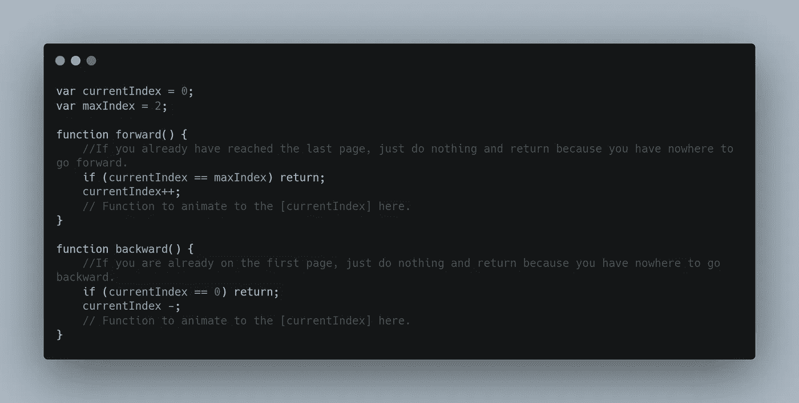
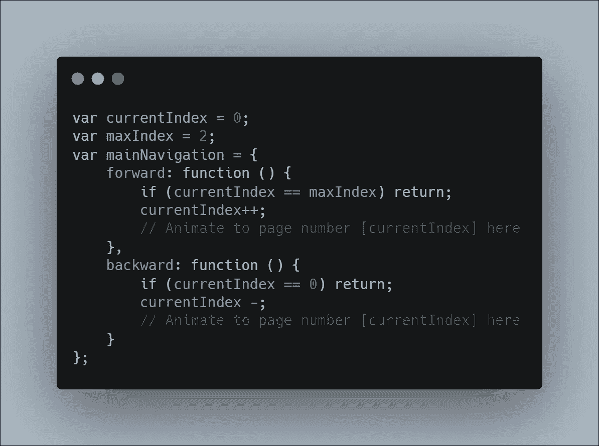
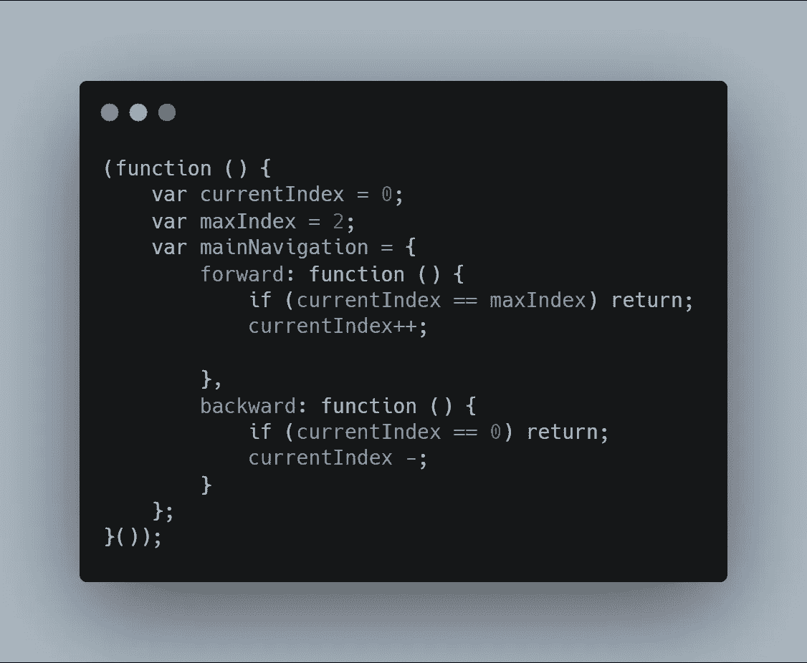
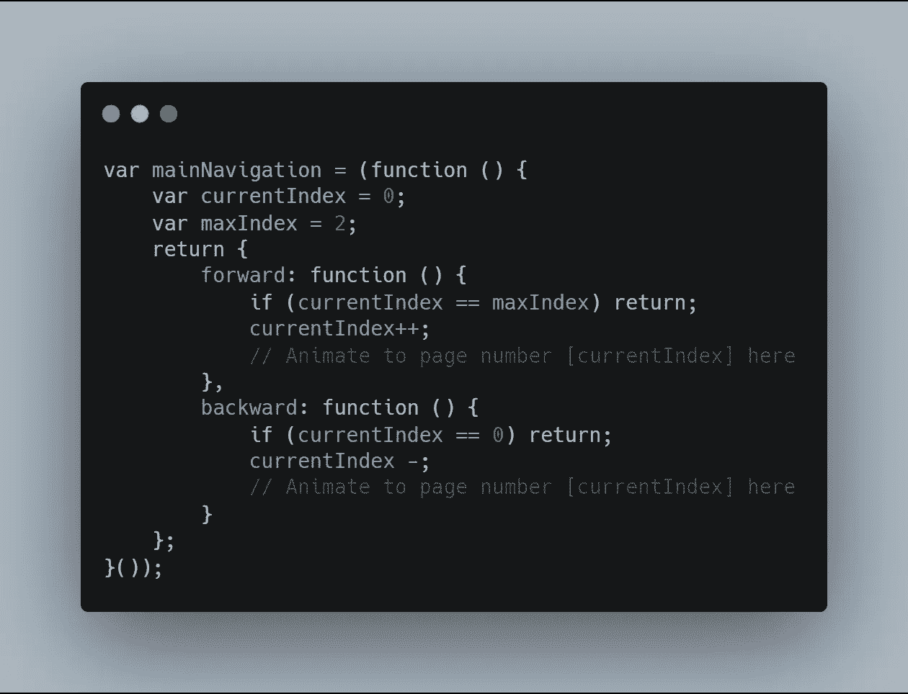

# 浏览 JavaScript 的最深处——闭包[3/10]

> 原文：<https://medium.com/swlh/navigate-the-deepest-parts-of-javascript-closures-3-10-bf1974dbfaa9>

注意:这是我正在进行的关于复杂 JavaScript 主题的系列文章。请在这里阅读本系列以前的文章:

 [## 浏览 JavaScript 的最深处——闭包[1/10]

### 作为初学者，我是如何破解困难的 JS 概念的。

medium.com](/swlh/navigate-the-deepest-parts-of-javascript-closures-1-10-a4214680b6f5)  [## 浏览 JavaScript- Closures 的最深处[2/10]。

### 这是一个正在进行的关于中间 JavaScript 方法的系列。如果你没有看过我的第一篇博客，请回头看看…

medium.com](/swlh/navigate-the-deepest-parts-of-javascript-closures-2-10-b7deac267d1) 

既然您已经接受了闭包是什么，并且已经看到了如何使用闭包在我们的代码中实现某些行为的例子，那么让我们更深入地研究如何使用闭包来实现 ***模块设计模式。***

考虑下面的例子。你在做一个网站的导航。您直接处理 DOM 来向左或向右滑动当前页面。你想出了下面的代码。代码是不言自明的。

它有两个功能，*前进()*和*后退()*。向前功能向前滑动页面，向后功能向后滑动页面。在做任何事情之前，forward 函数会检查我们是否已经到了最后一页。如果是的话，那就意味着我们没有更多的页面可以前进了。所以函数什么都不做就返回。同样，backward 函数检查我们是否已经在第一页了。如果是的话，你知道那意味着什么。

现在，如您所见，上面的代码存在许多问题。首先，假设有两个**全局函数**。可以肯定的是，随着代码库的增长，这种混乱会越来越多，你很快就会忘记在全局名称空间中声明了什么。想象一下，如果在其他页面中，您不小心声明了另一个同名的函数，那该怎么办。因为函数“forward”适用于页面导航，所以同名的 forward()也适用于另一个在页面内移动滑块的函数是有意义的，也许？然后你将不得不保存所有全球事物的索引；相信我，这不是你应该做的事。然后你应该为其他函数想出类似“ *moveForward()* ”或“ *next()* ”的替代方法；过一段时间，你的代码库就变成了一个普通的变种。随着代码库的增长，您很快就会失去对它的跟踪。

你应该做的是考虑最终维护你的代码的人。你已经知道俗话说得好。“总是认为最终维护你的代码的人是一个知道你住在哪里的暴力精神病患者。”

您现在需要做的是，将两个全局函数从全局名称空间移动到它们自己的对象中。

好多了。现在，您可以将您的函数称为 *mainNavigation.forward()* ，这确实很有意义。尽管如此，仍有两个全局变量 currentIndex 和 maxIndex 跟踪当前页面的索引和总页数。这两个也“污染”了全局名称空间；因为你最终可能会用相同的名字声明其他变量来跟踪代码中其他地方的东西，这样你的代码就会逐渐变成意大利面条。因此，进行以下操作是有意义的:

## 你刚刚做的是；把所有关于主导航的东西都移到了它自己的函数表达式中；在这种情况下，它是一个立即调用的函数表达式，或 IEFE。

现在它们被包装得很好很紧密，变量不会污染全局名称空间。

> 但是，他们现在是否被紧紧地包裹在生活中？现在没人能找到他们了！没有对它们的外部引用，所以它们永远不会被访问或使用。我们现在要干嘛？

## 我们需要创建对这些函数的外部引用，这样我们就可以在外部使用这些函数。

我们如何做到这一点？

是的。你说得太对了。关闭以拯救世界。

我们刚才所做的是，创建了一个内部块，它封装了前进和后退函数，并将它们返回给调用变量；在这种情况下，*主导航*。所以变量 *mainNavigation* 现在可以用来控制导航的各个方面。变量 *currentIndex* 和 *maxIndex* 现在在这些函数的闭包范围内；并且即使 IEFE 存在也可以被跟踪。

现在，仔细看。我们在这里所做的是模仿阶级行为。变量 *currentIndex* 和 *maxIndex* 现在是私有变量，只能通过类的成员函数访问。我们有两个公共方法， *forward()* 和 *backward()* ，可以在任何地方使用；和两个私有变量。

## 这被称为模块模式。

现在，您已经保持了代码的整洁和可维护性。你封装了你的脚本的不同部分，这些部分彼此之间没有太多的联系。

## 这样，当你的代码库增长时，你就有机会了。

你好世界。这些是我希望在我开始学习 JavaScript 时就拥有的文章和信息。这些灵感来自不同的来源，在不同的时期积累。关注我了解更多信息。

## 这篇文章发表在 [The Startup](https://medium.com/swlh) 上，这是 Medium 最大的创业刊物，拥有+435，678 名读者。

## 在这里订阅接收[我们的头条新闻](https://growthsupply.com/the-startup-newsletter/)。

