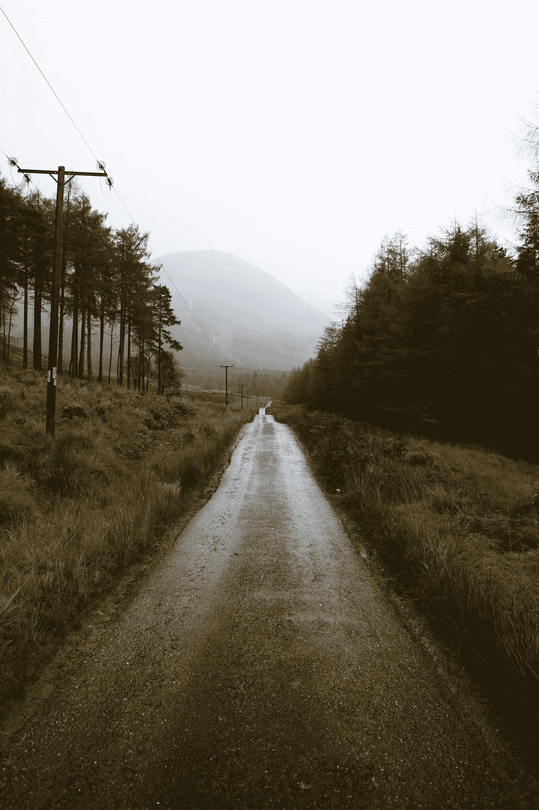
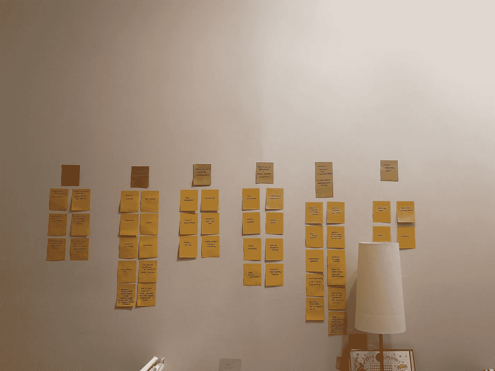
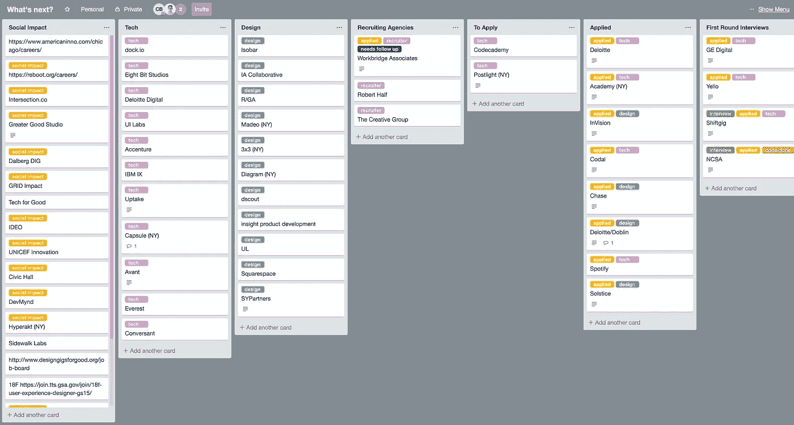

# 用设计思维的心态导航工作转换

> 原文：<https://medium.com/swlh/navigating-a-job-transition-using-a-design-thinking-mindset-ed4a83ee7aa>

*反思我是如何通过拥抱未知、坚持用户第一、偏向行动、保持对成长的不适来完成工作转型的*

作为一名训练有素的设计师，[设计思维](https://www.innovationtraining.org/design-thinking-mindsets/)已经成为我在日常生活中处理问题和情况的一个非常自然的框架。我用它来计划我阿姨婚礼上的座位安排。我用它来思考如何与朋友进行艰难的对话。我的卧室墙上没有壁纸或图片；更确切地说，是来自这些个人设计思考会议的大量彩色便利贴。

一年前，当我选择辞去前一份工作时，一系列的问题、感受和不确定性出现了，我也是用这种心态来应对的。当时，我甚至没有考虑过使用“设计思维”；我只是在用设计教给我的最好的方式解决我生活中的另一个现实问题。

然而回过头来看，我意识到这是我走到现在这一步的最大原因。这就是为什么我知道，如果我的生活中再次出现一系列类似的问题、感受和不确定性，我会没事的，我相信这是不可避免的。

所以，让我们快速回顾一下去年发生的事情。

## 拥抱未知

2018 年 5 月，我辞职了。我离开了一个对我不健康的办公环境和工作生活环境。我知道我想为未来的自己做的最好的事情是非常有意识地考虑我的下一步行动。这需要清醒的头脑。自我反省的空间。还有大量的休息。离开最终是正确的决定，但我没有正式找到另一份工作。

这一切听起来很勇敢，现在写起来也很容易，但是给自己空间去写这些事情，伴随着恐惧和轻微的焦虑，因为完全不确定接下来会发生什么。我想，“我什么时候能找到工作？在那之前还有几次面试？会是几周吗？几个月？我最终会在不同的城市找到工作吗？我必须马上收拾行李吗？支付租约违约罚金？多久之后，我需要在当地的咖啡店里轮班，或者从事自由职业来支付账单？”

逐渐模糊的感觉开始变得熟悉，我记得在某一点上，有一个向舒适和积极能量的转变。我的“会发生什么？”心态变成了“什么*会发生*？”心态。

这感觉就像任何设计项目的开始，我发现自己在说，“我还没有任何解决方案或答案，但没关系。我不知道这个产品会是什么样子，也不知道它最终会如何工作，但没关系。我有合适的工具。我乐观并愿意拥抱未知，因为这是一个我可以创造并融入其中的充满可能性的世界。而现在，这就是我所需要的。”

## 以用户为先(或者在这种非常罕见的情况下，以我自己为用户)

离职后的那个星期一，我去公寓旁边的一元店买了两样东西:一包便利贴和一支记号笔。

我回到家，撕开那包漂亮的小纸片，写下萦绕在我脑海中的问题:

*   我是谁？
*   我关心的事情是什么？
*   我的优势是什么？
*   我有哪些需要持续改进的地方？
*   我想种什么？
*   我和谁合作愉快？

在不同颜色的纸上，我写下了答案。

在接下来的几周里，这些便利贴(至今仍挂在我卧室的墙上)让我在寻找、申请和面试不同的公司时有了底气。他们以我为中心设计了我生命中的那一章。

## 关于脆弱

作为设计师的一部分，需要容易接受来自项目经理、内部利益相关者、工程师、用户和其他设计师对你工作的反馈。虽然在那段艰难的日子里，我的便利贴是很好的伙伴，但我知道我不可能仅仅依靠无生命的物体来支撑。我必须让其他人参与到这个过程中，依靠并相信他们的洞察力。

举个例子，我重新联系了一个朋友/另一个设计研究员，他是我在[体验学院](https://expinstitute.com/)的同事，他也碰巧经历了自己的工作转变:他希望在纽约的一家大型老牌公司找到一份工作。如果他得到了这份工作，他将不得不打包行李，搬到全国各地，适应一个与他目前在西雅图一家小初创公司的角色截然不同的角色。我们陶醉在对未知未来的恐惧和兴奋中。这是对 Ei 社区的一个温和的提醒，这是一个人们面对自己的恐惧不断追求好奇心的网络。这是我需要继续前进的一个小小的推动。

我渴望找到一个对“工作生活平衡”和“倦怠”概念也感兴趣的在线社区，于是我找到了阿瑞娜·赫芬顿、T2、亚当·格兰特和 T4 大本营的其他人的研究和工作。他们的播客片段、博客帖子和对这些天工作方式的整体见解帮助我意识到在这个过程中我并不孤单。他们服务过(并且继续服务！)作为一套关于如何从工作倦怠中恢复和预防工作倦怠的有用资源。

## 论偏向行动

My intense yet deeply satisfying Trello board set up

我知道恐惧和焦虑会让人麻痹，但一旦我愿意拥抱未知，就很容易采取行动。我在便利贴上涂鸦，给朋友打电话。我甚至建立了一个 Trello 板，看起来很像 JIRA 看板:它包含了几十家我感兴趣的公司的名字，这些公司是基于我的便利贴上的见解。它有不同的“泳道”，当我在不同公司的面试过程中前进时，我会用它们来移动卡片。

我研究并申请了很多地方。我有很多很棒的电话交谈。来回发了很多邮件。很多新的职业关系。许多人把我的简历和考虑周到的求职信扔进了没有任何回复的深渊。很多拒绝。

回想起来，对于我来说，很容易因为每一封未回复的邮件或立即的拒绝而情绪化，但坚持和继续采取行动提醒我要在这个过程中获得乐趣和信任。每一次拒绝和缺乏回应都让我觉得离我应该在的地方更近了。

(最终，我得到了几份很棒的工作邀请，并接受了其中一份🎉！)

## 把握学习与成长中的不适

真的，整个过程都很不舒服。从每周工作 60 多个小时到坐在咖啡店里思考，没完没了地填写申请表，这种感觉很不舒服。不知道下一站会在哪里着陆是不舒服的。几个星期没有稳定的收入来源是不舒服的。但是我知道这种不舒服的感觉只意味着一件事:我生活在我的舒适区之外。因为学习和成长发生在我们的舒适区之外，所以最终会有一些东西需要学习和成长。

通过这次经历，我第一手学到的是，设计心态就是:一种心态。它可以带到任何地方。任何人都可以使用它。不仅在解决复杂的业务问题时，而且在解决问题和找到日常生活中的方法时，它都可以被信任来导航模糊之处。