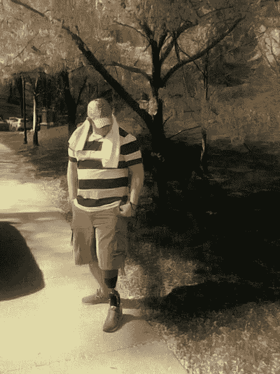

# 需要奇迹

> 原文：<https://medium.com/swlh/need-a-miracle-b4cf715ceb6>

我在红灯时注意到一个独臂人。他的鼻子和颧骨突出——很尖；他面颊上的肉已经干了，而且有了皱纹。他们被蒙上了阴影，还长了胡须。他突出的鼻子让我想起了克里夫；这座桥小心翼翼地拱起，顶端呈圆形。他的白色 t 恤被风吹破的袖子软绵绵地挂在他的右边，在风中飘扬。他的左臂举着一块硬纸板，上面潦草地写着永久…