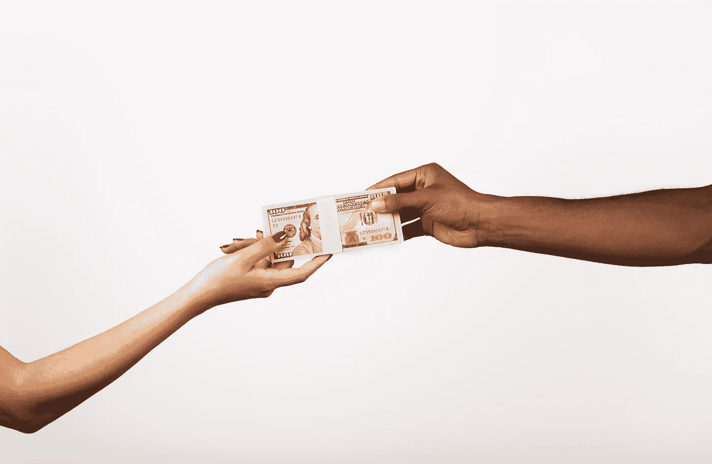

# 需要一个网站？这太不公平了

> 原文：<https://medium.com/swlh/need-a-website-its-flamin-unfair-18c22587a46e>

# 对于每一个初露头角的企业家来说，那种让你冲动购买域名，为下一次创业做准备的兴奋感几乎是无与伦比的。

它的可用性问题总是一场赌博，但大多数时候，即使你的愿望没有完全得到满足，你也会对一个微小的变化感到满意。

只需 12 美元，你就可以拥有一小块数字地产，让你梦想中的名字触手可及。

令我惊讶的是，GoDaddy 现在已经摧毁了这场赌博，他们已经在大量理想的域名上建立了垄断——在某些情况下对他们所谓的“高级域名”收取 5000 美元以上的费用。可以看下面他们的视频讲解。

我再也不能有一丝一毫的光辉，去触摸伟大。我更有可能卖掉我的车来换取一个价格低廉的 URL 地址，或者被有资本支付大价钱的知名企业出价超过。

难怪 GoDaddy 团队最近能够证明一场昂贵的广告活动是合理的。企业家可能会出售他们的财产来分一杯羹，但财务健康的人已经在吃了。

GoDaddy 拍卖可能会分散财富，并声称给企业所有者购买不可用域名的机会，但无论你如何旋转它，我相信佣金对域名所有者和促进实体都很可观。

我不禁质疑这个数字巨头的这一权力举动的道德性。虽然我不知道他们的隐私政策的来龙去脉，但网站上每天都会有成千上万的搜索，即使是最基本的跟踪或用户记录插件，该公司也可以访问大多数搜索的域。

现在，不要误解我——我知道这种购买和转售已经存在，域名的价格一直在稳步上升。然而，在过去，它不太容易计算，也更容易理解。GoDaddy 事实上可能只是第一个以最有效的方式提供服务的实体，并在类似的追求中击败了其他人。

可以说，也许这是不可避免的——也许它总是会发生。

这并不能阻止我内心的一点点死亡。对于那些银行账户里只有 48 美元、有着大胆目标的有抱负的企业家来说，这并没有给他们的未来带来希望。

这是一个道德困境，一个商业上明智的决定，也是一个巨大的打击，但我认为好的品牌必须作为一个解决方案占据上风。(尽管我并不真的喜欢为太长或太晦涩难记的领域写广告词。开玩笑…我喜欢顺口溜。)

无论如何，一个适当的营销策略，一个智能的品牌美学和基于关键词的内容创作才是你真正应该投资的，以提高你的企业的知名度——而不仅仅是(现在)定价过高的地址。

网址仍然可以通过几个按键来访问，也许他们只是在未来需要更多的按键，因为越来越少的人可以负担得起高级服务。

体面的，负担得起的域名。我会非常想念你，但我会紧紧抓住良好的品牌和伟大的内容实施的价值。

热情问候，

达尼·桑普森

## 这篇文章发表在[《创业](https://medium.com/swlh)》上，这是 Medium 最大的创业刊物，有+430，678 人关注。

## 订阅接收[我们的头条新闻](https://growthsupply.com/the-startup-newsletter/)。

