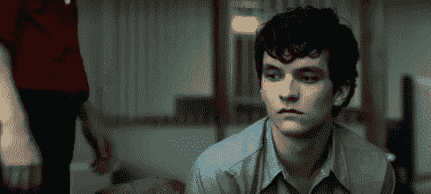

# 网飞用户界面设计分析

> 原文：<https://medium.com/swlh/netflix-user-interface-design-analysis-a625d20852ca>

以及下一代电视体验。

*   我们是否已经完全将电视文化从我们的生活中移除了？
*   ***我们在哪里关注直播？***
*   ***电视剧观看习惯是重新设计的吗？***

近年来，我们看电视的习惯开始转向网络媒体。尤其是在最近，网飞在世界范围内的崛起和为网飞用户制作特别电影变得更加有趣。

YouTube 和 Instagram 从 Periscope 时期就开始了直播流的崛起。观众已经厌倦了电视上的广告和广播形式。这些平台，使观众能够达到在同一时间，通过电视频道的直播。

此外，在线电影和电视节目平台网飞的用户友好的界面设计和数据分析也讨论了这一成功的背后。缩略图照片的变化根据您正在观看的系列的主题，喜欢在多种设备上继续观看的功能喜欢在多种设备上继续观看的功能网飞不可或缺性可以在原因中显示。

**继苹果在个性化界面上的成功之后，这些在其他平台上的发明可能成为偏好的理由。**

网飞屏幕可以分为三个部分进行分析

## **苹果电视应用使用情况**

苹果电视版《网飞》的易用性似乎在某种意义上演变成了过去的文化。虽然人们的用户习惯可能会在数字世界中发生变化，但我们也可以注意到一个事实，即大多数数字产品都像是模拟习惯的反映。改变我们不能从模拟文化中断开的频道将只使用前进和后退键，同时执行切换动作。在 Apple TV 上，这是电视导航的基础。像网飞这样重视用户体验的应用，正致力于以最简单的方式反映这种导航风格。

*gif from express.co.uk*

作为一个用户体验，悬停效果兼容的控制和一个简单的来回导航没有你痛苦。上次更新后，我个人唯一不喜欢的是菜单放在边上，在 YouTube 中使用相同的菜单结构。或许，这个从两个应用的数百万数据中分析出来的更新更有用。

## **浏览器用法**

与手机和电视不同，在笔记本电脑或台式机上观看《网飞》时，你可以有很多互动元素。悬停效果，如帐户页面，在浏览器中更具交互性的页面..等等。

> 在黑镜系列的 Bandersnatch 部分，我们体验了最新互动实验的最具创新性的体验。

同时，当我们查看主页时，我们看到一个简单的菜单结构，一张照片而不是加载图标这在技术上是每个项目的问题，并在视频加载时播放它。同时，这个屏幕看起来像数字世界中电影海报的互动版本。

我们单击其中一个缩略图向下滚动，以查看内容详情。特征字体的细节再次出现，一个简短的日期和季节信息，摘要，并且可点击你想要点击的播放按钮。还有互动按钮表示个人喜好。这是非常有效的，以决定是否观看该系列，除此之外，你可以在屏幕的左侧获得关于一个系列的详细信息。缩略图也是一个带有悬停效果的小预览屏幕。

版权或其他因素存在技术上的顾虑:如果你正在通过浏览器观看网飞的内容，你不能同时录制，因为它不允许！

## **移动应用使用情况**

当我们使用网飞作为移动设备时，我们可以看到带有屏幕和简短导航的轻松查看屏幕，这些屏幕根据电话用户的体验进行调整。网飞还用简单的方法把特定的 UX 规则应用到。

当我们总体关注网飞屏幕时，它为用户提供了基于简单性和内容的新一代电视体验。

在手机上看连续剧时，

-在计算机上继续的能力，

-在注销应用程序和返回观看时继续遵循分类，

-从传统电视到在线通行证和非常好的导航的传统体验的使用，

-视觉效果根据您正在观看的主题而突出，

为用户创造了巨大的功能。

希望在 YouTube 电视上看到同样的功能..

谢谢！

## 这篇文章发表在[《创业](https://medium.com/swlh)》上，这是 Medium 最大的创业刊物，有+435，678 人关注。

## 订阅接收[我们的头条新闻](https://growthsupply.com/the-startup-newsletter/)。

