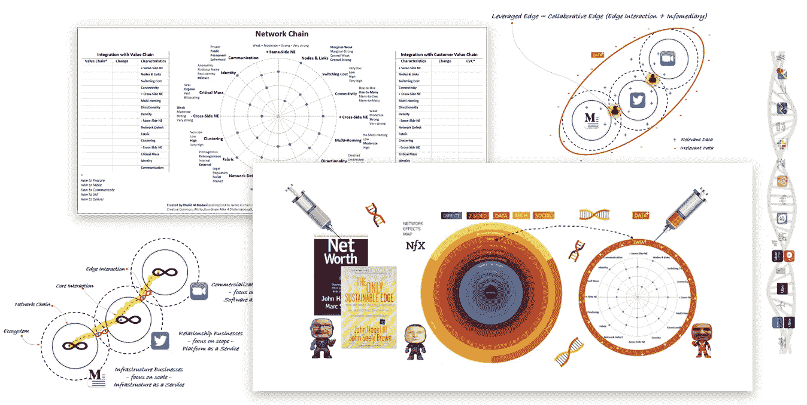

# 网络链——信息媒介、边缘互动和数据+网络效应

> 原文：<https://medium.com/swlh/network-chain-infomediary-edge-interactions-and-data-network-effects-ee0a5bf69d04>

在我最新的 [**帖子**](/@KhalidiAlmadani/network-chain-740b1c5dcc48) 中，我介绍了“网络链”的概念写完那篇帖子后，我看到了[约翰·哈格尔](https://medium.com/u/cfdaf9101507?source=post_page-----ee0a5bf69d04--------------------------------)最近的 [**帖子**](https://edgeperspectives.typepad.com/edge_perspectives/2019/04/infomediaries-a-significant-untapped-opportunity.html) (必读)，这激励我(通过[亚马逊](http://www.amazon.com))买了一本二十年前的书，书名为 [***净值***](https://www.amazon.com/exec/obidos/ASIN/0875848893/ref%3Dase_johnhagelcom-20/102-7090602-7035361) 。在订购这本书时，我无法阻止自己将 [***唯一可持续的优势***](https://www.amazon.com/Only-Sustainable-Edge-Productive-Specialization/dp/1591397200/) 添加到我的购物车中。如果你和我一样，想探索…