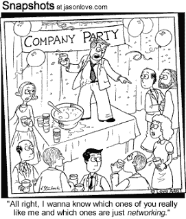

# 网络秘密

> 原文：<https://medium.com/swlh/networking-secrets-46c186229bbc>

在 [*八十年代的隐性就业市场*](http://www.bookfinder.com/dir/i/The_Hidden_Job_Market_for_the_Eighties/0812909739/) 中，汤姆·杰克逊和大卫·梅耶斯报告说，“只有 10%到 15%的工作机会在报纸或中介机构中被引用。”不足为奇的是，在接下来的二十年里，情况几乎没有变化。[就业之星中心](http://jobstar.org/hidden/hidden.php)发现，目前 80%的工作从未登过广告。同时,[职业 X 道路](http://www.ere.net/2012/01/31/employee-referrals-may-be-even-more-effective-than-we-think/)显示 2010 年 28%的工作是通过推荐找到的。典型的职业网站进一步指出，只有 5%的工作是通过回复招聘广告获得的。最后，经典求职手册 [*作者理查德·博尔斯(Richard Bolles)你的降落伞是什么颜色？坚持认为，86%的求职者通过电话推销和人际关系网获得了成功。总的来说，压倒性的证据表明求职的关键因素是人际关系网。*](http://www.amazon.com/What-Color-Your-Parachute-2013/dp/1607741474)

如果人际关系网是神奇的灵丹妙药，是促进有意义的高薪工作的秘密密码，那么我们学会有效地实践这一技能就显得非常重要。为了实现这个目标，我一直在研究这个行业的诀窍。多年来，坦率地说，我唯一关心的事情就是纽约巨人队比赛的票房成绩。但是，在某种程度上，由于成为这个领域的学生，这种情况最近已经改变了。以下是我从研究中提炼出的最佳智慧，并在各种情况下(包括在所有地方，从布拉格到布达佩斯的火车上)应用得非常有效。

1)让自己变得有价值——《人脉小黑书 的作者杰弗里·吉托莫认为，人际关系网的关键是让自己成为他人不可或缺的一部分。如果你想让你的联系人回报你，你必须创造价值或意义。正如吉托默所说，“如果你让自己变得有价值、令人难忘，其他人会*希望*让你成为他们网络的一部分。”在这段引文中，我强调了“想要”这个词，因为这似乎是获得有意义联系的关键因素——他或她*想要*帮忙。当然，如果你已经以某种重要的方式帮助了这个人，这就变得更有可能了。

在我的经验中，宇宙以一种因果和谐的方式运行。你越是让别人了解你，他们就越是了解你。许多伟大的人物都教导相似的原则。阿西西的圣方济各曾写道:“因为我们是在给予中获得的。”孟加拉博学家罗宾德拉纳特·泰戈尔认为“生命是赋予我们的，我们通过给予来赢得它。”即使你没有获得直接的帮助来交换你提供的帮助，它也很可能从另一个来源回到你的身边。在人际交往中，就像经营一家企业或创办一个社会组织一样，我们真的会收获我们所播种的。

2)不断地把自己放在决策者面前——我们中的绝大多数人从来没有把自己完全放在那里。因此，那些成功的人通常会获得巨额回报。这不是什么新鲜事。几千年前，塔西陀·特伦斯写道:“命运偏爱勇敢的人。”威廉·斯普拉格表达了类似的观点，他建议说:“不要等到铁热了才动手，而是要通过敲击使它变热。”

建立关系网时，冒险是很重要的。把自己放在重要人物面前，你就能充分利用你的人脉，为自己提供最大的成功机会。热情拜访(这不同于冷漠拜访，因为你有目标的背景信息，最好是推荐人)，经常向高层提出建议，参加决策者所在的活动，保持强大的公众形象(稍后会详细介绍)，这些技巧可以让你看起来不像是墙上的苍蝇。你越是在决策者面前，并迫使他们评估你的才能，迫使他们考虑说“是的！，“你就越有可能实现你的目标。此外，成功人士的积极品质往往会感染到他们交往的人。也许克里斯托弗·d·弗曼说得好，“如果你想成为赢家，就和赢家在一起。”

至于名人，吉托默建议谨慎行事，保持简洁。他的技巧是说“我是你的超级粉丝”，和目标握手，然后说“祝你一切顺利。”这听起来没什么，但在某些情况下，这个小小的举动——就像他遇到吉姆·凯利时发生的那样——可能会导致更长时间的谈话，而这反过来又可能会导致未来的重要商业交易。最后，沿着同样的思路，哈维·麦凯在他的书《用你的头脑打开你的门》中建议与你的目标公司的员工建立关系网，以了解一种商业文化。他特别建议你缩小一个关键问题的范围:“谁是你的招聘经理？”这将使你能够绕开人力资源部门，而人力资源部门通常会阻碍你的晋升，而这只有决策者才能推动。

3)慢慢建立关系——当你钓鱼时鱼线被咬了，建议不要太快地猛拉鱼竿，因为这可能会使你失去鱼。这同样适用于网络。行动太快，跳过你有希望的线索，你可能会破坏你最初建立的联系。更好的策略是慢慢来，建立更深、更持久的关系。

在 [*社交生存指南*](http://www.amazon.com/The-Networking-Survival-Guide-Success/dp/0071409998) 中，黛安·达林建议主动给潜在客户买午餐，这被认为是自以为是。此外，对于许多日程繁忙的重要人物来说，这似乎是一个过于繁重的要求。达林建议提出在联系人的办公室与其会面 15 分钟，喝杯咖啡。这种低风险的姿态创造了一种更积极的氛围。这也让摆脱困境变得更加容易。最后，一旦你建立了这种初步的联系，一定要继续跟进，不断地在加强这种联系中扮演积极的角色(例如，通过为你的联系人创造价值)。关系需要不断的培养。正是这个基本事实导致伍迪·艾伦开玩笑地把一段关系比作鲨鱼。他的意思是，一段关系“必须不断向前发展，否则就会消亡。”

4)保持公众形象——在新的、竞争异常激烈的就业市场中，被动地提交简历是不够的。一个人必须采用激进的技术才能脱颖而出。在《求职者的游击营销 2.0 一书中，杰伊·康拉德·莱文森和大卫·e·佩里建议发布新闻稿、分发白皮书和/或时事通讯、采用有针对性的电子邮件活动、参与公共演讲项目(在图书馆、疗养院和会议上)、建立网站、写博客、在新闻频道上志愿担任专家或权威人士、向杂志和报纸投稿，以及，一般来说，参与任何需要的措施来建立值得注意的公众形象。

这样做的好处是相当明显的。罗宾·威廉姆斯、奥普拉和理查·基尔没有社交网络。因为他们已经有了一个平台。那么，目标就是让你自己留在雇主的脑海中，并建立你作为所在领域专家的可信度。因为你将为他人提供价值，而且是免费的，雇主将更有可能意识到你，找到你，并雇用你——而无需你打一个陌生电话。

5)利用校友网络、社交网站和/或其他组织联盟——如今，几乎每个人都在 LinkedIn 上。但并不是每个人都有效地使用它，从一个来源获得推荐来帮助你达到你的目标。此外，考虑利用 Classmates.com[、](http://classmates.com/)的力量，参加高中、大学和研究生院的聚会，通过专业或贸易组织建立联系，加入慈善和非营利组织。通过把你的时间贡献给有价值的事业，接触那些和你有过去的人，你不仅会对你的专业领域和你自己在更大的社会领域中的角色有所了解，当你需要下一份工作时，你还会经常接触到对你有用的关键人物。

经常有很多关于人际关系网力量的喋喋不休。例如，人们常说，重要的不是你知道什么，而是你认识谁。当然，网络是强大的。但除非你是在创造价值，维持公众形象，把自己放在重要人物面前，慢慢建立关系，挖掘校友和社交网络，否则这种力量你是得不到的。那么，实践这些策略，同时永远记住我们彼此依赖，没有人是孤岛 。我们需要另一个。依靠我们的网络。他们供养我们，我们反过来供养他们。或者，正如文斯·隆巴迪所说，“个人对集体努力的承诺——这是团队工作、公司工作、社会工作、文明工作的基础。”