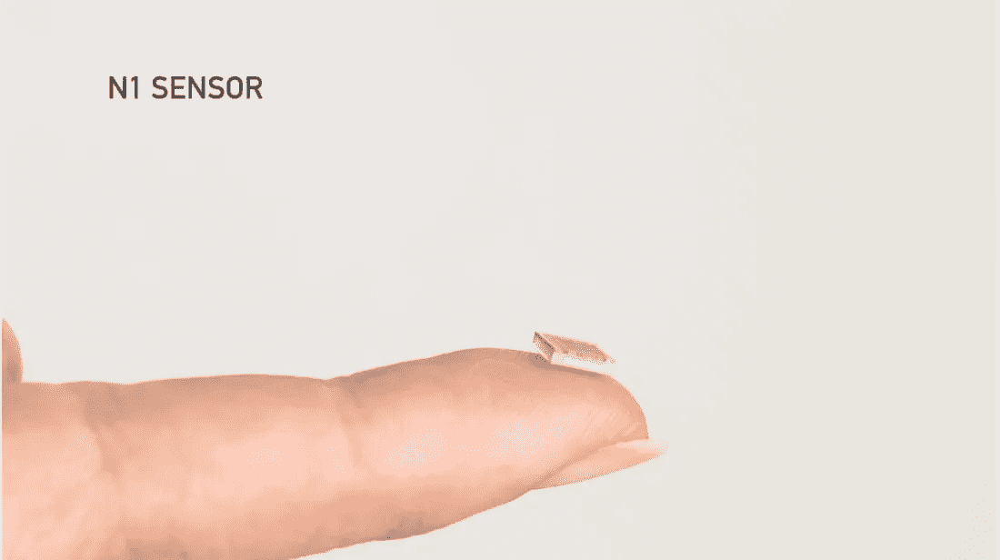
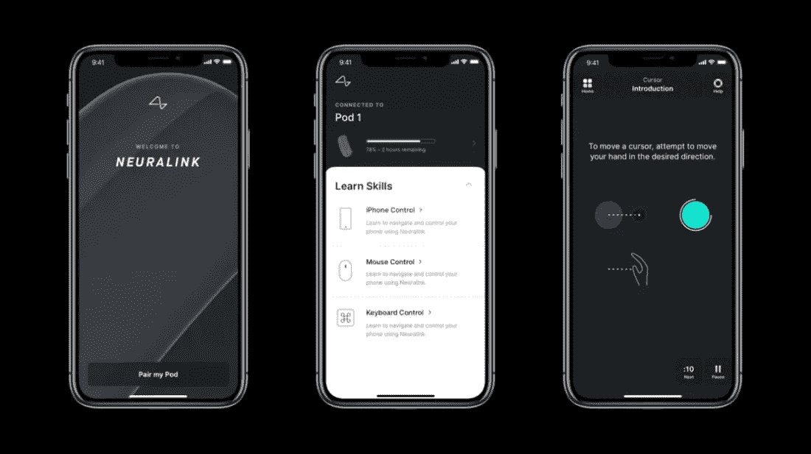
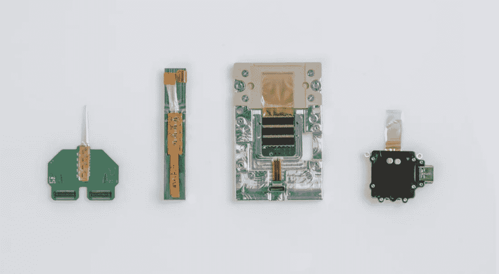
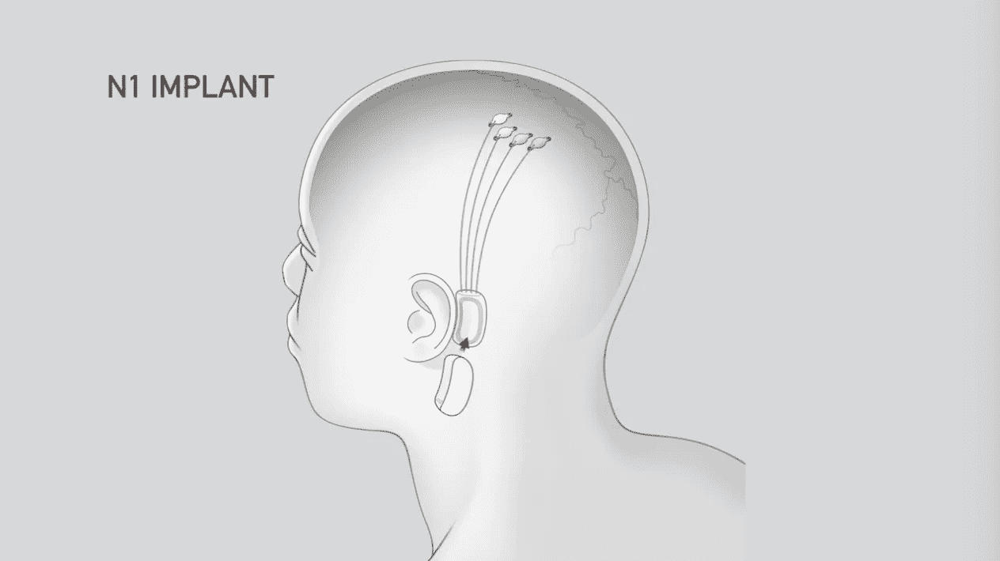

# neural ink:TL；灾难恢复和常见问题

> 原文：<https://medium.com/swlh/neuralink-tl-dr-and-faq-cae0fbd2eb27>

埃隆·马斯克秘密的脑机接口(BCI)公司 [Neuralink](https://www.neuralink.com/) 展示了他们过去两年的工作成果。

该演示展示了一种位于耳朵后面的设备，可以让你用思想控制手机。使用该设备需要经历一个医疗程序，在这个程序中，一个自动机器人将数千个电极植入你的大脑。第一个产品被称为 N-1 传感器，将通过 iPhone 应用程序控制。人体临床研究预计将于 2020 年开始。

**为什么是 Neuralink？**

*   治疗现有的大脑疾病和难以治疗的疾病
*   为老年痴呆症和帕金森症等晚期疾病保留大脑
*   创造一个和谐的未来，以改善沟通和信息传递

# 常见问题解答

**问:我可以买这个吗？**

答:还没有。该小组开始对脊髓损伤后变成四肢瘫痪的病人进行临床试验。

**问:为什么设备需要安装在我的大脑中，而不能作为可穿戴设备使用？**

答:在无法记录来自神经元的动作电位(信号)之前，传感器的距离有一个严格的物理限制。距离大约是 0.006 毫米。

**问:这是从哪里来的？今天存在哪些类似的技术？**

答:目前的 BCI 设备包括犹他阵列，它需要一个大的外部传感器；以及深度大脑刺激器，它被插入到帕金森患者的大脑中，以提供电刺激。

**问:该设备可以做哪些事情？**

答:最初，该设备将用于控制电话、鼠标和键盘，以改善四肢瘫痪者的生活。随着时间的推移，该设备发出的信号将能够识别多种类型的认知功能，包括:运动、视觉、空间地图、言语、情绪、疼痛、饥饿、口渴、记忆、数学推理等。

**问:这款设备会有“应用商店”吗？**

答:现在下结论还为时过早，但很可能开发者将能够利用设备上的数据创建解决方案。唯一的规则是它们不能由广告商业模式来支撑。

**问:该设备的商业模式是什么？**

答:脑损伤的社会成本极高。综合医疗护理、收容所和护理人员是经济负担，可以通过让以前瘫痪的病人有所作为来消除。

问:这是在动物身上做的实验吗？

答:是的，为了确保人类患者的安全，动物试验是科学过程中的一个重要步骤。然而，该团队认真考虑道德因素，并有意设计实验，考虑如何减少、再利用和提炼材料。此外，埃隆证实他们已经将芯片植入猴子体内，它已经学会用思维控制电脑。

## 进一步的细节

目前，我们的大脑由边缘系统(蜥蜴脑)和皮层(大而聪明的穴居人脑)组成，它们一起工作。Elon 打赌 Neuralink 可以引入一种数字格式的第三层，这将补充我们现有的生物学。

该演示主要是作为一个招聘活动，以及深入到产品的科学方面。Neuralink 的一些关键人物值得关注:

*   马克斯·霍达克 —总统
*   [马特·麦克杜格尔博士](https://profiles.stanford.edu/matthew-macdougall)——神经科学家
*   [瓦妮莎·托洛萨](https://www.reddit.com/r/science/comments/2ko351/science_ama_seriesim_vanessa_tolosa_an_engineer/)——神经接口
*   [DJ Seo](https://www.linkedin.com/in/seodj) —植入系统
*   菲利普·塞贝斯——科学家

## 推荐阅读:

[Neuralink 和大脑的神奇未来——等等，为什么](https://waitbutwhy.com/2017/04/neuralink.html)

[使用聚合物电极阵列的高密度、持久和多区域电生理记录](https://www.cell.com/neuron/fulltext/S0896-6273(18)30993-0)

[学习控制脑机接口，让灵长类动物伸手抓握](https://journals.plos.org/plosbiology/article?id=10.1371/journal.pbio.0000042)

[交流的数学理论](http://math.harvard.edu/~ctm/home/text/others/shannon/entropy/entropy.pdf)

## 一些照片:

