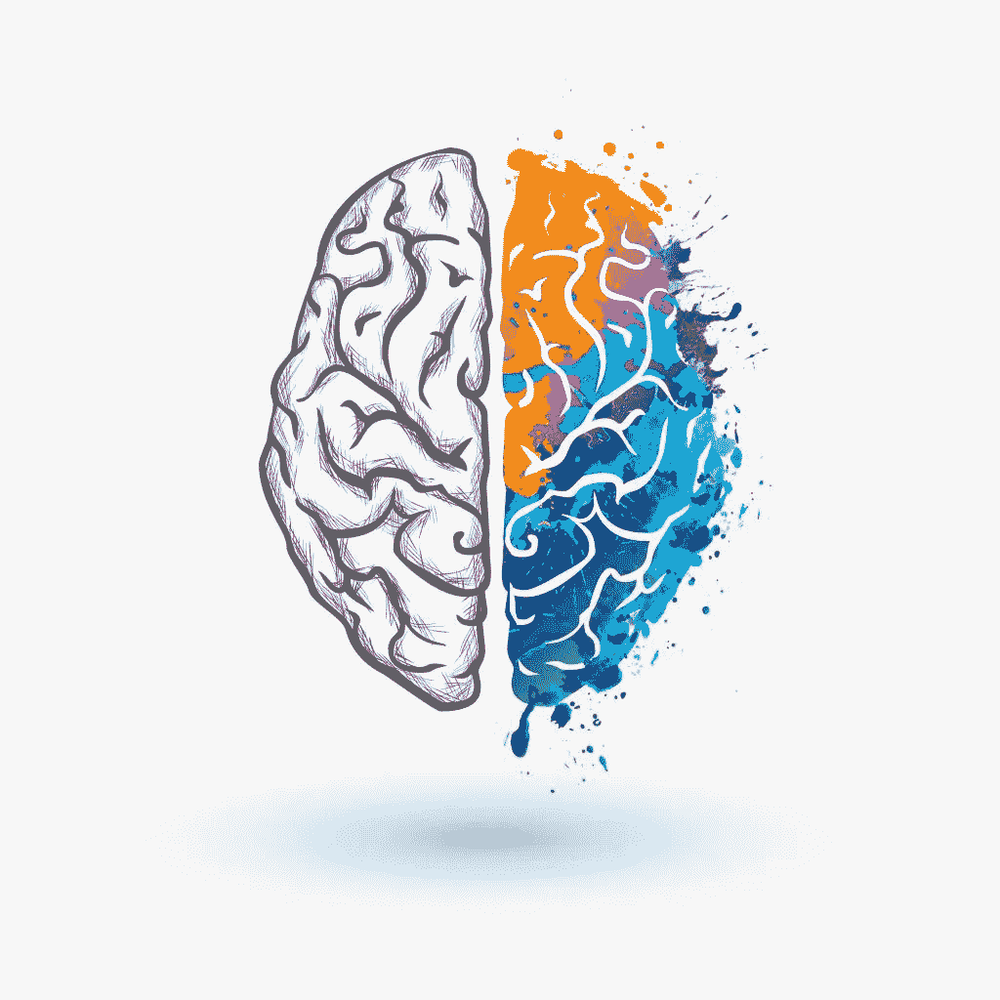
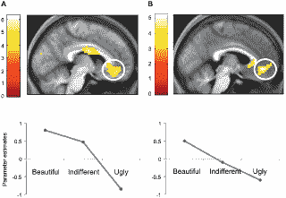
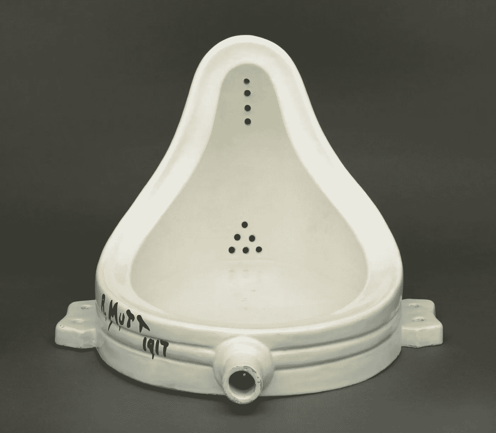

# 神经美学:理解我们对美的感知。

> 原文：<https://medium.com/swlh/neuroaesthetics-understanding-our-perception-of-beauty-eabf06fc65a3>

[Neuroaesthetics and Informative Art](https://www.idashboards.com/blog/2017/08/23/neuroaesthetics-and-informative-art/)

> “只有通过理解支配人类在所有领域——法律、道德、宗教甚至经济和政治，不亚于艺术——活动的神经法则，我们才有希望对人类的本质有更正确的理解。”-瑟米尔·泽基博士。

美的概念一直是哲学中最引人注目的谜题之一。什么是美？是否有一套单一的特征来定义它？美是主观的还是客观的？具有普遍性吗？艺术呢？它的定义是什么？*所有的*艺术都必须美吗？

神经美学是经验美学领域的一门新兴学科，它利用神经科学来理解我们如何在神经层面上体验不同领域(艺术、舞蹈、音乐等)的美。像“美的体验，一种主观的精神状态，*能被量化和客观化吗*？”位于这个新领域的中心。

伦敦大学学院(UCL)的神经科学教授 Semir Zeki 博士对我们欣赏各种形式的美背后的神经过程特别感兴趣。他发表了一篇关于“[一种基于大脑的美丽理论](https://journals.plos.org/plosone/article?id=10.1371/journal.pone.0021852)”(2011)的研究文章，并做了一次 [TED 演讲](https://www.youtube.com/watch?reload=9&v=3E46oWB4V0s) (2012)，解释他在认知神经科学和审美体验领域的发现。泽克博士质疑，当一个人接触到不同的美丽来源时，是否会出现相同的大脑活动，并旨在从理论角度探讨美丽的经历。

[**一种基于大脑的美的理论。**](https://journals.plos.org/plosone/article?id=10.1371/journal.pone.0021852)

Tomohiro Ishizu 和 Semir Zeki 进行了一项实验，向 21 名参与者展示艺术绘画并播放音乐片段。

他们被要求分别从 1-9，最不漂亮到最漂亮进行评分，同时使用功能性磁共振成像(fMRI)扫描他们的大脑活动，以跟踪活动区域。

功能磁共振成像的发现表明，尽管每种类型的刺激都有几个活跃的区域，但情绪大脑的奖赏和愉悦中心的一部分，称为内侧眶额皮质(mOFC)，是唯一一个不管刺激如何都活跃的区域。不仅如此，mOFC 的经济活动与刺激评级(1-9 级)成正比。刺激等级越高，在 mOFC 检测到的血流量(活动增加)越多。不管你是在听一首好听的歌，还是对梵高的画肃然起敬，或者看着一张美丽的脸，你都会在大脑的同一个部位感受到活动。这导致了“基于大脑的美丽理论”的形成

Figure 1: ‘A’ showing brain activity after a visual stimulus and ‘B’ showing brain activity after an auditory stimulus. Circled area is the mOFC, common in both. [Brain-Based Theory of Beauty](https://journals.plos.org/plosone/article?id=10.1371/journal.pone.0021852)

[**美女的烦恼**](https://journals.plos.org/plosbiology/article?id=10.1371/journal.pbio.1001504)

尽管这一领域似乎有希望推进我们对如何处理美的理解，但并不是所有的专家都支持神经美学。神经科学家贝维尔·康威和音乐学家亚历山大·雷丁发表了一篇[文章](https://journals.plos.org/plosbiology/article?id=10.1371/journal.pbio.1001504)，表达了神经美学的一些潜在陷阱。1993 年，艺术家 Komar 和 Melamid 向 1001 名美国人询问了关于他们艺术偏好的问题，试图确定“美国最受欢迎的画作”。结果呢？通常认为不漂亮的东西。

Figure 2: Komar & Melamid, ‘*America’s Most Wanted’* (1994). [This is America’s Most Wanted Painting.](https://www.artsy.net/article/artsy-editorial-komar-melamid-americans-painting-thought-wanted)

根据大多数人的偏好，我们发现乔治·华盛顿在画的中下部，现代步行者在右下部，在他们前面的两只鹿似乎在水上行走！将每个人的喜好组合成一幅作品并不能创造出美丽的东西。因此，一件东西不可能对每个人都是美的，并不意味着它一点也不美。

> “这幅画太乏味了，太可预测了。这就像你可以在凯马特买到的东西。”—布莱恩·凯斯·杰克森致美联社(1994 年)

康威和雷丁担心，量化美可能会给艺术作品创造一个“正确”或“错误”的标准，对于体验它的观众和创作它的艺术家来说都是如此。他们担心这一标准可能会导致人们将艺术与美等同起来，而事实并非总是如此，例如，马塞尔·杜尚的《喷泉》。

Figure 3: Marcel Duchamp, ‘Fountain’ (1964). [Tate.](https://www.tate.org.uk/art/artworks/duchamp-fountain-t07573)

马塞尔·杜尚(1887-1968)是达达运动的先驱；一场质疑艺术是什么以及它应该是什么的艺术运动。杜尚使用商业的、大规模生产的、功利的物品，叫做*现成的*，这违背了艺术必须美丽或者必须具有视觉吸引力的理念。他更关心想法，而不是视觉效果。对美的各种形式的体验是开放的，观众/听众可以自己去解读。

他们还认为，如果我们足够频繁地使用这种方法，我们就会开始用科学来评估我们的主观经验，这可能会很麻烦。

> "如果 mOFC 没有被激活，我们应该否认某人对美的体验吗？"

最后，他们不相信美是一个科学领域，那么为什么要量化和研究它的经验呢？审美体验不是也永远不可能是客观的；他们总是受到文化影响，生物遗传，甚至是[人工制造的](https://www.ncbi.nlm.nih.gov/pmc/articles/PMC4221210/)。例如，一个穆斯林可能会发现清真寺比任何其他宗教礼拜场所更美丽，仅仅因为它有更多的文化和宗教意义。另一个例子是通过大脑刺激来人工增强对美的体验。人们发现，通过电极向大脑中负责工作记忆的左背外侧前额叶皮层传递称为经颅电流的低直流电，可以提高对具象艺术的欣赏。

大约 40 年前，我们无法客观地研究对美的感知。但是今天，科学正在审视人类主观经验的领域，量化曾经被认为是无形的东西。我们可以潜在地测量其他主观体验，比如爱，恨，甚至幸福。

尽管受到批评，这一有争议领域的研究议程仍在继续发展。每天，它推动边界，模糊艺术和科学之间的界限，并探索神秘的概念。你对这次探索有什么想法？你觉得潜力在哪里？

# 参考

 [## 神经美学与美丽的烦恼

### 有关 PLOS 主题领域的更多信息，请点击此处。我们想要…

journals.plos.or](https://journals.plos.org/plosbiology/article?id=10.1371/journal.pbio.1001504)  [## 美丽与大脑:神经美学的新兴领域|艺术|哈佛深红

### 神经美学，一个创新但有争议的神经科学研究新领域，有潜力帮助我们…

www.thecrimson.com](https://www.thecrimson.com/article/2017/11/10/neuroaesthetics-cover/)  [## 神经美学

### 神经美学是一个新的研究领域，出现在交叉的心理美学，神经科学和…

neuroaesthetics.net](https://neuroaesthetics.net/neuroaesthetics/)  [## 神经美学正在扼杀你的灵魂

### 对科学趋势稍有兴趣的人都不会不注意到大脑是下一个大…

www.nature.com](https://www.nature.com/news/neuroaesthetics-is-killing-your-soul-1.12640)  [## 审美经验的认知神经科学。NCBI 公共医学学院

### 透视心理学。2016 年 3 月；11(2):265-79.doi: 10.1177/1745691615621274。

www.ncbi.nlm.nih.gov](https://www.ncbi.nlm.nih.gov/pubmed/26993278)  [## 设计心理学和 UX 的神经科学

### 阅读这篇文章的西班牙语版本，有一门科学解释了为什么特定的设计…

www.toptal.com](https://www.toptal.com/designers/ux/design-psychology-neuroscience-of-ux)  [## 关于设计，认知科学教会了我什么

### 我毕业于弗吉尼亚大学，获得了认知科学学士学位。每次我告诉别人，他们的…

www.invisionapp.com](https://www.invisionapp.com/inside-design/cognitive-science-design/) 

[https://www.whyarewehere.tv/people/semir-zeki/#](https://www.whyarewehere.tv/people/semir-zeki/)

 [## 森马·泽克:情人眼里出西施| EarthSky.org

### 根据 2011 年在线期刊上的一篇论文，美不在情人眼里出西施——而是在大脑中。在一个…

earthsky.org](https://earthsky.org/human-world/semir-zeki-beauty-is-in-the-brain-of-the-beholder)  [## 神经美学

### 伊曼纽尔·杜南/法新社/盖蒂图片社威廉·德·库宁，著名的荷兰裔美国抽象表现主义画家…

www.the-scientist.com](https://www.the-scientist.com/cover-story/neuroaesthetics-37572)  [## 走向基于大脑的美丽理论

### 我们想知道大脑相同区域的活动是否与对美的体验相关…

journals.plos.org](https://journals.plos.org/plosone/article?id=10.1371/journal.pone.0021852)  [## 美丽点亮大脑的地方——访神经科学家塞米尔·泽克《大脑世界》

### 法国人有一句话，chacunàson got，意思是“各人所好”。这可以适用于几乎任何事情…

brainworldmagazine.com](https://brainworldmagazine.com/beauty-lights-brain-interview-neuroscientist-semir-zeki/)  [## 世界可以看起来更好:用大脑刺激增强美容体验

### 审美是我们日常生活的一部分:它是我们在看一幅画时做出的主观判断，是一种…

www.ncbi.nlm.nih.gov](https://www.ncbi.nlm.nih.gov/pmc/articles/PMC4221210/)  [## 这是美国最想要的画

### 你最喜欢什么颜色？你喜欢尖角的画还是柔和曲线的画？你喜欢光滑的画布还是…

www.artsy.net](https://www.artsy.net/article/artsy-editorial-komar-melamid-americans-painting-thought-wanted)