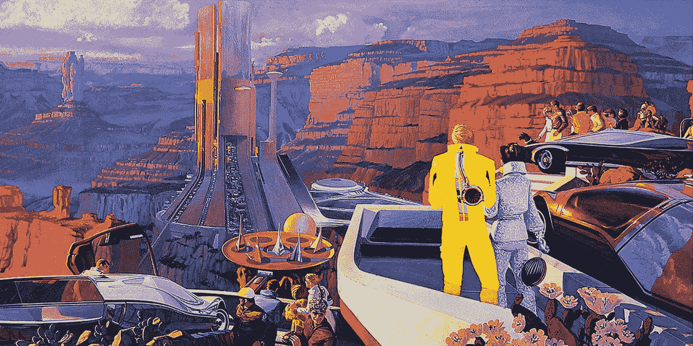

# 神经神话:关于大脑的 10 大误解

> 原文：<https://medium.com/swlh/neuromyths-the-10-top-misconceptions-about-your-brain-51675a4f4c4f>

# (以及如何利用这些优势)

Image Credit: [Syd Mead](http://sydmead.com/syd-mead-steel-series/)

> "人们相信的神话往往会变成真的."
> 
> —乔治·奥威尔

# 定义

> 神经之谜——一种普遍持有的关于思想和大脑如何运作的错误信念。