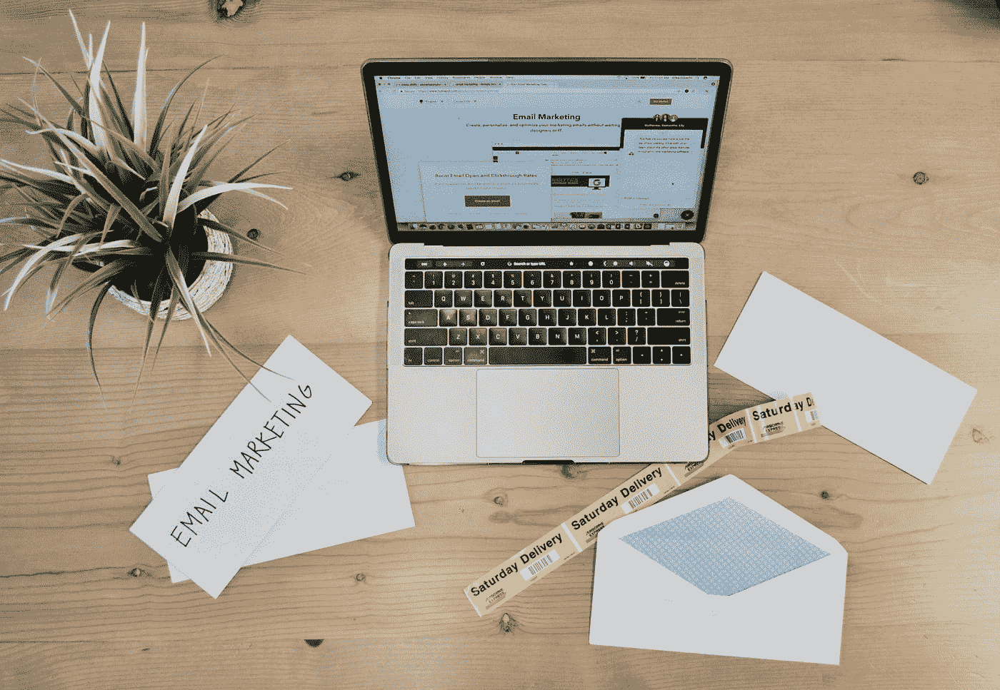

# 新的 2019 年行为数据研究揭示了 2019 年最佳在线广告实践

> 原文：<https://medium.com/swlh/new-2019-online-behaviour-data-study-reveals-2019-best-ad-practices-63bc5d690942>

广告拦截对你的活动来说是个坏消息

Photo by [Campaign Creators](https://unsplash.com/@campaign_creators?utm_source=medium&utm_medium=referral)

我们都经历过，都很讨厌。广告。数字说明了一切。展示广告的点击率平均为 0.1%，这意味着只有千分之一的人真正点击了[的横幅广告类型](https://www.invespcro.com/blog/effectiveness-online-advertising/)。其余人根本不看他们。这是可以理解的，当你知道…