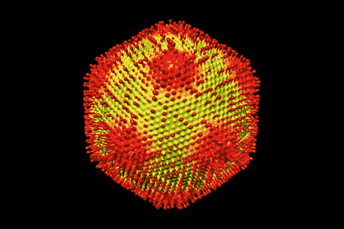

# 新的巨型病毒可能有助于理解复杂生命的出现

> 原文：<https://medium.com/swlh/new-giant-virus-may-help-understand-the-emergence-of-complex-life-e147713b14b8>

来自日本的一组研究人员发现了一种新的大型 DNA 病毒，这可能有助于科学家更好地理解 DNA 复制的起源和复杂生命的进化。

水母病毒的发现为更复杂生命的进化提供了线索。今年早些时候发表在《病毒学杂志》上的论文已经掀起了波澜…