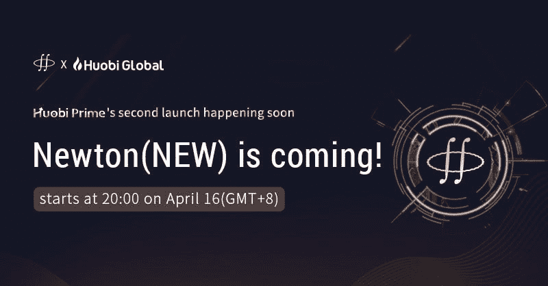

# 新的 Huobi Prime 已准备好参与！是吗？

> 原文：<https://medium.com/swlh/new-huobi-prime-is-primed-for-participation-are-you-ee9baa2a3cfb>

*智力是适应变化的能力——斯蒂芬·霍金*

三月中旬推出的 Houbi prime 是 Huobi stable 的最新创新。与其他交易所代币发行平台不同，Huobi Prime 采用了 DPO(直接溢价发行)模式，而不是常规的 IEO(初始交易所发行模式)上市。

按照这种模式，在 Huobi Prime 上市的项目将有三轮发售过程。每一轮，硬币将以折扣价出售，下一轮价格会继续上涨。举个例子，一枚硬币在第一轮可能会便宜 30 %;也许第二轮会提供 20%的折扣，而最后一轮只提供 10%的折扣(这些比率随着项目的不同而不断变化)。

**与其他平台相比，火币 Prime 的独特之处包括**

*   通过 Huobi Prime 购买的硬币立即存入，可以在 Huobi Global 上交易。
*   硬币的标价低于市场价格。
*   精心挑选的项目，一遍又一遍地检查，以确保质量。

第一个上市的项目是 Top Network，几秒钟内就销售一空。这种疯狂的热潮使得火币团队做出了一些令人兴奋的改变，以帮助交易者获得更好的交易体验。

引入了三个主要变化。他们在哪里

# 修改的 500 HT 规则:

现在，Huobi 已经强制要求用户在过去 30 天内平均每天持有 500 HT 或以上，才有资格参加 Huobi Prime。

或者你可以确保你的账户中总是有 500 HT，或者如果你没有所需的平均值，那么你可以购买更多的 HT，这样你的平均需求就会得到满足。

还有一点就是根据你账户中 HT 的日均持有量设置的交易限额。你拥有的越多，交易限制就越多——这是持有 HT 的又一大理由。

# 更短的交易周期。

与第一次上市不同，Prime 将进行 5 分钟的活跃交易，中间有 5 分钟的休息时间，而不是 20 分钟的交易，中间有 10 分钟的间隔。在这几轮中，将按照先到先得的原则向用户提供折扣代币，折扣代币在第一轮中将占高级代币总供应量的 20%，在第二轮中将占 30%。

# 一个特殊的社区回合将在那里举行

为了确保所有交易者都得到回报，Huobi Prime 将进行第三轮交易，其中将提供 50%的余额令牌。所有在第三轮发出买入订单的合格交易者将有机会通过基于下面给出的计算调整后的系统匹配至少部分完成他们的订单。

一个条件是必须以最高买价下单才能部分成交，成交金额与订单大小正相关。订单将根据以下公式填写

Huobi Prime 上的下一次 DPO 将于 2019 年 4 月 16 日 20:00 GMT+8 开始。只有 2%的新代币将被分配，Prime 将寻求筹集不到 500 万美元的资金。

所以要快，为 4 月 16 日做好准备。

***免责声明*** *:本文不作为投资建议。这只是我个人对火币素数的看法。你应该总是做自己的研究。*

## 这篇文章发表在 [The Startup](https://medium.com/swlh) 上，这是 Medium 最大的创业刊物，拥有+444，678 读者。

## 订阅接收[我们的头条新闻](https://growthsupply.com/the-startup-newsletter/)。

