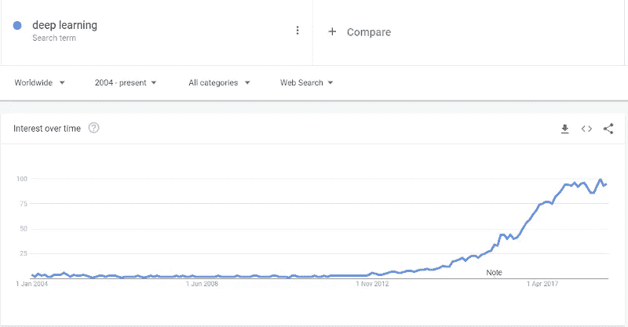

# 下一个车库创业想法:人工智能

> 原文：<https://medium.com/swlh/next-garage-startup-idea-artificial-intelligence-d430cf6ac43d>

Photo by [Angely Acevedo](https://unsplash.com/@angelyviviana55?utm_source=medium&utm_medium=referral) on [Unsplash](https://unsplash.com?utm_source=medium&utm_medium=referral)

就在几十年前，史蒂夫·乔布斯和比尔·盖茨开始通过将不可能变为可能来彻底改变技术世界。

他们让我们有机会像现在一样享受科技。每天都是。

他们的发现让我们的生活变得更好。

而且不仅仅是他们。人类历史上有许多伟人，所以当我们回首往事时，我们很容易就能记住他们:

> 比尔·盖茨、史蒂夫·乔布斯、杰夫·贝索斯、埃隆·马斯克、谢尔盖·布林、拉里·佩奇、马克·扎克伯格以及其他许多人…

他们的发现改变了世界和我们的生活。

当他们看到了一个不同的未来，并在他们的脑海中带着一个新世界的突破性愿景时，其他人并没有意识到这一点。

所以现在，让我问你一些事情。

> 你真的知道此时此刻世界上正在发生什么吗？你知道对我们的未来有巨大影响的下一件大事是什么吗？

就像我的一个朋友说的:“新的电被发现了”。

对我来说，它甚至超越了这一点。它比电重要得多。所有我们现在认为不可能的事情将会比我们想象的更快成为可能，这都是因为一个现象。

## 人工智能。

我不会在这里告诉你艾的发展历史，这不是本文的主题，但我想向你展示这一现象在过去几年中的快速发展。

让我给你看一个解释一切的图像。

如你所见，飞机已经起飞了:)

所以这里的问题不是关于人工智能的历史、重要性、发展或好与坏的特质。这里的问题是:

你准备好乘坐这架飞机了吗？

## 今天的投资将在 10 年后产生巨大影响

就像导致今天的大公司成立的其他技术发现一样，人工智能将导致未来的公司在一个对我们来说更好的地方重新设计我们现在知道的世界。

如果你阅读数字革命的历史，你会发现每一项发明都对人类产生了巨大的影响，它们让我们的生活变得更轻松、更美好。

一个接一个。

硬件行业的发展导致了像苹果这样的电脑公司的存在。

随着互联网的兴起，谷歌、亚马逊这样的公司进入了我们的生活。

Web 2.0 将互联网变成了一个更好、更具互动性的地方。

静态网站被动态网站所取代，让每个人都有能力贡献并积极参与不断增长的网络世界。

就这样，脸书和推特诞生了。

如你所见，一个发展到另一个。那么，下一步是什么？

## 为什么这个标题是“下一个车库创业想法:人工智能”？

所有伟大的想法都是从小处开始的。车库的想法是这一概念的象征性表现。如今，车库故事成为当今最大的科技公司和发明的幕后推手。

## 革命现在开始

我们正处于一场重大变革的开端。

你可能成为未来的下一个比尔·盖茨或史蒂夫·乔布斯……谁知道呢？

重点是 AI 给我们所有人带来了很多机会。为了能够改变未来，我们必须觉醒并采用这项技术。我们需要投入时间去学习它，拥抱它。与以前只有几个人改变世界相比，现在我们可以一起建设未来。

> 有一个重要的事实你千万不要错过。这是一个事实，我们生活在一个你今天所做的事情可以在 10 年后产生巨大的全球影响的时代。我不知道 10 年后谁会是下一个大的巨型公司，但我知道人工智能将成为这些公司的核心。

## 采取行动，成为变革的一部分

你是谁并不重要。这是对每个人的呼唤，包括我，我想在那个人工智能平面里，设计一个新的未来。我不知道你现在在做什么，也不知道你的目标是什么，但我再问你一次。

## 你准备好乘坐这架飞机了吗？

这是呼吁:

*   **政府，**把人工智能带到你国家的每一个领域。改造每一个领域，抓住未来。把 AI 放到你的教育体系里，从现在开始教育人们关于 AI 的知识。
*   **同学**，AI 将引领我们的未来，所以不要错过。从今天开始赶上潮流。当你毕业时，公司会寻找数据科学家和人工智能专家。所以做好准备。
*   **首席执行官们**，在想你们公司的下一个重大创新是什么？答案很清楚，艾。现在就开始投资吧。如果你希望你的公司在未来还活着，拥抱 AI。
*   **投资人**，自问把钱投在哪里？万一你不知道，请再读一遍文章:)
*   **产品经理**，思考如何提升你的产品？利用人工智能提供给你的美丽，让你的产品甚至市场本身都提升起来。
*   **开发者**，你能学到的下一件大事是什么，你能获得哪些技能？数据、机器学习、深度学习等。别停下来。去吧。你现在所知道的软件开发将会比你想象的更快的被改变。
*   **医生和研究人员**，对于拥有一个额外的超级智能大脑，帮助全球数百万人，你怎么看？AI 应该是健康产业的重中之重。
*   **院士**，用 AI 的力量，让年轻的心灵尽快进入这个领域，一起成为你所在领域的先锋。
*   **创业者**，寻找下一个辉煌的创业公司？我不知道你对什么有热情，你想完成什么，但我知道如果你不在你的下一个项目中应用人工智能，你会错过航班，你不会走远。
*   **营销人员**，你知道营销是一门学问。那个地区正在发生一些新的事情。你可以在你的领域利用人工智能。不要停下来，努力去做。

等等等等…

这个清单可能很长，但我相信你已经抓住了重点。每个人都可以利用 AI 达到更好的目的。

这是你几乎可以在任何地方应用的东西，它刚刚开始改变我们的未来。

所以，醒醒吧，行动起来。成为变革的一部分，让我们一起改变未来。

*最初发表于*[T5【huseyinpolatyuruk.com】](https://huseyinpolatyuruk.com/next-garage-startup-idea-artificial-intelligence/)*。*

**每个👏如果你喜欢这篇文章，欢迎！**

我写关于编程、技术、人工智能、初创公司和自我成长的文章。如果你 [**在 Twitter 上关注我**](https://twitter.com/h_polatyuruk) **我不会用不必要的帖子浪费你的时间。👍**

## 这篇文章发表在 [The Startup](https://medium.com/swlh) 上，这是 Medium 最大的创业刊物，拥有+408，714 读者。

## 在这里订阅接收[我们的头条新闻](http://growthsupply.com/the-startup-newsletter/)。

