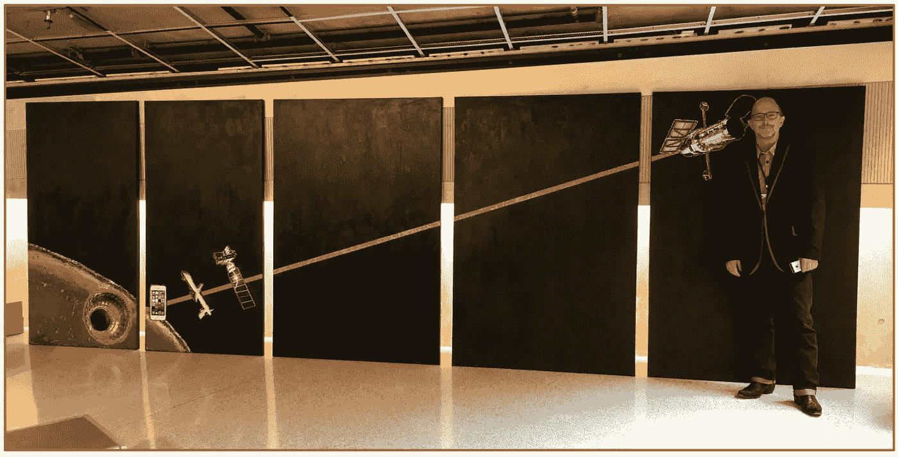

# 尼采的望远镜:哈勃的哲学深渊

> 原文：<https://medium.com/swlh/nietzsches-telescope-the-philosophical-abyss-of-hubble-81312a1043a3>

“Rope Over Abyss (Nietzsche’s Telescope),” mixed-media installation (6 feet x 18 feet) by Barry Vacker (pictured) and Liza Samuel. Developed for the Media Ecology Association Conference, University of Toronto, June 27–29, 2019\. Photo of Barry Vacker, by Gail Bower, 2019, used with permission.

零分，零分，零分。我们已经发现了两万亿个星系，但是没有外星人，没有神，也没有人类存在的普遍意义。在达尔文之后，尼采知道人类在过去和科学未来之间面临着巨大的存在主义空白，这引发了著名的短语“人是拉在动物和超人之间的一根绳子——一根跨越深渊的绳子。”

正如上面的艺术作品所描绘的，从大型强子对撞机到哈勃太空望远镜，是一层层的介质，是 21 世纪哲学尚未涉足的技术。至少在任何被广泛接受的或全球范围内都没有。 ***阿波罗 11 号以来的五十年表明。*** 部落和勇士们经营着这个星球，尽管阿波罗和哈勃的消息显而易见。

作为人类历史上最著名的望远镜，哈勃给我们展示了恒星、星云、星系和许多其他史诗般的宇宙现象的奇妙图像。其最深刻的图像是“深视野”系列，其中望远镜瞄准了银河系夜空中的微小黑点。在每个小空间中，哈勃收集了来自距离地球数十亿光年的数千个星系的光线——这是一个令人惊讶和完全令人震惊的发现。迄今为止，还没有造物主费心去拍摄任何一张哈勃图像，也没有被广泛接受的世俗哲学将我们与这个浩瀚而令人敬畏的宇宙联系起来。

我们可以说哈勃望远镜是尼采的望远镜。

One of the Hubble Extreme Deep Field images. Courtesy, NASA; image in the public domain. Each speck of light is a galaxy with billions of stars.

# 紧随达尔文和哈勃之后

在《查拉图斯特拉如是说》中，弗里德里希·尼采推测，既然人类是从类人猿进化而来的高级物种，那么可能会有一个同样更高级的物种从人类进化而来——他称之为“超人”尼采想知道:

*“猿人是什么？一个笑柄，一个耻辱。人对于超人来说也是一样的:一个笑柄，一个耻辱的东西…人是一条绷在动物和超人之间的绳子——一条跨越深渊的绳子。*【1】

那么接下来会发生什么呢？人类进化的下一阶段，尤其是我们的智力和哲学进化，会出现什么？哈勃太空望远镜揭示的宇宙之后会发生什么？

哈勃望远镜以埃德温·哈勃(Edwin Hubble)的名字命名(他在 20 世纪 20 年代发现了膨胀的宇宙)，代表了人类最伟大的科学和技术成就之一——展示了人类理性和合作的力量，以及无限的创造力和好奇心。对于深视场图像，人眼的视觉能力被放大了 40 亿倍！

通过揭示一个拥有两万亿个星系、跨越 1000 亿光年的巨大宇宙，哈勃望远镜是跨越 21 世纪存在主义和哲学深渊的绳索。 与此同时，哈勃望远镜为艺术家、电影制作人和哲学家提供了一个巨大的机会来创造新的宇宙叙事，将人类与宇宙的崇高威严联系起来。

# 哲学深渊上的绳索

尼采想知道人类进化的下一阶段会出现什么。我们可以问哈勃太空望远镜一个类似的问题:

*从深空图像和人类历史上最著名的望远镜中可能会出现什么新的哲学？*

到目前为止，这种哲学还没有出现，也没有对人类用来解释他们的起源、命运、意义和目的的主流叙事提出任何挑战。主导的叙事是有神论、部落主义、民族主义、家庭和消费主义，所有这些都通过滚动社交媒体和谷歌新闻阅读器的日常狂欢得到了证实。当然，科学和生态学已经在这些叙事上做出了小小的让步，但是并没有基于这些事实的广泛的跨国文化叙事:

—全人类共享 99.5%的相同 DNA，是与数百万其他物种共享的行星生命系统的一部分。

—我们是一个微小(但聪明)的物种，在一个星系中绕着一颗恒星运行的一颗行星上，在点缀着 1000 亿光年宇宙空间的两万亿个星系中。

伽利略之后的四个世纪，哈勃通过展示我们是绝对虚无的中心，是宏伟而冷漠的宇宙中的一个微小物种，成倍地提升了我们的非中心性。所有 21 世纪的哲学都存在于哈勃望远镜之后。

# 上帝和哲学都“死了”

阿波罗任务、 *2001* 和最初的*星际旅行*电视连续剧将我们带入了一个未来，有机会建立一个统一的行星文明，但我们拒绝了它，因为我们不愿意接受我们是一个单一物种，居住在无限宇宙中围绕着燃烧的氢球旋转的含水岩石上。

通过阿波罗，我们已经在 45 亿岁的月球上行走，通过哈勃太空望远镜，我们已经仔细观察了 137 亿年，这是可观测宇宙的年龄——但看不到一个创造者。正如尼采在阿波罗和哈勃之前说过的一句名言:“上帝死了。”阿波罗从太空拍摄的地球照片和哈勃深空图像已经抹杀了支持我们用来解释我们的起源、意义和命运的主导叙事(神学、民族主义和部落主义)的基本原理。然而，我们的物种仍然完全否认。

在*《大设计*》(2012)中，史蒂芬·霍金和列纳德·蒙洛迪诺声称“哲学已死”(第 5 页)。他们写道:“我们好奇，我们寻求答案。生活在这个时而仁慈时而残酷的广阔世界中，凝视着头顶的浩瀚苍穹，人们总是会问许多问题:我们如何理解我们所处的世界？宇宙是如何运转的？现实的本质是什么？这些都是从哪里来的？宇宙需要造物主吗？……传统上这些都是哲学的问题，但是 ***哲学死了*** 。哲学跟不上现代科学的发展，尤其是物理学。”(第 5 页)。

当然，哲学仍然活跃在学术期刊、亚马逊书籍和巴诺书店不断缩小的哲学版块中。但是，作为流行文化中的一股力量，当代哲学在很大程度上已经死亡，主要是因为它没能跟上当代宇宙学的发现。在阿波罗和哈勃望远镜取得惊人成就之后， ***哲学未能产生一种流行的宇宙叙事*** 将人类物种的起源和命运融入浩瀚而奇妙的宇宙。

这场“死亡”始于阿波罗 8 号和地出 11 号的撞击，并持续到 21 世纪。当然，像卡尔·萨根、尼尔·德格拉斯·泰森、丽莎·蓝道尔和理查德·道金斯这样的科学家写过科普书籍，但这并不等同于为人类在哈勃宇宙中的生存写哲学，一种给我们意义、目的和希望的哲学。世俗哲学的尸体——因为生活在哈勃宇宙中——在长期播放的电视连续剧*远古外星人*中充分燃烧，我已经在《灵媒》中[写了关于它的](/explosion-of-awareness/ancient-aliens-evidence-of-stephen-hawkings-claim-that-philosophy-is-dead-7a06e4a28fbe)。

# 笑柄

似乎大多数人类显然不能理解我们最伟大的科学成就和最重要的哲学发现的矛盾意义: ***宇宙是浩瀚和雄伟的，而我们的物种是微不足道的，可能完全没有意义*。我们的物种已经发现我们居住在一个巨大的宇宙中，在这个宇宙中，我们并不是中心，我们只存在了宇宙时间中的一个瞬间。在过去几十亿年和未来几万亿年的浩瀚宇宙中，我们的存在可能毫无意义或目的。**

或者，也许可以在“我们是宇宙认识自己的一种方式*——自我意识的“明星”【正如卡尔·萨根所说】这一概念中找到某种宇宙意义。到目前为止，我们这个物种已经被证明过于虚荣和恐惧，无法前进*并根据我们在宇宙中的实际位置开发新的故事，心胸过于狭隘，无法拥抱我们共同的进化起源，为我们的长期未来和地球的健康创造共同的命运，地球是为我们提供生活、爱和探索宇宙的资源的家园。**

**像尼采的猿类一样，我们是一个 ***哲学笑柄，*** 一个由高级猿类组成的星球，他们仍然相信造物主对我们和我们的国家有着超级特殊的命运，这一计划表明我们是我们 47 亿岁的星球和 137 亿岁的宇宙的中心——仍然是所有价值、意义和目的的中心。我们的部落必须有多自恋？我们真的真的相信氢原子进化了 130 亿年，以至于在宇宙偏远地区的一个小行星上的一个物种可以假装它是宇宙的中心，而事实上那个物种是什么也不是的中心？**

**然而，我们的部落用数千枚核导弹武装自己，显然渴望现实生活中的世界末日，就像最初的《人猿星球》(1968 年)。正如宇航员泰勒(查尔登·海斯顿)所说，“在那里，一定有比人更好的东西。必须如此。”泰勒肯定是正确的，因为就我们所生活的浩瀚宇宙的哲学而言，我们是一个笑柄。**

**我们最受欢迎的太空电影都是关于战争、部落主义和自恋的人类心理剧——尤其是《星球大战》电影。我们被迷惑、精神错乱、极度危险，对宇宙中的其他物种构成威胁。比我们更好的东西？必须是！**

# **后哈勃发射？**

**大多数人似乎太害怕拥抱进化和哲学的空白石板，它首先由 2001 年*的《太空漫游》和 1968 年来自斯坦利·库布里克的艺术和哲学杰作*所象征。高大、光滑、美丽而冷漠的巨石是敬畏、奇迹和宇宙虚空的象征，但它也是我们为人类物种的未来书写[新哲学的高耸的空白石板。哈勃图像代表了同样的东西，一个新的哲学开端的白板，一种思考人类世人类生存和责任的新方式。](/explosion-of-awareness/honoring-the-50th-anniversary-of-2001-the-monolith-and-hope-for-the-human-species-1704c93501a0)**

**我们是一个充满希望的物种，正是这个物种在 2001 年*触碰了黑色巨石，然后将骨头抛入太空，开始探索宇宙。我们是从非洲大草原出现并进化成人类的猿猴，是成为宇航员的猿猴，是成为宇航员的投掷矛者。在我们中间出现了对我们在宇宙中的位置感到好奇的艺术家和哲学家，以及将我们的意识扩展到太空和整个宇宙的科学家和技术专家，他们为我们的起源和命运提供了非凡的新视角。我们是聪明勇敢的物种，我们用望远镜仰望星空，说:“管它呢！我们去争取吧！”于是我们把阿波罗发射到月球，把哈勃太空望远镜指向宇宙的边缘。***

**就像 2001 年的*中的猿类一样，我们已经将 ***技术*** 骨头抛向空中，但我们还没有进化到超越凝视地球在太空中升起的星子。我们什么时候将 ***哲学*** 骨发射到宇宙中？这是库布里克在 2001 年底提出的问题，星子出现在黑暗的宇宙中，地球在他的注视下升起。作为一个太空物种，人类将在一个充满无限可能性的令人敬畏的宇宙中做什么？***

*如果《星球大战》和露天开采月球是我们所拥有的最好的东西，我们就会成为笑柄。*

# ***宇宙的崇高***

*我们需要一个深刻的哲学转变来匹配哈勃深场，一个新的哲学来匹配新的宇宙观。它需要拥抱由阿波罗和哈勃望远镜提供的巨大的“意识爆炸”。哲学需要将我们微小的存在与宇宙的浩瀚和雄伟联系起来，特别是阿波罗从太空拍摄的地球图像和哈勃拍摄的宇宙图像。这种联系不仅存在于科学中，也存在于崇高的美学中——敬畏、惊奇和广阔的体验压倒了一个人的情感和自恋的世界观，而 ***指向了对我们存在的新理解。*** 崇高是同声体验的:*

*—无限(宇宙的无限)和无限小(我们在地球上的微小自我)*

*在宇宙的庄严和美丽面前的兴奋，以及我们以前的叙述的消失*

*—存在的空虚和它召唤出来的自由，在宇宙中按照它的本来面目，而不是按照我们希望的样子，重新塑造我们自己的力量。*

*正是宇宙的崇高可以激励人类超越当前的叙事，拥抱一种统一的体验，将人类与宇宙和我们物种的更大叙事联系起来。[2]*

*科学本身是不够的，尤其是当它得到战争、征服和竞争的补充时。相反，应该是艺术、美学和哲学引导我们和我们的科学进入哈勃宇宙的虚无和神奇。艺术家、理论家、哲学家是时候加入到创造这种新的哲学和叙事的努力中来了。[3]*

*[1]弗里德里希·尼采，《查拉图斯特拉如是说:一本适合所有人而不适合任何人的书》(纽约:企鹅出版社，1972)，26 页。引用尼采的话，并不意味着我一定同意他写的一切或任何东西，除了他宣称上帝“死了”并提出了一个深刻的问题:人类会进化成什么？*

*[2]当然，这个概念只是一个起点，尽管我在我的中期论文《意识的爆发》中用它来概述一种新的哲学*

*[3]这也是我参与创作《深渊上的绳索》(尼采的望远镜)的原因之一混合介质和丙烯酸浮石。6 英尺 x 18 英尺。灵感来自国际获奖散文:[《媒体(S)scene 中的热与凉》，](/mediascene/hot-and-cool-in-the-mediascene-a-mcluhan-style-art-and-theory-project-658ce02a6af8)朱莉娅·希尔德布兰德和巴里·瓦克尔(2018)。*

*艺术作品中的照片和图形图像，从左到右:欧洲粒子物理研究所大型强子对撞机上的小型μ子螺线管探测器。苹果 iPhone，五角大楼部署的捕食者无人机。美国宇航局卫星图像。美国宇航局哈勃太空望远镜。*