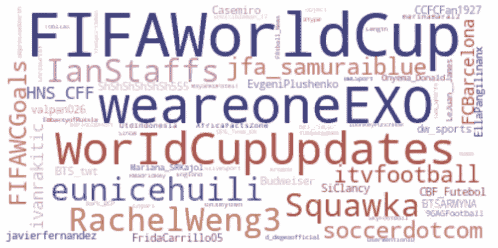
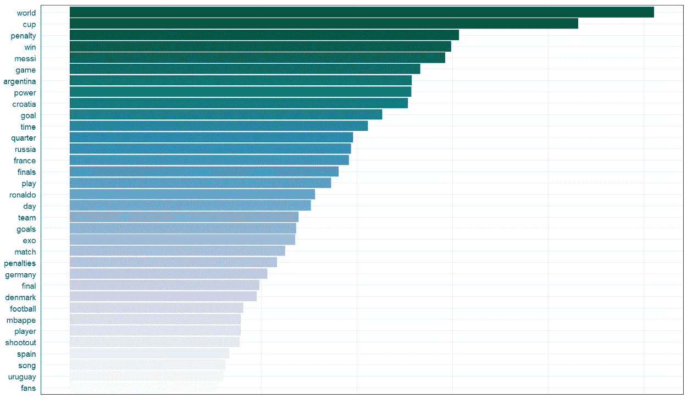
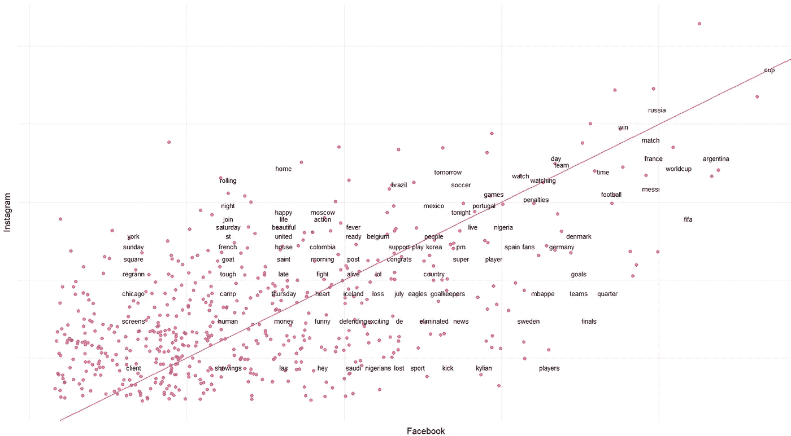
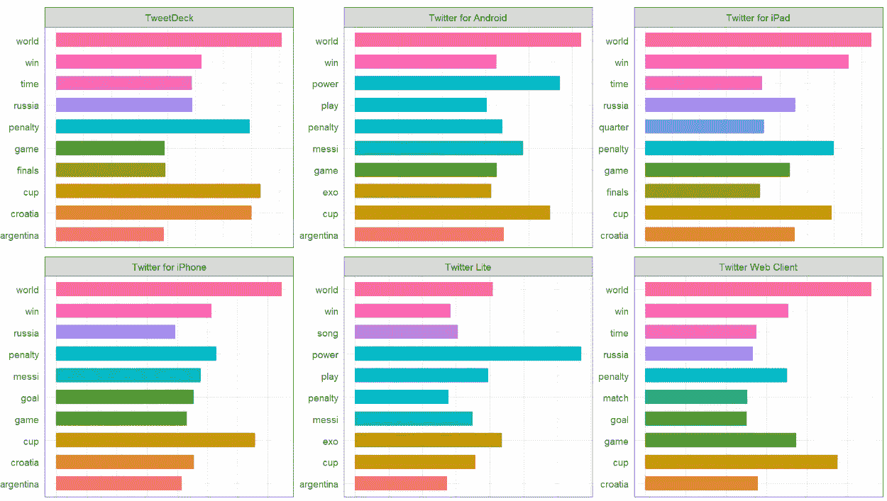
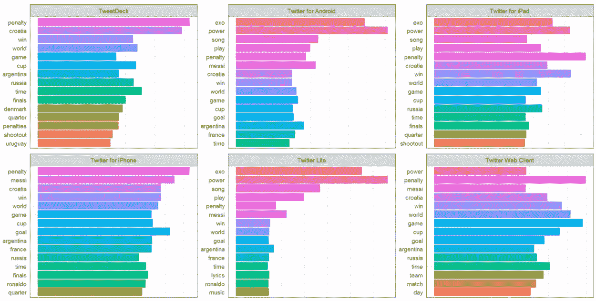
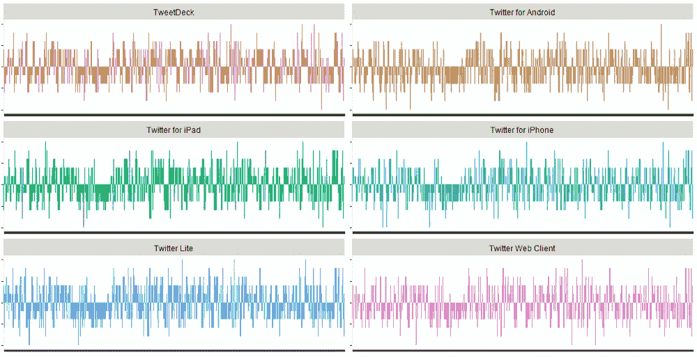

# R 语言中的自然语言处理文本可视化和 Twitter 情感分析

> 原文：<https://medium.com/swlh/nlp-text-visualization-twitter-sentiment-analysis-in-r-65b14240258f>

国际足联世界杯(FIFA World Cup)通常简称为 T2 世界杯(FIFA World Cup)，是由国际足球联合会(FIFA)成员国的高级男子国家队参加的国际足球比赛，每四年举行一次。决赛分两个阶段进行:小组赛，然后是淘汰赛

第 21 届国际足联世界杯目前正在俄罗斯举行——从 14 年 6 月开始，将于 2018 年 7 月 15 日的决赛结束。小组赛& 16 强赛《狂飙》赛于 7 月 3 日结束。《狂飙》阶段将继续与四分之一决赛开始 7 月 6 日。

世界杯是最负盛名的足球联赛，也是世界上最受关注的体育赛事。很自然地，它在 Twitter 上经常成为热门话题之一。在这本笔记本中，我们将浏览一系列与世界杯相关的推文，并使用 R

## 关于数据

我使用 Python Tweepy API 收集了比赛期间(直到第 16 轮)这里使用的数据。这些数据是比赛前、比赛中或比赛后的推文的随机组合。流式数据已经过清理&预处理，为分析做好准备。这些推文也被清除了英语中的停用词

我在这里使用了 Tidy Text 包来分析 tweets——这是 R 中一个有用的包，可以让数据争论和文本数据的可视化变得更容易和更有效([https://www.tidytextmining.com](https://www.tidytextmining.com/preface.html))。它提供了一种将文本视为单个单词的数据框架的方法，这反过来允许轻松地操作、总结和可视化文本的特征，并将自然语言处理集成到有效的工作流中

# 热门词汇

让我们来看看这段时间内推文中使用的热门词汇。

有趣的是，世界杯是最热门的热门词汇:)
有相当多的推文与这段时间比赛的国家相关——阿根廷、克罗地亚、法国、德国&俄罗斯，等等。梅西、罗纳尔多等顶级球员也出现在热门词汇中。
其他词语包括与足球/体育相关的常用术语，如点球、比赛、打球、比赛、获胜、进球等。

# 脸书 vs Instagram 热门词汇

用户通过各种媒介发布推文——例如，iPhone、Android、iPad、网络或其他设备上的 Twitter，或者脸书的 Instagram。让我们来看看通过脸书 vs Instagram 最常见的推文

# 每个推特来源的热门词汇

接下来，让我们看看来自几个顶级 Twitter 来源的热门词汇——iPhone、iPad、Android、Web 客户端、Twitter Lite & Tweet Deck

# TF-IDF 推特来源

另一种分析单词的方法是使用 TF-IDF(术语频率-逆文档频率)机制。尽管之前已经删除了停用词，但某些其他词可能非常常见，无助于理解文本，这些词可以通过与相反的文档频率进行比较来识别，如果它们是常见的，则将其过滤掉。剩下的单词可以对文本给出更清晰的观点。

值得注意的是，世界，世界杯，点球，胜利，俄罗斯，克罗地亚，阿根廷仍然是这组推文的热门词汇，即使应用了 IDF

# 情感分析

NLP &文本分析工具也可以广泛用于理解文本的整体情绪。R 中有各种方法——使用一些可用的词典，比如 NRC、Bing 或 Afinn。这些是内置的词典，将单词分类成各种情绪或组。NRC 词典将单词分为积极、消极、愤怒、期待、厌恶、恐惧、快乐、悲伤、惊讶和信任等类别。Bing 词典以二元方式将单词分为积极和消极两类。afinn 词典给单词打分在-5 到 5 之间，范围从负到正。

上面的图表是 afinn 词典在推特数据集上的应用——这些词已经被分类，并在-5 到 5 的范围内绘制，描绘了所表达的消极或实证主义。由于大量的推文，我们可以看到情绪有很大的差异，推文的范围从高度负面到高度正面，还有很多介于两者之间

这是一些 NLP 和文本分析工具和技术的简要概述，这些工具和技术可以在 R 中应用，以帮助处理自然语言和理解文本和情感

## 这篇文章发表在 [The Startup](https://medium.com/swlh) 上，这是 Medium 最大的创业刊物，拥有+408，714 名读者。

## 订阅接收[我们的头条新闻](http://growthsupply.com/the-startup-newsletter/)。

