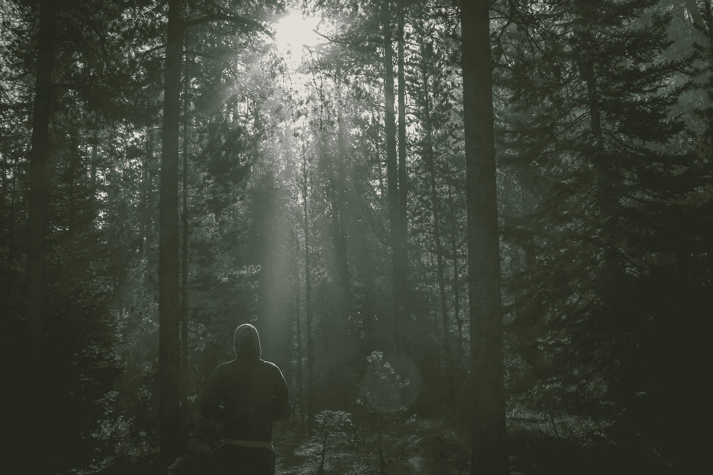

# 不要和野兽讨价还价

> 原文：<https://medium.com/swlh/no-bargaining-with-the-beast-43694666bb22>

Photo by [Dustin Scarpitti](https://unsplash.com/@dusty_blanco?utm_source=unsplash&utm_medium=referral&utm_content=creditCopyText) on [Unsplash](https://unsplash.com/search/photos/running?utm_source=unsplash&utm_medium=referral&utm_content=creditCopyText)

我一生都在跑里程。许多英里都是为了追求运动和踢足球。其他人则以年轻活力的形式在跑道、小径或人行道上狂奔数英里。

当生活很美好的时候，我跑了。但是当生活变得黑暗的时候，我还没有学会在生气的时候逃跑。有人说这是一件好事。我不同意。不过话说回来，我跟大多数人不一样。