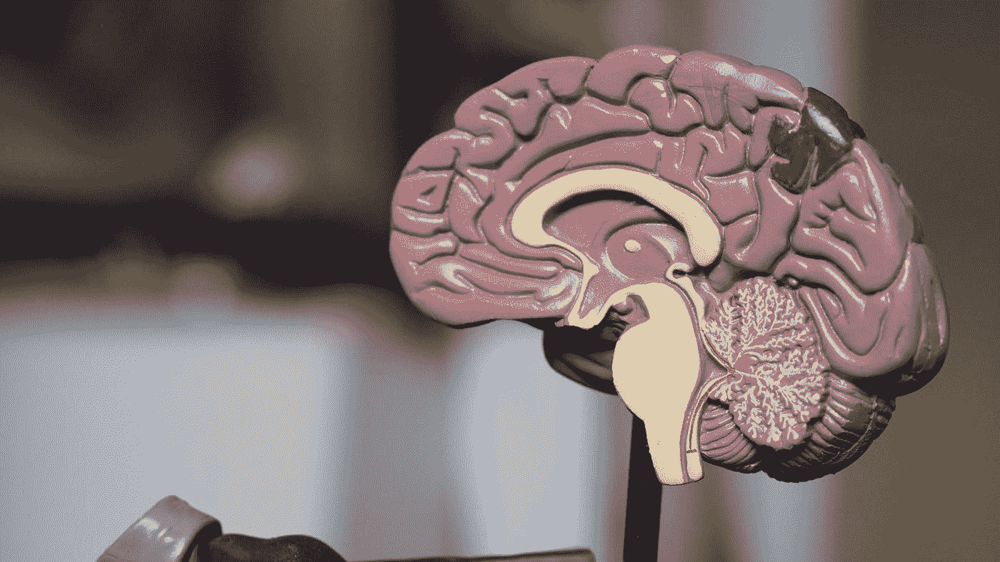

# 这台机器里没有鬼魂

> 原文：<https://medium.com/swlh/no-ghosts-in-this-machine-dd685c3cfc1d>

## 忽视意识的物理起源会破坏我们对精神疾病的理解。

Photo by [Robina Weermeijer](https://unsplash.com/@averey?utm_source=medium&utm_medium=referral) on [Unsplash](https://unsplash.com?utm_source=medium&utm_medium=referral)

你有没有尝试去思考一个想法是从哪里来的？我不是指你生活中的什么事情在一个突然的想法出现的时候一起发生了。我的意思是，思想本身在你大脑中的物理位置是什么？你有没有感觉到…