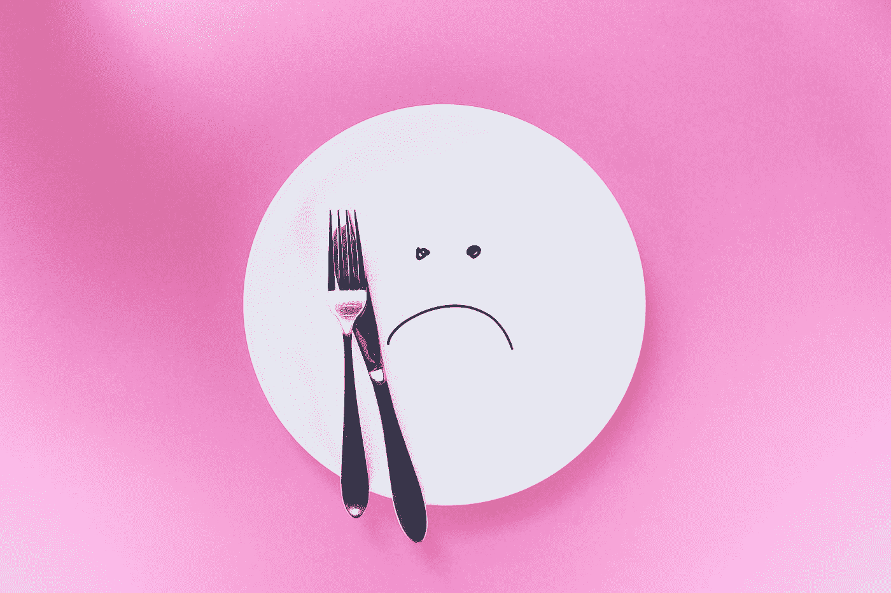

# 没人关心你的写作

> 原文：<https://medium.com/swlh/no-one-cares-about-your-writing-2c2604be25e0>

在 Medium 上写了一年，终于想通了。每篇文章点击量达到 10，000–50，000 的关键因素。

*秘制酱料*。

我不得不筛选大量数据:来自过气的媒体撰稿人和苦苦挣扎的艺术家的万亿字节的思考。在那之后，事情变得非常清楚。

**作家患有精神障碍，这使得他们无法像病毒一样传播。**

Photo by [Thought Catalog](https://unsplash.com/@thoughtcatalog?utm_source=medium&utm_medium=referral) on [Unsplash](https://unsplash.com?utm_source=medium&utm_medium=referral)