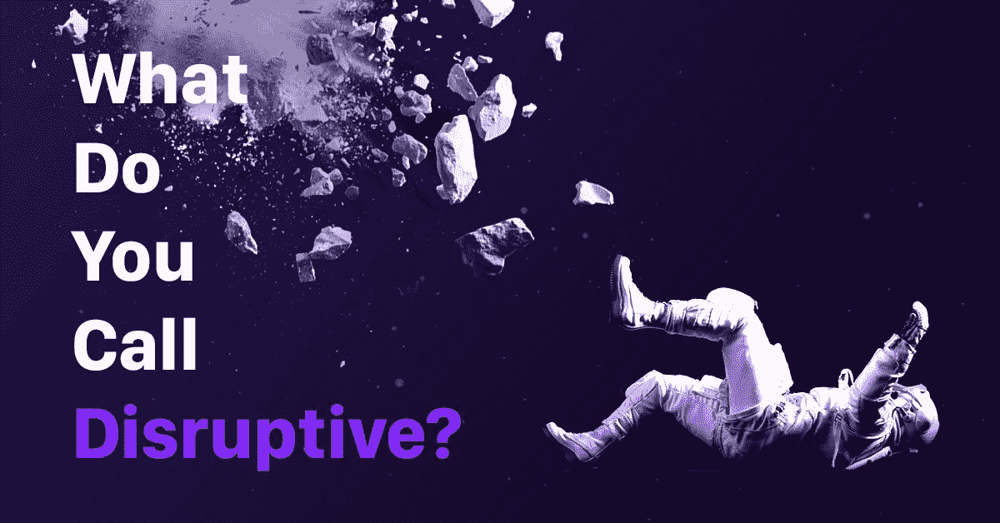

# 不，苹果卡不是“颠覆性的”

> 原文：<https://medium.com/swlh/no-the-apple-card-isnt-disruptive-a5ebcb7e6312>

## 科技巨头没有破坏性，但他们可能会赢得与银行的“游戏”。

我和全世界数百万人一起，“虚拟地”站在詹妮弗·贝利面前，介绍新的苹果卡。花了几个小时，如果不是几分钟，媒体开始推出标题，描述这张信用卡为“[破坏性](https://irishtechnews.ie/how-apple-card-can-disrupt-the-decades-old-credit-card-industry/)”。但是…