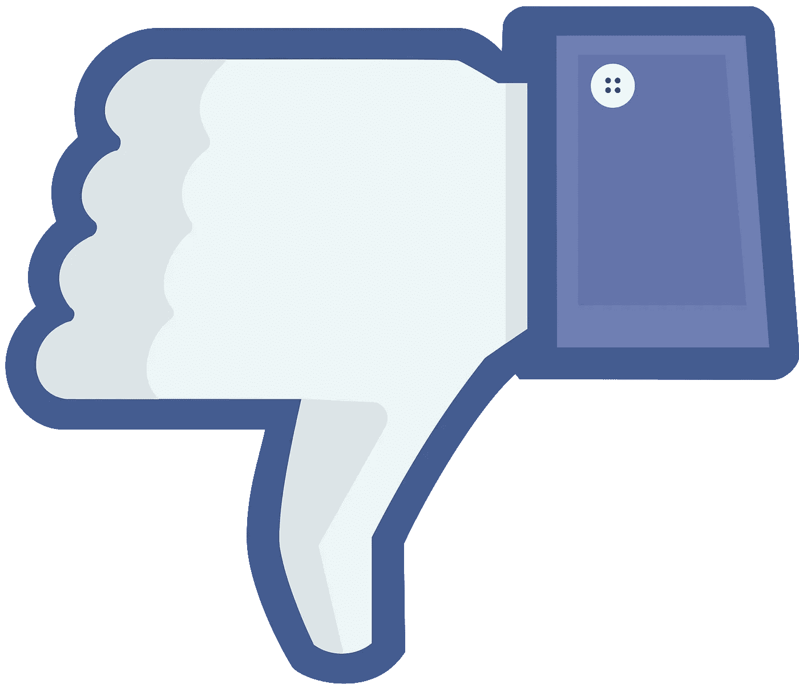

# 不去脸书。对天秤座说不。

> 原文：<https://medium.com/swlh/no-to-facebook-no-to-libra-894bc52e043d>

tell me how you really feel

> 扎克:是的，所以如果你需要哈佛任何人的信息，扎克:就问
> 扎克:我有超过 4000 封电子邮件，照片，地址，社交网站
> 朋友:什么！？你是怎么做到的？
> 扎克:人们刚刚提交了
> 扎克:我不知道为什么
> 扎克:他们“相信我”
> 扎克:傻逼

他们说，人们最终会变得更好，特别是在像脸书这样的公司受到如此多的公众监督的情况下。但是时间…