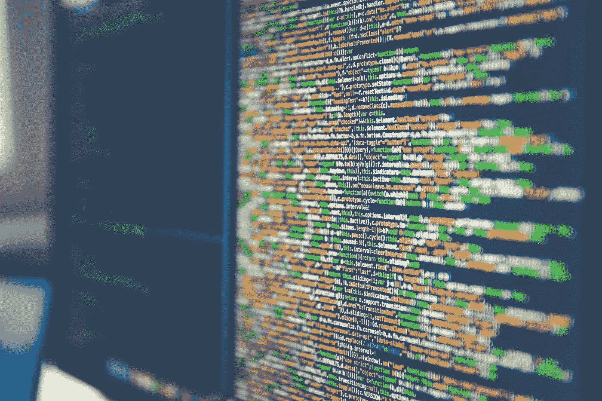

# 每个开发人员都应该记住的“Node.js 的神奇技巧”

> 原文：<https://medium.com/swlh/node-js-magical-tips-every-developer-should-remember-4c27b4dc6e2b>

## 更干净地使用 Node.js 的技巧

Photo by [Markus Spiske](https://unsplash.com/@markusspiske?utm_source=unsplash&utm_medium=referral&utm_content=creditCopyText) on [Unsplash](https://unsplash.com/search/photos/programming-tips?utm_source=unsplash&utm_medium=referral&utm_content=creditCopyText)

我使用 JavaScript 已经一年多了，现在主要关注 Node.js 和 Angular.js。根据我的经验，我发现每种编程语言都有一些技巧和提示，不管它的目的是什么。