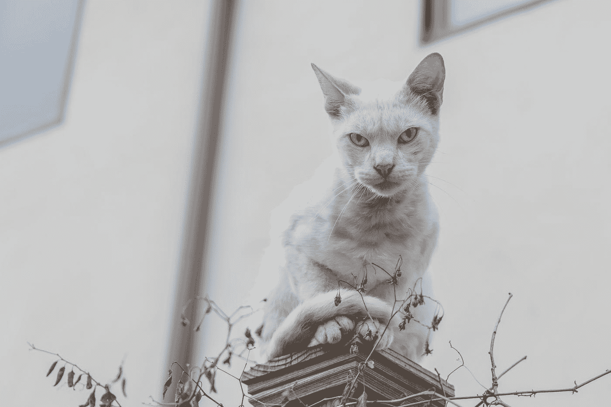

# 不会又是一场暴风雨吧…？自我引发的压力会让你瘫痪

> 原文：<https://medium.com/swlh/not-another-sh-t-storm-44fe56bf6aa3>

## 就在你认为事情正在好转的时候…

Photo by [Steve Harvey](https://unsplash.com/@trommelkopf?utm_source=medium&utm_medium=referral) on [Unsplash](https://unsplash.com?utm_source=medium&utm_medium=referral)

又是那种古老的舞蹈——向前一步，向后两步。感觉更像是一个小小的脚尖向前(*也许是*)向错误的方向跳了三大步。抑郁和焦虑随时都可能偷袭你。