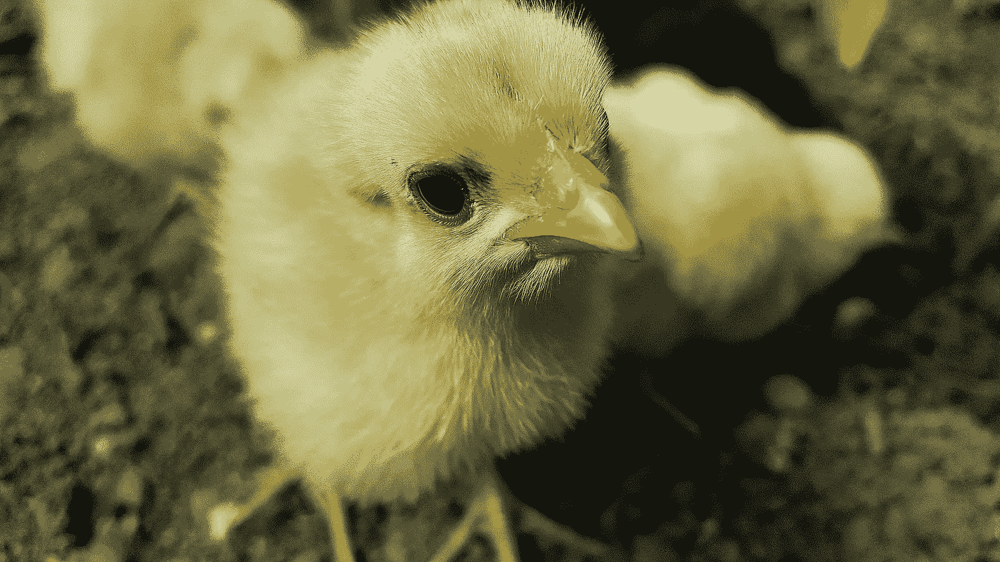

# 不是为了鸡:发展社交媒体角色

> 原文：<https://medium.com/swlh/not-for-chickens-developing-a-social-media-persona-2bc6dcc6d110>

Image by [SanduStefan](https://pixabay.com/es/users/SanduStefan-2727302/?utm_source=link-attribution&utm_medium=referral&utm_campaign=image&utm_content=2205233) on [Pixabay](https://pixabay.com/es/?utm_source=link-attribution&utm_medium=referral&utm_campaign=image&utm_content=2205233)

到目前为止，在我的写作生涯中，我已经积累了很多智慧。例如，作家就是写作的人。不客气珍珠是免费的。这是另一个:一个成功的作家是其作品被阅读的人。

基本的，简单的事情。

现在我有了这些知识，问题仍然是:我如何习惯于…的陌生感