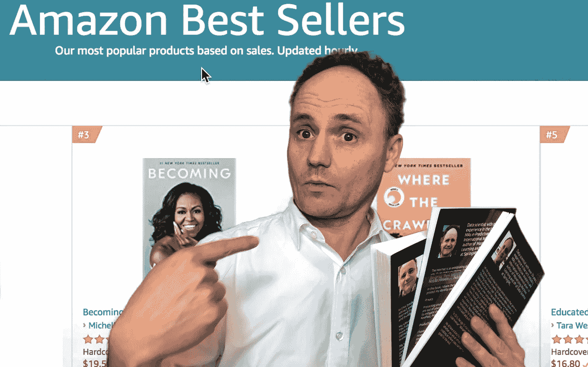
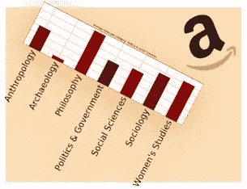
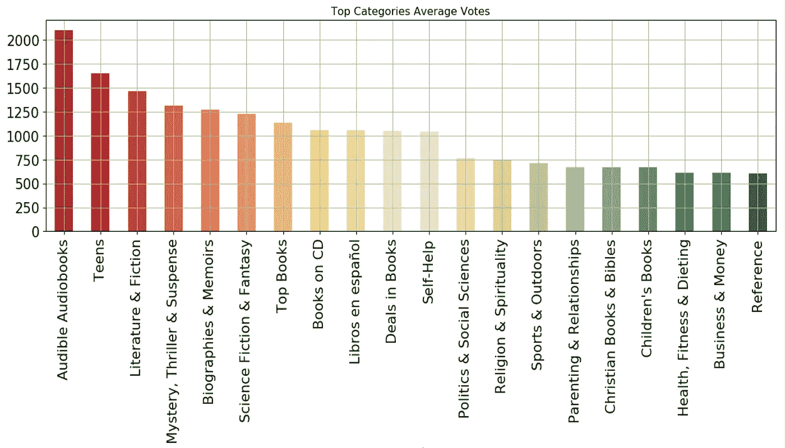
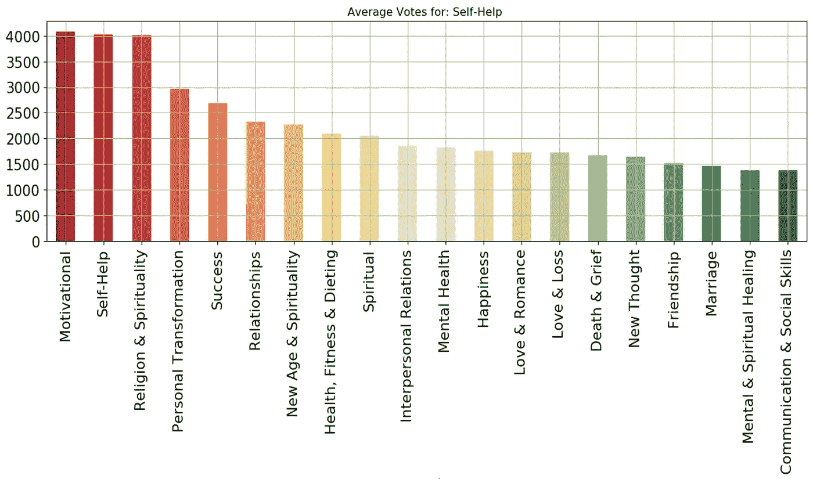
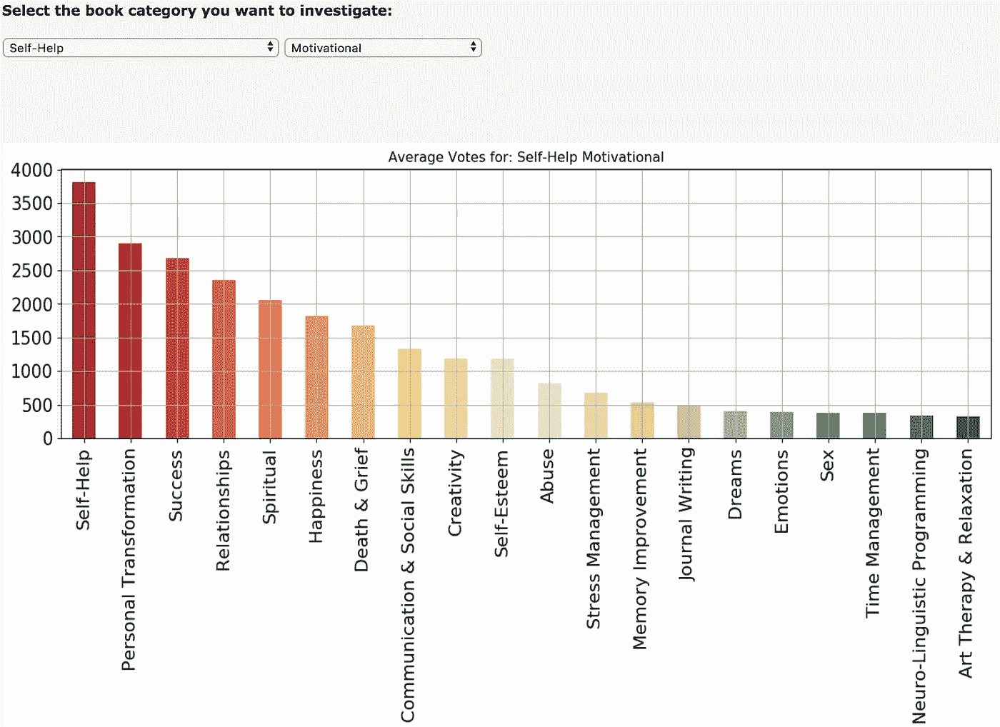
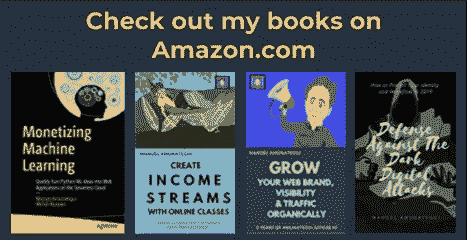

# 不确定接下来要写什么？这是一件好事，因为这并不完全取决于你

> 原文：<https://medium.com/swlh/not-sure-what-to-write-about-next-thats-a-good-thing-because-it-isn-t-entirely-up-to-you-6d3e558a0544>

Amazon Best Sellers’ Data, a treasure trove for the budding author

如果你想像 Steve Scott 一样以写作为生(他写了很多关于 Amazon.com 的书，每月收入超过 4 万英镑)，那么就写一些人们真的、真的、真的想读的东西。

这不仅适用于书籍，也适用于文章、博客、播客、YouTube 视频，甚至墓碑。如果你想找到一个愿意消费的观众，尤其是愿意为你的内容投资的观众，那就和他们妥协吧。

[Leveraging the Amazon Best Sellers](http://www.viralml.com/abs)

大量的书籍和话题使得这成为一个竞争激烈的环境，在这里大多数书都卖不出去。为了尽可能减少这种命运，使用[亚马逊畅销书](https://www.amazon.com/best-sellers-books-Amazon/zgbs/books)列表。这个惊人的信息来源将帮助你把时间和精力集中在你感兴趣的话题上。

我编写了一个简单的免费 web 应用程序来可视化这些数据。在 http://www.viralml.com/abs[找](http://www.viralml.com/abs)。虽然我以前写过这个工具，但这是 2.0 版，新的和改进的！

# 写一本关于动机的书

让我们兜一圈。我正在写一本关于动机的电子书，想看看这个主题进展如何。“**热门类别**”图表是你第一次加载应用程序时得到的。把这些看作是“飞离亚马逊的书架”类别。与动机最接近的类别是排在第 10 位的“自我帮助”——目前看来很有希望。

Top-Voted Book Categories

接下来的逻辑步骤是拉起“**自救**”。

Self-Help Categories by Average Votes

我们首先看到了什么？是的，“**励志**”！这基于平均投票量化了对该主题的巨大兴趣。

我们可以再深入一层。在“**励志**”下，我们找到了“**自助**”、“**个人蜕变**”、“**成功**”、“**人际关系**”、“**精神**”。

Top Categories under Motivational

围绕这些类别写作并不能保证成功，但不会因为缺乏观众而成功。

希望这能给你一个如何使用 ABS 类别来引导你到流行和热门话题的想法。祝你好运！

感谢阅读！在[ViralML.com](http://www.viralml.com/signup.html)注册订阅我的时事通讯

曼努埃尔·阿穆纳特吉

amunategui@gmail.com

推特:@amunategui

*著有* [*各种关于 Amazon.com*的书籍](https://www.amazon.com/s/ref=nb_sb_noss_2?url=search-alias%3Daps&field-keywords=manuel+amunategui)。 [amunategui.github.io](http://amunategui.github.io/) 的馆长和 [ViralML](http://www.viralml.com/)

*Author of* [*various books available on Amazon.com*](https://www.amazon.com/s/ref=nb_sb_noss_2?url=search-alias%3Daps&field-keywords=manuel+amunategui)

## 这篇文章发表在 [The Startup](https://medium.com/swlh) 上，这是 Medium 最大的创业刊物，拥有+424，678 名读者。

## 在此订阅接收[我们的头条新闻](https://growthsupply.com/the-startup-newsletter/)。

