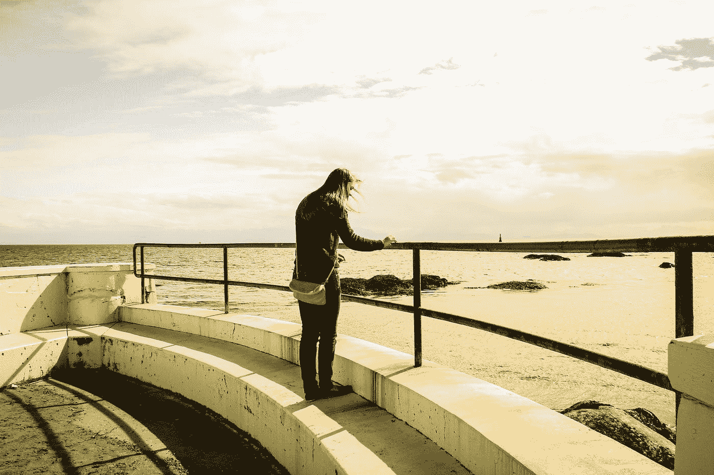

# 不是那种通常的关于摆脱自己头脑的文章

> 原文：<https://medium.com/swlh/not-the-usual-article-about-getting-out-of-your-own-head-fe6c0492bff5>

Photo by [Kim Cafferky](https://unsplash.com/@cafferkyphotography?utm_source=medium&utm_medium=referral) on [Unsplash](https://unsplash.com?utm_source=medium&utm_medium=referral)

> “我们生活中最美好的时刻并不是被动的、接受的、放松的时刻……最美好的时刻通常发生在一个人自愿努力去完成一些困难而有价值的事情的时候。”
> 
> 米哈里·契克森米哈

我花了很多时间思考。