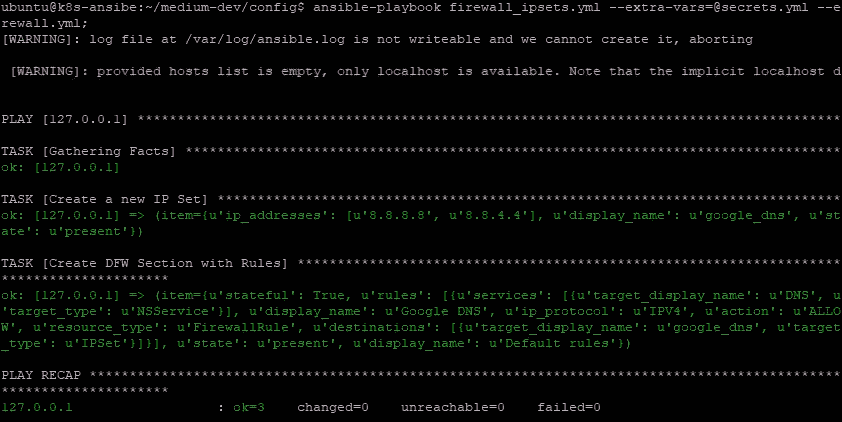

# NSX-T 安全与 ansi ble-Pt 1。基本防火墙规则

> 原文：<https://medium.com/swlh/nsx-t-security-with-ansible-pt1-basic-firewall-rules-6aa08c25e226>


The sky’s the limit with Ansible

## 放弃

这篇文章是我的观点，而不是我雇主的观点。

# 背景

NSX-T 是 VMware 的新一代软件定义网络堆栈。虽然有图形用户界面，但如果你使用图形用户界面来驱动防火墙，那你就大错特错了。本文将介绍如何使用 Ansible 以一种您可以在 GitOps 工作流中使用的方式来驱动 NSX-T 防火墙。

本文假设您对 Ansible 有基本的了解。如果没有，你可以通过你最喜欢的搜索引擎找到很多视频和文章。

使用这些 Ansible 模块，可以将 NSX-T 作为代码管道集成到基础设施中。无论您是想使用它来构建虚拟机规则、基于容器的规则还是 NSX 负载平衡器的防火墙，您都可以在管道中使用这些模块，基于最少的输入自动驱动 NSX 边缘和分布式防火墙。我们将在 YAML 构建防火墙规则，这些规则可以存储在 Git 中，然后因为 Ansible 模块是幂等的，这些规则可以在任何时候重新应用，如果模块检测到定义的 YAML 与 NSX T 中的配置状态不匹配，它将更新 NSX T 中的配置

## 旁注

NSX-T 2.4 引入了更新的、更具声明性的 API，它简化了驱动防火墙所需的 API 调用，同时引入了不适合当今所有用例的依赖性。在撰写本文时，声明式 API 不支持与 NCP 插件互操作，这意味着您不能将所有新的 API 特性和结构用于 Kubernetes 或 Pivotal 应用服务。下面介绍的模块集中在原始的 API 规范上，但是由于 Ansible 处理所有的 boiler 板，所以与新的 API 相比，交互模式是相同的。唯一主要的是，你有一个额外的领域为每个对象进行分类。例如，如果您有一个基于 IP 集的规则目的地，您已经调用了您的 IP 集名称，并且它是一个 IP 集。

## 假定的知识

*   基本网络交换和路由概念
*   基本的防火墙概念，如端口和协议
*   虚拟化概念，包括虚拟网络
*   基于可行的知识准备和运行行动手册
*   阅读和写作 YAML

# NSX-T 概念

如果您想深入了解防火墙之外的 NSX-T 架构，VMware 经验证的设计指南是一个很好的起点。
[https://docs . VMware . com/en/VMware-Validated-Design/5 . 0 . 1/VMware-Validated-Design-501-sddc-nsxt-workload-architecture-Design . pdf](https://docs.vmware.com/en/VMware-Validated-Design/5.0.1/vmware-validated-design-501-sddc-nsxt-workload-architecture-design.pdf)

## 分布式防火墙(DFW)和微分段

分布式防火墙是软件定义网络(SDN) IMO 的最佳特性之一。在传统网络中，如果您想要分离 2 个工作负载，您需要将它们放在单独的子网/VLAN 上，然后在网络之间运行防火墙。由于多种原因，这种方法无法扩展，主要是因为网络交换机上最多只能配置 4094 个 VLANs，而且提供第 3 层隔离需要大量的配置开销。在虚拟化和容器化解决方案中，当使用 SDN 堆栈时，可以在虚拟机或容器级别实施防火墙策略。例如，对于虚拟机，NSX-T 软件在虚拟机管理程序中运行，位于虚拟机连接的虚拟交换机上，虚拟交换机中的该软件可以执行防火墙策略。通过在流量退出虚拟机时实施策略，可以构建零信任和微分段类型，其中每个对象只能有绝对最少的规则，例如阻止在同一主机上运行的同一子网中的虚拟机之间的流量。

## IP 集

顾名思义，IP 集是 IP 地址的集合。您可以定义单个 IP、范围或基于 CIDR 风格的子网，每个 IP 集最多可有 4000 个 IP。

# ansible-for-nsxt

这里使用的模块是官方 VMware ansible-for-nsxt repo 的一个分支。所有新功能都已通过拉取请求提交回 VMware，如果模块被接受，本教程将更新以引用 VMware repo。

环境设置

*   假设您已经有了一个工作的 NSX-T 环境，最好是 2.4 或 2.3 版本。
*   你需要一个 Ansible 控制服务器，带 Ansible 2.7。我用过香草 Ubuntu 16.04。
*   (可选)YAML·林挺的好编辑。VSCode 非常好，有很好的 YAML 扩展，远程 SSH 扩展允许您从非 Linux 系统远程编辑 Ansible 控制主机上的文件。
*   (可选)托管防火墙规则 YAML 的 git 存储库。

在您的 Ansible Control 服务器上，从合适的目录运行:

```
git clone [https://github.com/laidbackware/ansible-for-nsxt/](https://github.com/laidbackware/ansible-for-nsxt/)
```

这将创建' [ansible-for-nsxt](https://github.com/laidbackware/ansible-for-nsxt/) '子文件夹。然后从当前文件夹创建一个名为 config 的新文件夹。

```
mkdir config
```

现在，模块和配置将是分开的，这意味着配置可以单独提交给 git。您的文件夹应该按如下方式构建:

```
/
- ansible-for-nsxt/
- config/
```

从这一点开始，我们将从配置目录开始工作。

# 规则答案示例

在本例中，我们将设置一条规则，允许 NSX 域内的所有内容连接到 Google DNS。

下面显示的 part1_answers.yml 文件应该保存在您刚刚创建的 config 目录中。

## IP 集

在本例中，我们将 Google DNS 服务器设置为 IP 集，这样每个源都可以访问 DNS。

## 防火墙规则部分

由于我们希望在 NSX-T 控制的对象上启用此策略，因此我们希望插入一个分布式防火墙规则。幸运的是，这是默认类型的规则，我们将让规则适用于任何地方。如果需要限制规则的范围，可以使用 applied_tos 部分将规则应用于某些逻辑端口。Scope 和 applied_tos 将在以后的教程中介绍。

在本例中，source 字段已被省略，这意味着 source 将被设置为 any。目标将是新的 IP 集，它将是一个 IPv4 规则。该服务被设置为 DNS，这是内置的 NSX 服务类型之一。

## 经理文件

最后，将你的 NSX-T 管理器细节从配置中分离出来是一个很好的做法，所以创建一个名为 manager.yml 的单独的应答文件，用你的 NSX-T 管理器连接细节进行更新。有关如何托管或安全存储密码等机密信息，请参见 Ansible 文档。

# 剧本

应用这种变化需要一个相当简单的可行的剧本，因为所有的任务都是独立的。与答案一样，这应该保存在 config 文件夹中。请注意，答案文件是已定义的，它们将在运行时传入。

# 运行行动手册

要从 ansible-for-nsxt 文件夹导入模块，需要两个环境变量指向 library 和 module_utils 文件夹。

```
export ANSIBLE_LIBRARY="../ansible-for-nsxt";
export ANSIBLE_MODULE_UTILS="../ansible-for-nsxt/module_utils";
```

运行剧本时，使用 extra-vars 传入答案 yaml 文件，用@告诉 Ansible 打开一个文件。

```
ansible-playbook firewall_ipsets.yml --extra-vars=[@m](http://twitter.com/secrets)anager.yml --extra-vars=[@](http://twitter.com/answers_firewall)part1_answers.yml -vvv;
```

如果一切顺利，应该会显示类似下面的输出。



# 下次

本系列的下一篇文章将介绍 NS 组以及如何根据动态标准(如操作系统类型)进行分组。

[https://medium . com/@ laid backware/nsx-t-security-with-ansi ble-pt-2-ns-groups-665 edd 8 BAC 6](/@laidbackware/nsx-t-security-with-ansible-pt-2-ns-groups-665edd8bac6)