# 你需要知道的一切开始轻推营销

> 原文：<https://medium.com/swlh/nudge-marketing-bringing-behavioral-economics-to-online-retail-8da0b923affb>

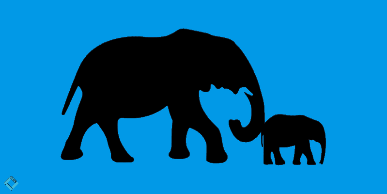

您努力提高点击率，进行了数百次 A/B 测试，试图找到最完美的 CTA 颜色、产品图片和价格框架。然而，不知何故，你的(微观)转换率增长不够。

这是一个困扰所有在电子商务领域工作的营销人员的问题。虽然在提高转换率方面没有灵丹妙药，但你可以从行为经济学中吸取一些有价值的经验。具体来说，通过“[轻推](https://blog.crobox.com/article/behavioral-economics-marketing?_ga=2.173434656.2000106776.1555316919-124876615.1554128205)”

如果做得好，推动营销可以帮助推动全渠道购买行为。让我来解释一下如何开始。

# 什么是微移营销？

推动营销是通过迎合个人心理来传达鼓励预期行为的营销信息的过程。

它来源于理查德·塞勒和凯斯·桑斯坦的轻推原理，他们[在他们的书《轻推](https://www.goodreads.com/book/show/3450744-nudge)中将其描述为:

> *“微推，正如我们将使用的术语，是选择架构的任何方面，以可预测的方式改变人们的行为，而不禁止任何选择或显著改变他们的经济激励。要想算作一次小小的推动，干预必须简单易行，避免成本低廉。”*

简而言之，推动是以吸引决策者的方式设计选择的过程，因此整个决策过程更容易。

在零售业中做到这一点的一个方法是指出吸引购物者的具体产品特征。

例如，假设一个电子品牌正在他们的网上商店推广其智能手表。他们可能会在产品图片上贴上“防水”的标签，以宣传手表的功能。或者，如果他们想吸引创新购物者，他们可能会贴上“创新技术”的标签来吸引他们的注意力。

这些微妙但有效的信息有助于决策过程，指出具体的特征，鼓励根据购物者的目标或个性倾向采取行动。它们充当[相关行为触发器](https://blog.crobox.com/article/marketing-triggers-fbm?_ga=2.144705207.2000106776.1555316919-124876615.1554128205)，在个体层面上起作用。

# 推动理论

轻推是一个从行为经济学中诞生的术语。对于那些还不熟悉这一点的人，行为经济学应用行为的心理学观点来解释经济决策。

行为经济学是理解行为的新时代方式，从做出健康饮食决定和选择健康保险到投资周期和消费者购买模式。它摒弃了传统的“[理性决策](https://blog.crobox.com/article/the-rational-consumer-debunked)的观点，拥抱了个体的非理性。

# 启发式对轻推的影响

轻推建立在启发式的[概念之上，本质上是我们用来做决定的捷径。我们的大脑努力尽可能高效，因此它使用视觉和心理线索来帮助尽可能自动化地做出决定。](https://www.businessballs.com/improving-workplace-performance/nudge-theory/)

这些捷径总是下意识地发生。它们帮助我们做出日常的、平凡的选择，比如晚饭做什么。它们还帮助我们在更重要的决定上做出选择，比如买什么样的车或者买哪种人寿保险。

试探法的一些例子是传达产品受欢迎程度的社会证明信息。或者说锚定，当把一个数字放到一个更大的数字上时，这个数字看起来更小。有数百种启发法，每一种都根据个人过去的经历和观点对他们产生不同的影响。

对于那些想了解更多这些的人来说，丹尼尔·卡内曼的【T4 思考，快与慢】在彻底介绍这个概念方面做得非常好。

轻推利用了许多启发法，因此可以巧妙地鼓励行为。他们试图通过让决策感觉更加自然和自动，而不是强迫或操纵，来吸引个人。

# 如何开始推动营销

现在你对轻推是什么以及它是如何产生的有了更好的理解，我们可以把重点放在你需要开始做的事情上。

# 1.明白你在和谁说话

首先，彻底了解你的目标受众是一个关键的先决条件。如果你不知道你在向谁营销，你就不能使用吸引他们的词语和短语。

接触数据。回到你的客户人物角色，更好地了解他们的兴趣、语言和个性。通过[分析购物者的心理特征](https://blog.crobox.com/article/psychographic-marketing)来挖掘更深层次的信息。

# 2.分析你的产品的 USPs

一旦你知道你的客户可能在寻找什么，找到你提供的产品的共同点。适用于任何产品的一些标准心理学原则是:

*   社交证明:对于排名前 10%的畅销书，使用“畅销书”、“当季最受欢迎”或“受欢迎”这样的信息
*   稀缺性:对于低库存、独家优惠或限量版的产品([参见本文了解何时使用何种信息](https://blog.crobox.com/article/scarcity))。
*   权威:有没有你，你的设计师，生产商，或者其他方推荐的产品？让你的顾客知道！
*   创新:使用新技术的产品可以用“创新技术”或“前沿设计”这样的标签来推广

除此之外，如果你的产品是有机的、防水的、原创的，或者你知道你的顾客正在寻找的任何其他特征，你也可以描述更多的功能性好处。

# 3.起草和测试选定产品的副本变体

采取不同的原则(如社会证明、权威等。)或产品 USPs，想出尽可能多的副本变体。也许甚至可以试着用不同的颜色贴标签来吸引顾客的注意力。

然后选择一些产品贴上标签。记住，你正试图[减少选择超载](https://blog.crobox.com/article/choice-overload)。所以，你不要选择太多。否则，标签将变得无效，因为它们不能充分限制选择。

一旦内容准备好了，就该开始测试了。你现在已经习惯了 A/B 测试，是时候开始多元测试了。在选定的产品上运行各种测试，以找出哪种副本在驾驶行为中最有效。[或者用 AI 来精简这个过程](https://blog.crobox.com/article/crobox-ai)。

# 4.迭代和分析数据

与任何测试一样，迭代是必不可少的。一定要检查测试，看看哪个表现最好。

这些数据还可以让你深入了解哪种技巧最能引起你的听众的共鸣。他们更可能回应权威或社会证明信息吗？您甚至可以在跨渠道沟通中使用这些见解。

在 Crobox，我们使用来自人工智能实验的所有数据来创建购物者档案。这些配置文件可用于根据渠道、来源、国家和其他维度对营销活动进行细分。这是给你的顾客创造独特心理图形的好方法。

# 推动营销实例

你想从轻推开始吗？看看这些来自全球零售商的例子，从中获得一些灵感。

# 1.具有功能优势的产品标签

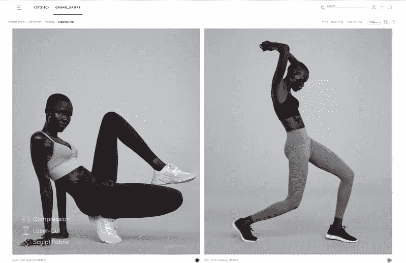

Oysho 的网上商店不仅有华丽的设计，他们以微妙的方式驱动行为，不会妨碍购物者的体验。

通过突出产品特征，他们帮助目标导向的购物者更快地找到他们寻找的产品。

# 2.带有心理触发因素的产品标签

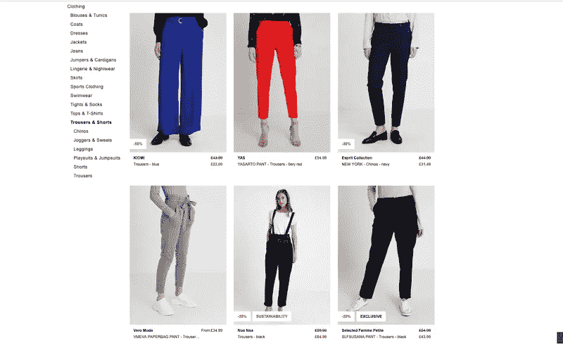

Zalando 使用各种标签来吸引个人的注意力。除了折扣百分比，它们还会引起人们对产品独特性(稀缺性)或可持续性([高贵边缘效应](https://www.coglode.com/gem/noble-edge-effect))等属性的关注。

# 3.具有社交证明的智能通知

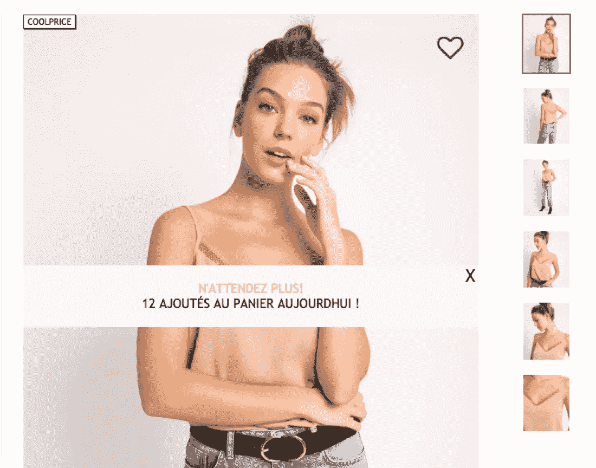

利用社交证明，Pimkie 使用智能通知(可以关闭)让你知道有多少人看过该产品。有助于增加人们对自己做出正确选择的确定性。

智能通知提醒购物者他们应该购买产品的具体原因。这里可以利用任何原理或功能优势。

# 4.出口意向叠加中的视觉提示+折扣

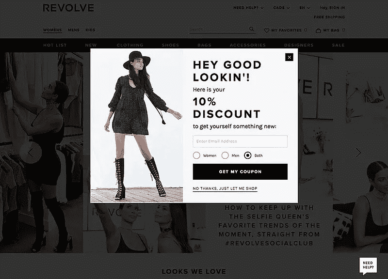

视觉提示可用于将注意力引向文本或其他元素。Revolve 使用模特的凝视来突出显示出口覆盖中提供的折扣。

当人们离开产品页面时，会触发退出意图覆盖。通过促销折扣，增加了他们停留在页面上并最终结账的机会。

# 5.自主退出意向叠加

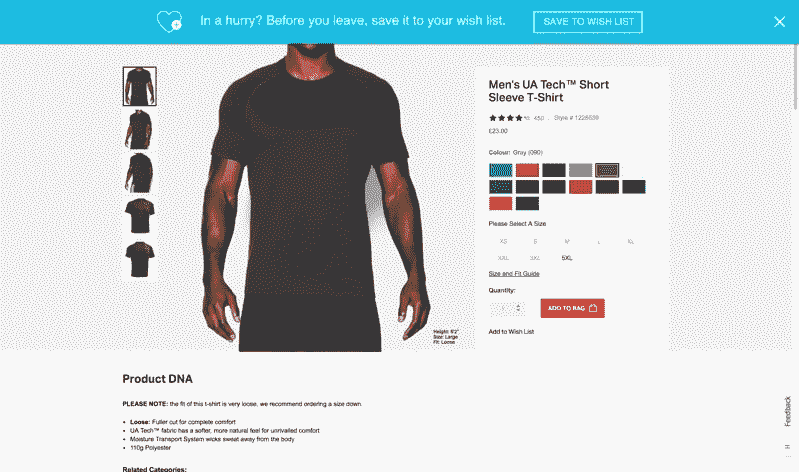

这种出口覆盖给予了人们自主决策的权利。心理学理论发现，人们希望在自己的决定中保持自主，因此能够从各种选项中进行选择(结账或放入包中)给了他们这种自由。这也被称为[霍布森的+1 选择效应。](http://www.wheelofpersuasion.com/technique/hobsons1-effect/)

# 6.在产品详细信息页面上定位

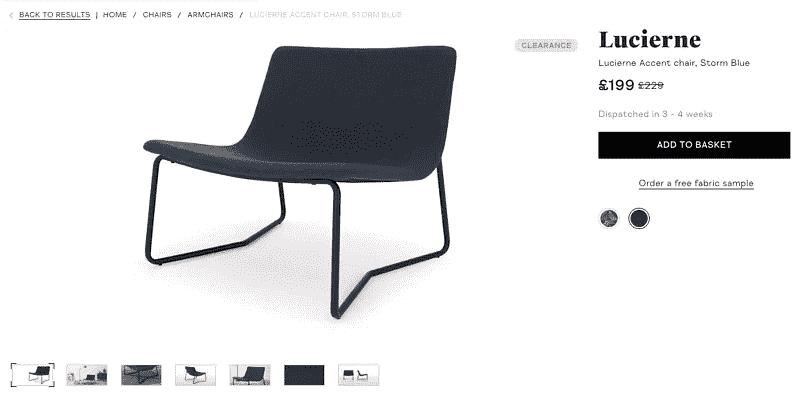

锚定是众所周知的[心理定价技巧](https://blog.crobox.com/article/persuasive-pricing)。它用更高的价格“锚定”个人，使折扣价看起来更小。

# 7.社会证明促进评论

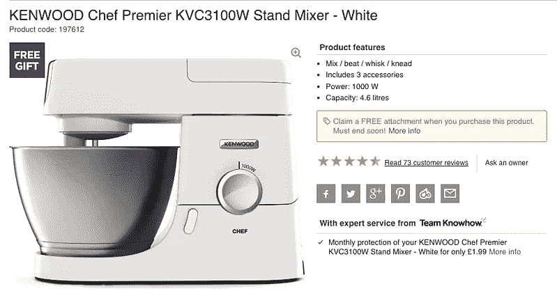

评论在推动购买行为方面如此有效的原因在心理学研究中有充分的依据。他们玩的是社会证明的说服技巧，即在不确定的时候，个人会关注他人的行为来帮助他们做决定。

评论为产品提供了更多的背景和个人体验。这在购买新品牌、网店或产品类别时尤其有用。

# 8.产品比较中的诱饵效应

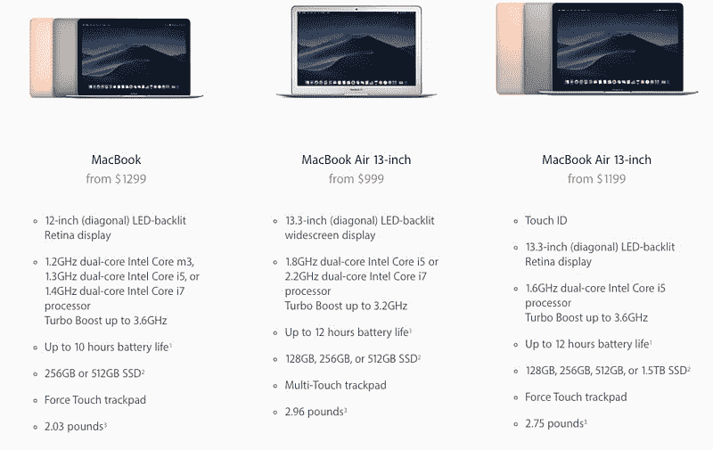

诱饵效应可以用来推动特定产品的销售，方法是将它放在被认为不划算的类似产品旁边。这种方法通常用于使最具吸引力的选项看起来更好(从而增加满意度)。

虽然诱饵效应通常被服务提供商用来推动特定的订阅，但它也可以用于比较表中的产品。

# 9.装运的默认选项

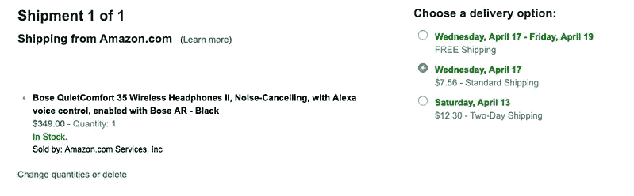

通过自动选择默认选项，您可以减少用户在体验过程中必须做出的选择数量。一般的经验法则是选择一个对用户最有吸引力的选项，不要试图误导他们，这样就能维护信任。

# 10.结账时的目标梯度

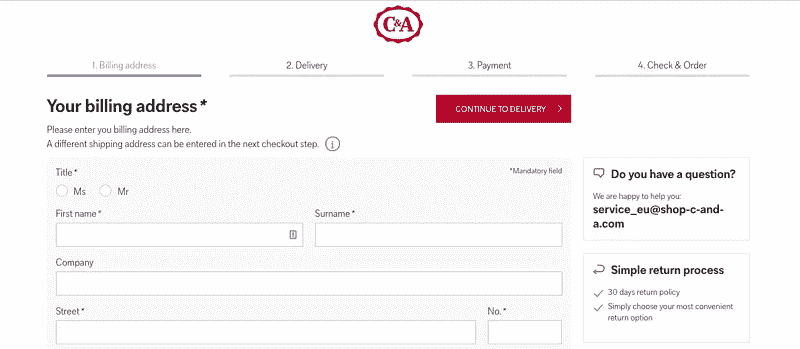

目标梯度发现，比起他们已经走了多远，人们更受还有多远要走的激励。当他们接近目标时，他们的速度会加快。您可以实现这一点，使您的结帐速度更快，从而增加转换成功的可能性。

# 最终注释

使用轻推不仅有助于引导顾客点击购买按钮，还能让购物体验更加愉快。在今天拥挤的市场中，顾客体验决定一切，他们可能是你的网上商店的缺失部分。

从这篇文章中，请记住:

*   Nudges 源于行为经济学，它关注的是人们在预测经济行为时的心理倾向。
*   他们利用各种启发法，迎合个人的偏好来激励行动。
*   在你开始测试文案和设计之前，一定要进行必要的购物者调查。
*   运行多变量和 A/B 测试，为你的目标受众找到最有效的推动。
*   重复你的实验，并不断测试新的想法，以获得对你的客户独特的心理图形。

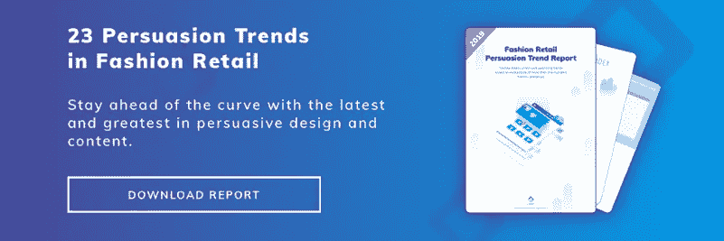

[Download it here!](https://blog.crobox.com/cs/c/?cta_guid=790912bb-41ec-4102-9405-60b1acbc1b0a&placement_guid=d398ec55-0521-4a16-a37b-9e709185591d&portal_id=3782461&canon=https%3A%2F%2Fblog.crobox.com%2Farticle%2Fnudge-marketing&redirect_url=APefjpE5DBFJNZmNFcpJgKmb4qnUDWEtwdMfmacBtB03HGC9fLKNsjS3j6UBWSJ2910DagcMFOwun6qW1JO4CokxSrkeuVo8Q0E0xOCvBbTgaGVta2hianfl5AtVyF8xCK93rxJrRr9pb81aS6mvguOZjsLoaXXmjF-dM3kqtQTWk56dbzhg7vvyYDWC_wc0g3WZp_c0sDO6cBRdIbmSi5nXZW4F6wKjdW5pQ59F38vegUROnlpL81iJfhEt8ftfsmJ75V6RKqYh&click=42871268-5180-435f-9a38-2bbdca6f6847&hsutk=60138009c171ce26d1e6dbde46826c48&pageId=8842504284&__hstc=55380212.60138009c171ce26d1e6dbde46826c48.1555424197596.1555576971758.1556023454634.6&__hssc=55380212.1.1556023454634&__hsfp=3183807969)

*原载于 2019 年 4 月 16 日*[*【https://blog.crobox.com】*](https://blog.crobox.com/article/nudge-marketing)*。*

## 这篇文章发表在 [The Startup](https://medium.com/swlh) 上，这是 Medium 最大的创业刊物，拥有+445，678 名读者。

## 在这里订阅接收[我们的头条新闻](https://growthsupply.com/the-startup-newsletter/)。

