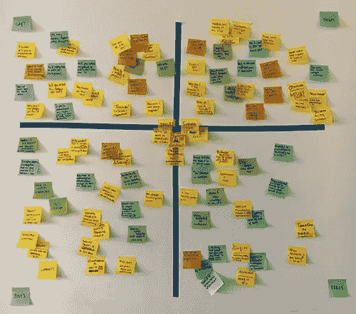
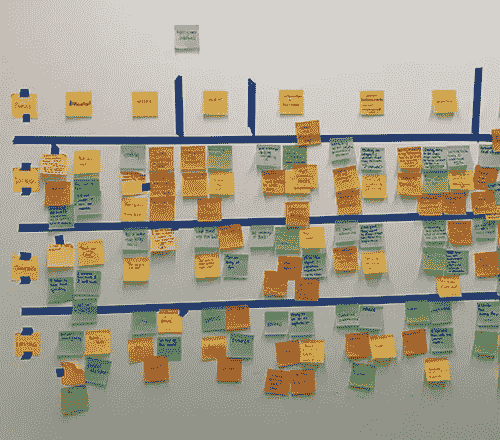
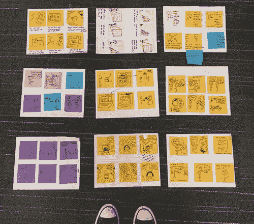
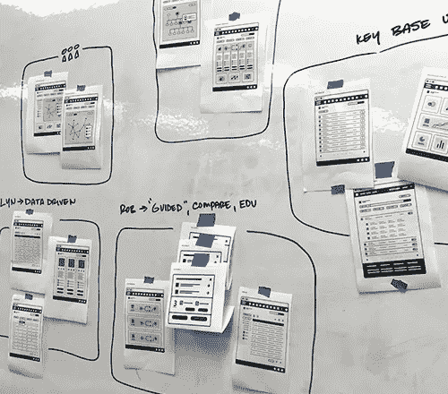
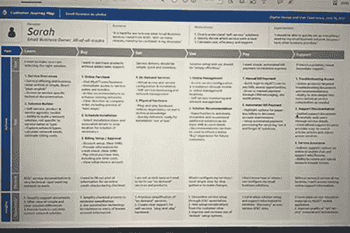

# 客观性是最重要的设计技巧

> 原文：<https://medium.com/swlh/objectivity-is-the-most-important-design-skill-863aa6de5c78>

## 人性化设计中的客观移情

在几乎所有关于日常移情的概念、实践或哲学观点中，流行文化都是正确的。同理心非常好。

沿着流行设计理论的兔子洞，同理心变得更加微妙。

> TL；dr 版本可以在文章摘要中找到。

# 移情作为一种设计态度

谁是设计方案的受益者？

因为以人为中心的设计过程的“成功”最有效地通过设计解决方案对其*人类*参与者的受益程度来衡量，所以以人为中心的设计实践者必须理解陈述的人类需求，以及需求的*激励* *性质，以有效地响应设计解决方案，代表参与者创造有意义的有影响力的产品、服务和体验。*

人的感觉是什么？人类的思维是什么？人类需要什么？人类想要什么？人类的理想结果是什么？人类的动机和期望是什么？人类衡量成功的标准是什么？我们如何创造直接造福人类的系统？我们如何为系统中的所有人创造有意义的利益？

我们如何更好地理解人类需求、理想结果或成功衡量标准的激励性质、环境和背景？

**因感同身受。**

假设从设计解决方案中受益的人的视角，为以人为中心的设计实践者提供了一种理解所收集的设计研究、以人为中心的系统观察和定性的人类反馈的上下文和意义的方法。

> 在以人为中心的设计过程中，同理心是一种态度、方法和实践，在设计有意义的有影响力的服务、产品或体验时，假设一个确定的人类参与者的观点，以更好地理解他们的需求、结果和成功的衡量标准。

# 为什么共情令人困惑

根据设计文化，移情就是一切。

随着“同理心”这个词的概念用法和行业态度在设计哲学和实践的交叉中不断发展，找到一个清晰的、有意义的定义作为团队期望的基础变得越来越困难。

同理心[日常](/mule-design/everyday-empathy-6a475e03fd81)。移情作用是[同情心](/@auldyn.matthews/from-empathy-to-compassion-an-evolution-in-ux-3a56d4b31be9)。移情[作品](/@auldyn.matthews/from-empathy-to-compassion-an-evolution-in-ux-3a56d4b31be9)。换位思考是一个[阶段](https://www.interaction-design.org/literature/article/stage-1-in-the-design-thinking-process-empathise-with-your-users)。换位思考是一个[基础](https://uxplanet.org/empathy-the-foundation-of-a-great-design-9b1887497c09)。移情是一种非常有效的销售技巧。同理心是一种生活方式。同理心是一个关键。移情是一个[框架](https://blog.growthhackers.com/the-complete-guide-to-building-a-framework-for-customer-empathy-ca4407f928f)。

Google Trends: “Empathy” — January, 2004 to May, 2019

随着每一个新的哲学观点强调移情的概念价值，它在以人为中心的设计中的实际目的经常会被误解。这种误解导致对人类参与者的情感上的主观解释，导致设计的解决方案不符合客观确定的需求、目标和理想结果。

因为每个协作设计贡献者都带来了不同的视角(或文章),来说明共情作为一种世界观、商业实践或技术哲学有多么重要，所以在参与实际的、真实世界的解决方案的设计时，对于共情的解释和使用可能会有*许多*分歧。

> 同理心在设计领域之外有如此广泛的解释和情感考虑，以至于当设定对合作设计团队的态度的期望时，它成为一个很难处理的主题。

# 以人为中心的设计框架中的移情

如何对人类演员产生共鸣来驱动设计过程。

当设计从业者强调协作团队和功能中人类参与者的观点时，参与的贡献者围绕一个共同的以人为中心的目标。

以人为中心的设计将一个确定的人为因素置于一系列情境问题陈述的中心，设计实践者围绕这些问题陈述构建发现研究、测试假设和协作设计练习，以确定“人为驱动”的设计解决方案。

> 以人为中心的设计团队的目标是，在做出影响“人类演员”体验的决策时，从他们的角度看待设计挑战，从而为“人类演员”创造有意义的利益。

移情作为理解设计团队问题陈述中“人”的部分的有效方法，实践者能够在整个设计规划、创建和实现阶段更有效地衡量解决方案的“成功”。这种“基于视角的决策”的态度在任何过程、功能或服务的迭代创建中指导设计从业者，为系统中的人类参与者提供接触点。

Empathy Map — Human Centered Design Exercise

阐明人类参与者的观点为设计团队提供了参与者需求背景的参考框架，将原本分散的事实和反馈汇集在一起，以创建设计问题和解决方案的清晰视图。

在创建各种各样的设计或研究工件、可交付成果或解决方案时，将同理心作为团队哲学来推动设计态度和讨论。

同理心设计意味着团队观察、假设、讨论和解决方案集中于创造利益，或改善人类参与者的条件、关系或体验。

> 直接回应人类的需求，以人类的利益为中心做出选择，并融入有意义的人类反馈，所有这些都代表了移情在以人为本的设计哲学中的实际应用。

# 移情的目的

*没有一个有意义的目标，移情是没有意义的。*

随着“同理心”一词的不同流行用法继续改变其战术、专业用法，当参与以人为中心的设计过程时，合作设计从业者将同理心重新定位为一种客观态度变得越来越重要。

当设计从业者客观地假设一个人类演员的观点时，移情在以人为中心的设计框架中有一个实际的、有益的目的。

Scenario Map — Human Centered Design Exercise

在以人为中心的设计过程中，移情的目标是创造一种基于视角的对人类需求、理想结果和成功衡量的理解。通过理解行动者的视角，设计从业者构建客观的假设和观察来创建解决方案*，用于进一步的反馈和测试*。

以人为中心的设计工具包包括各种集体建立的练习、态度和技术，以客观地建立对人类参与者需求的深刻理解，然后*通过测试和评估不同的面向人类的假设来有意义地响应*，以识别和部署最有益的以人为中心的解决方案。

> 在以人为中心的设计实践中运用同理心为设计从业者提供了一种方法，通过**客观地**从人的角度观察设计解决方案的条件或好处，更好地理解人类参与者的动机，并将其融入情境中。

# 移情是一个棘手的话题——拥抱之后

*以人为中心的设计实践框架下的移情类型。*

在以人为中心的设计实践中，同理心是从设计方案中直接受益的人类参与者的角度出发的能力。

因为许多设计贡献者认为“同理心”是一个普遍理解的词，其应用和意义在以人为中心的设计过程之外，所以在协作设计阶段设定如何最好地*实际应用*同理心的期望成为有效聚焦团队讨论和练习*的关键因素*。

> 情感共情建立的是情感视角，认知共情建立的是心理视角。

## 情感共鸣(AE)——情感共鸣

情感共鸣是一种理解人类演员观点的行为，通过在情感上认同他们的感觉或情感状况。情感共鸣*认同人类演员的情感*，并因此展现出*情感驱动的反应。*

从解决方案中受益的人的*情感*角度出发，旨在最小化设计从业者固有的情感偏见，并提供对情感复杂的问题陈述的整体理解。当应用于以人为中心的设计方法时，情感共鸣有鼓励从业者“代理情感”心态的风险。

## 认知共情(CE)——分析共情

认知同理心是通过从心理上*认同人类演员的心智模式、观点或存在状态来理解他们的观点的行为。认知同理心为设计从业者提供了一个分析模型，以识别人类演员的*心理、思维过程和方法*，从而更好地理解他们的世界观和相关视角。*

采用人类行动者的心理视角，给设计从业者一种方式来表现和回应人类的态度、预期系统和潜在的心理模型，这些在设计解决方案的空间内最能引起行动者的共鸣。以人为中心的设计练习通常也关注于使用战术认知移情来识别可能的设计解决方案，这些解决方案与人类参与者的感知、功能或心理模型产生共鸣。

*{* ***一句简短的告诫:*** *在以人为中心的设计对话中，涉及到哲学意义，或者“移情”一词的实际应用，声音变得提高了。*

> 在“Design-rony”的扭曲中，要改变设计贡献者对“同理心”这个词的解释是极其困难的，即使他们接受了客观设计方法的训练。}

# 情感共鸣的缺点

*以人为中心的设计实践中情感共鸣的常见问题。*

> 由情感共鸣驱动的设计选择产生了几种有害的谬误。如果任其发展，这些谬误会破坏以人为中心的设计解决方案的成功，这是由人类参与者的受益程度来衡量的。

## “我认识人类，我就是人类。”

“我推动了包括人类在内的定量和定性研究。我已经直接和人类谈过了。我知道人类的隐私。我代表人类感受情感。我同情人类。我承担了人类的情感角色。我与人类的情感视角联系在一起。我了解人类。我理解人类。我同意人类的观点。”

***“我是人类。”***

在以人为中心的设计过程中使用移情的主要理念是明确承认设计从业者是在代表其他人创造解决方案。站在他人的角度看问题并不意味着你就是那个人。

无论你多么认同人类的感受，或者你多么强烈地认同人类的情感世界观，或者你在使用相同的设计方案时有多少次相同的情感反应， ***你永远不会是人类。***

> 将自己视为****人类**的设计从业者，而不是**我们人类**的客观倡导者，这样做是他们主观世界观的表现，而不是出于对从解决方案中受益的人类的客观考虑。**

## **情绪确认偏差**

**当采取人类演员的情感视角时，情感共鸣很快成为“遗传的情感”通过继承情感，设计从业者假设他们自己对人类情感的主观解释，而不是基于已知视角或人类演员的新观察来客观地确定解释。**

**当贡献者的情绪倾向只继承*那些与实践者产生共鸣的情绪时，继承的情绪促进了情绪确认偏差。虽然不明确，但这些内在的情感价值判断极大地扭曲了定性研究的解释，导致设计没有解决人类演员的需求。***

> **当只对在设计从业者中产生共鸣的人类行为者的情感进行优先排序时，许多其他的因果因素、替代解释和最终的解决方案通常会被降低优先级，或者被忽略。**

## **情感辩护**

**情感同理心创造了一种情感合理性的感觉，由此实践者在操作上优先考虑人类的情感表现，而不是人类自身的直接反馈。**

**当采用“情感代理”方法时，实践者*觉得*被授权在逻辑上采取*的情感跳跃*来证明设计决策的合理性，而不是客观地限定决策的价值，以人类参与者受益的程度来衡量。**

**因为从业者现在在情感上代表了人类，他们感觉被授权做出由他们自己的情感镜头框定的选择，因为他们现在已经将自己限定为真正的“用户的情感声音”**

**当在以人为中心的设计过程中采取行动时，诉诸情感共鸣通常被用作一种选择的理由，这种选择可能没有明确定义的逻辑、原因或目的，而不是解决设计从业者传达的情感优先性。**

> **设计从业者在情感上的合理行为最终会破坏以人为中心的设计的核心原则，即从解决方案中受益的人的客观表现系统。**

## **情感共鸣“畅销”**

**当从业者在情感上向利益相关者表达人类的感受，试图引发情感反应，并以此为基础做出批准的决定时，情感共鸣就成了一种**销售立场。****

**在这一点上，设计从业者不再为人类辩护，他们将解决方案与人类的情感故事联系起来，希望将解决方案“销售”给合作者或利益相关者。**

**当以主观(或政治)动机的方式使用时,“移情销售”的技巧经常歪曲人类的情感需求，而没有创造出具有同等水平的相称利益的解决方案。**

**当情感共鸣没有被用来代表从解决方案中受益的人，而是被用来在项目批准的利益相关者或审查点中引发情感反应时，就会出现“销售”谬误。**

> **尽管在设计团队或业务涉众的头脑中建立人类的情感需求是有益的，但是解决方案本身不应该需要在涉众中唤起情感反应来证明其对人类参与者的客观益处。**

## ****错误归因的解决方案****

**将情感共鸣融入设计过程的设计从业者经常会错误地优先考虑解决方案，作为对情感的反应，而不是情感的*原因*。**

**因为情感共鸣的使用是一种如此成功的销售技巧，所以*可能没有利益相关者注意到这样一个事实*该解决方案没有解决人类参与者的因果需求，而只是解决了情感本身。**

**当解决方案不能满足人类参与者的需求时，有形业务度量的价值就会受到影响。**

1.  **推荐的解决方案是否有效且有意义地解决了驱动情感的人类需求，而情感现在正被用作推荐决策的理由？**
2.  **解决方案对人类参与者的价值和对解决方案的倡导所赋予的情感权重之间有直接的关联吗？**
3.  **在*事实中，*从业者情感主张的权重是否代表人类行动者的因果需求？**

> **如果为其设计解决方案的人没有直接受益于实践者对其需求的情感表达，那么当以该人的利益衡量时，该解决方案将是不成功的。**

## **“我是自己衡量成功的标准。”**

**“我理解人类的情感。我知道什么能让人类快乐。我知道人类想要什么。我觉得这个解决方案在情感上很有吸引力。我喜欢。我相信这个解决方案会满足我的情感需求。我觉得这是个正确的决定。对我这个人类情感的仲裁者来说，这是最有意义的决定。”**

*****“我更喜欢这个。”*****

**承担人类演员情感负担的设计从业者也清楚地定义了他们自己成功的衡量标准。当设计从业者情绪化地行动时，*甚至代表人类演员，*他们现在已经改变了以人为中心的设计“成功”的既定衡量标准，以反映他们自己的情绪资质。这种态度的转变最小化了人类参与者的实际需求，并与实践者自己一起建立了“成功”的度量标准。**

**通过衡量他们自己的情绪反应作为解决方案成功的试金石，以情感共鸣运作的设计从业者正在将他们自己的主观情绪反应限定在人类演员的需求之上。**

> **沾沾自喜的情绪削弱了以人为中心的设计方法的价值。设计从业者必须客观地理解人类需求的本质，同时也促进对所提议的解决方案的人类驱动的评估。**

## **遗传偏见**

**当设计从业者开始理解人类的情感观点时，他们*不能承担这种理解的情感负担*，因为这会将“从业者偏见”转化为“代理情感”**

**通过要求设计从业者代表人类参与者“感受”来引入更多的情感复杂性，会在专门为代表人类参与者客观地创建有意义的有影响力的解决方案而聚集的团队中产生困惑、意见和挫折。**

**当设计从业者基于一种感觉而不是一种想法来表达观点时，他们要么不知不觉地将人类的偏见作为自己的偏见，要么在“代表人类”的幌子下呈现自己的情感偏见**

> **遗传的情感偏见是设计师、研究人员和产品领导者必须保持客观性来解决的问题，尤其是在以人为中心的设计过程中专注于设计“解决”阶段的团队中。**

## **谬误，总结**

**情感移情侵蚀了客观推理的价值，因为它不必要地将情感因素引入了一个客观驱动的框架。因为人类参与者的客观表现是以人为中心的设计方法的关键基石，*客观地* *响应*有意义的设计解决方案应该是协作设计团队的最高优先级。**

**包含情感共鸣或其他主观表达的对话应该重新构建，以确定验证团队假设的客观方法。如果情感共鸣成为一个问题，重新将合作对话的中心放在人类演员的客观确定的视角上，而不是设计从业者的情感解释的视角上。**

> **在理想的以人为中心的设计模型中，从解决方案中受益的人总是认可的点，并且最终是解决方案成功的最终衡量标准。**

# **认知移情的好处**

***客观理解人类演员视角的好处。***

**情感移情呈现出人类行动者的*情感*视角，而认知移情则侧重于人类行动者的*心理*观点、现有心理模型或已建立的分析思维模式。**

**对于设计从业者来说，使用认知同理心是一种非常有效的方法，可以考虑一系列可能的设计解决方案，同时还可以基于对人类行为者动机的理解，系统地评估人类可能的反应。**

****

**Story Boarding — Human Centered Design Exercise**

**了解心理学视角*或人类思考方式*的设计从业者，在解决方案被积极创造出来的时候，能够更好地解决设计摩擦点。**

**基于认知同理心的解决方案基于从业者对人类心智模型、心理视角或解决方案成功的预期指标的客观理解。**

> **客观地应用认知同理心意味着从人类参与者的角度观察、测量和评估设计决策，以努力更好地理解他们的需求、目标和结果的背景、条件和环境。**

## **功能设计中的战术认知移情**

**设计从业者在探索满足特定功能需求的设计选项时，经常使用战术认知移情。假设与功能解决方案交互的人的视角驱动了跨各种系统接触点的交互模型、数据架构和平台策略。**

**在客观地识别出已知的人类功能需求、目标和成功的度量标准之后，设计从业者就更容易做出直接有益的解决方案作为回应。**

> **认知同理心是一种方法，可以模拟人类对实现预期功能结果所需的任务、步骤和过程的*反应*。**

**将移情客观地结合到以人为中心的设计解决方案中，使设计从业者能够设计出反映人类行动者的意图、期望和进步需求的交互系统。**

**在设计包括高度专业化或企业级数字应用的解决方案时，认知同理心尤其有益。因为在企业级执行功能任务的人类参与者的心智模型与人类需求的“为什么”和“在哪里”如此紧密地一致，所以设计从业者能够通过考虑人类参与者的心理和功能视角来增加显著的益处。**

> **当设计从业者专注于理解功能需求的“为什么”时，他们能够更有效地确定以人为中心的设计解决方案的“如何”。**

## **平衡技术解决方案与认知同理心**

**设计从业者经常面临平衡实际系统变量和人类参与者需求的挑战。**

**在某些环境中，这些挑战是基于有限的预算、资源或技术。在其他环境中，它们基于需求、交付时间表或市场支出。在所有以人为中心的设计中，系统、团队或公司的局限性也直接决定了解决方案。**

> **认知同理心为设计从业者提供了一种在精神上衡量人类对“技术上可行的”解决方案的反应的方法，以便在人类参与者的需求和实际解决方案的局限性之间建立平衡。**

**当面临技术挑战时，认知同理心为设计从业者提供了一个参考框架，以创建关于人类如何对可行性限制做出反应的假设或假说。**

**一旦创建了一个假设，从业者就可以近似人类参与者的响应，用于进一步的设计迭代和测试。当面临技术或系统挑战时，考虑人类的观点是认知同理心可以客观地应用于实际、真实世界设计解决方案的许多方式之一。**

> **设计从业者对人类需求和商业目标的观点，提供了在商业度量、技术可行性和有意义的人类成果之间实际“平衡”设计解决方案的必要的可见性。**

## **设计交付中的认知移情**

**客观地确定人类参与者的理想需求、目标和结果，通过清楚地识别并不断地优先考虑解决方案的人类成功度量，服务于以人为中心的设计的功能。**

**当从参与者的心理角度来看问题陈述时，确定人类参与者希望获得什么好处要容易得多。**

**随着以人为中心的设计过程形成设计解决方案以满足客观确定的人类需求，认知同理心的角色转变为贯穿设计交付和实施的实际精神检查点。**

**在整个端到端的设计和交付过程中，当排除业务、技术或系统限制时，具有认知同理心的设计从业者能够结合人类参与者的视角。在整个交付过程中，这种对人类参与者视角的持续关注保持了解决方案和人类参与者之间有意义的联系，即使代码是从数字印刷机上滚下来的。**

> **认知同理心为设计从业者提供了一种客观地将团队对人类视角、心智模型和可参考的研究观察的理解应用于技术挑战的方法，目的是平衡交付的可行性和人类参与者的需求。**

## **从理解到解决的认知移情**

**在以人为中心的设计过程的不同阶段，认知同理心的好处转移到继续满足人类行动者的需求。**

**基于每个设计过程阶段的相应用途和目标，认知同理心在以人为中心的设计中的应用和价值在整个设计和交付过程中不断发展。**

**当包含在问题框架练习中时，认知同理心是一种更好地理解人类参与者需求的方式。在构思阶段，认知同理心在团队头脑风暴中扮演着激励、优先排序和目标识别的角色。在迭代阶段，认知同理心提供了一个功能视角，推动战术设计解决方案。在研究和评估期间，认知同理心为设计团队提供了一种将反馈和演员反应联系起来的方法。**

> **尽管这是一种用于确定人类参与者的视角需求、确定的优先级或预期结果的方法，但认知同理心仍必须客观地呈现在设计解决方案中，以创造相关的有意义的利益水平，作为人类视角需求的反映。**

# **客观移情**

***分离依恋的微妙平衡。***

**客观共情是有目的的。客观移情是战略性的、战术性的、有意义的。客观同理心理解人类的需求，同时也平衡“系统”的固有知识，在现实世界的约束条件下，为人类参与者提供最大可能的利益。**

**共情对设计过程的成功贡献取决于设计从业者在设计解决方案的背景下客观理解、表现和响应人类行动者观点的有效性。**

**在任一移情功能模型中，*客观地表现*人类行动者的视角是其在以人为中心的设计框架中的应用和功能使用的核心考虑因素。**

> **当基于以人为中心的设计实践制定解决方案时，设计从业者必须学会客观地运用移情作为一个步骤和一种团队态度。**

## **人性化设计中的客观移情**

> ***以人为中心的设计实践高度强调移情，将其作为理解人类参与者的需求、目标和结果的一种方式，因为设计解决方案“成功”的确定是通过其对人类参与者的直接利益* ***的程度来衡量的。*****

**在组建以人为中心的协作设计团队时，应该清楚地阐明建立客观的同理心作为驱动团队的态度。设计者通过了解系统的所有变量，包括可能不是由人类自己直接驱动的变量，创造出最有益的解决方案*。***

****

**Architectural Assessment — Human Centered Design Exercise**

**许多创造成功设计方案的决策点并不为人类参与者所知。“共情理解”的价值在于设计从业者能够从用户的角度看待问题*，同时也能从专业设计从业者的立场做出回应。这种双重目的必须客观地应用于在人的需求和服务、产品或技术之间找到平衡。***

**设计从业者有责任理解人类的需求，并给出有意义的设计解决方案，同时客观地平衡人类利益与“系统”的功能需求和限制**

> **客观地平衡人的观点和解决方案的功能考虑是客观移情在以人为中心的设计过程中提供的众多好处之一。**

## **专业化团队职能中的客观移情**

**当设计从业者接近和评估人类行动者的可能视角时，他们必须实践客观性以有效地最小化他们自己的相对偏好、偏见和世界观。**

**当协作设计参与者贡献高度专业化的技能或业务功能时，保持客观性可能特别困难。**

**虽然整个设计团队都面临着相同的客观性挑战，但那些拥有专业技能的团队通常受到不同于以人为中心的问题陈述的系统考虑的激励。专业化的团队考虑会带来更高的风险，促使决策成为“部门”需求的反映，而不是相关的以人为中心的利益。**

**客观地讨论专门的团队角色或功能对人类参与者的体验的影响，通过将团队对话集中在人类参与者对系统限制的响应上，促进了越来越成功的以人为中心的设计解决方案。**

> **在评审专门的限制或机会时，考虑人类参与者的观点为协作设计团队提供了一个论坛，以解决满足人类参与者的需求以及专门团队功能贡献的需求的备选解决方案的问题。**

# **设计研究的客观性**

***客观上在设计研究过程中的作用。***

**以人为中心的设计研究的功能性贡献是客观地观察、测试、测量或评估人类行为者的动机、需求、结果、态度或反应。**

**设计研究人员充当面向人的对话的推动者，目的是观察、测量或量化各种利益的决定因素，同时也评估或限定人对各种设计解决方案的反应。设计研究人员通过各种各样的方法、技术和练习来促进对话、反馈、观察、鉴定和量化人类演员。设计研究测试通常针对非法的特定类型的反馈，或成功的指标，从一个人类演员作为设计“成功”的反映**

> **因为以人为中心的设计团队的许多决策将基于纳入从解决方案中受益的人的*直接反馈*，所以将客观性、信任和透明度作为设计研究贡献者的核心特征变得越来越重要。**

## **建立客观的研究基线**

**客观性最大限度地减少了不同设计研究人员的主观研究变量，有效地建立了一个比较基线，从中得出有意义的设计结论。**

****

**Journey Map, Research Artifact — Human Centered Design**

**目标设计研究为设计从业者提供了一个中央团队知识库，由定性和定量研究结果汇编而成。经过编辑和评审，在评估测试和评估的设计解决方案时，跨职能团队可以对客观的研究结果进行有意义的比较、参考和分析。**

**当设计研究人员受到情感共鸣的影响时，随后的结果、观察、读数和发现就变成了对人类演员的解释，而不是客观的表现。这种偏见最终导致设计解决方案强调设计研究者的主观观点或解释，而不是人类参与者的*实际*需求。**

> **不准确的、有偏见的或“解释的”设计研究创造了一个错误的成功衡量标准，当根据人类参与者的实际需求、目标和结果来衡量时，显著地影响了设计解决方案响应的“准确性”。**

## **交流设计研究结果。**

**有效地交流定性和定量结果是设计研究从业者的主要职责。**

**跨部门、角色和合作者交流以人为中心的设计研究结果提供了一个中心“人”的参考点，这有助于促进更大的组织和团队功能中的人类参与者的同理心。**

**随着实践者对客观设计研究的了解，跨职能团队更容易理解他们对人类体验的影响。当以人为中心的设计研究变得“过滤”时，当只呈现有限的研究结果时，可能对某些专业团队贡献者有意义的上下文细节可能被最小化或丢失。**

**由于不同设计贡献者的功能专业可能对人类参与者视角的不同解决方案影响方面感兴趣，基于研究者的解释限制或提炼设计研究最终会忽略或最小化研究结果中可以找到的不同功能专业机会。**

> **定性和定量研究结果通过为跨部门解决方案的成功建立一个共同的参考框架，并促进团队功能，使整个跨协作设计团队受益。**

# **客观移情——战术观点(TL；博士)**

**当客观地平衡同理心时，以人为中心的设计实践者能够有效地识别因果需求，设计和评估理想的人类结果，并比传统的需求导向的设计过程更有效地为人类参与者提供有意义的利益。**

1.  **在发现、创新、迭代、评估和交付的整个以人为中心的设计阶段，以客观移情的专业态度进行设计。**
2.  **从认知同理心入手，理解受益于设计解决方案的人类参与者的视角需求。**
3.  **客观地确定需求、目标和结果，人类参与者将使用它们作为解决方案成功的感知度量。**
4.  **理解情感指标背后的人的心理观点、因果需要或心理模型，而不承担人类参与者的情感负担。**
5.  **强调人类演员视角的功能、战术或心理观察，而不是情感解释。**
6.  **通过精心设计解决方案，客观、直接地解决参与者的成功衡量标准，以反映和回应他们的需求、目标或理想结果。**
7.  **客观地运用移情作为一种方法，从心理上衡量人类演员对实际设计解决方案的预期反应。**
8.  **在设计研究中运用同理心，理解行动者的观点，同时也观察周围的条件、环境和场景，这些构成了行动者意图的背景。**
9.  **客观地思考设计解决方案的实际的、真实的好处，与人类参与者的需求相对照。**
10.  **即使在设计解决方案交付后，继续促进有意义的以人为中心的设计对话。**

****

**As facilitated by this kitten.**

# **…现在拥抱一下。**

**移情不仅仅是一种态度、工具或设计销售术语。**

**在设计框架之外的世界里，同理心、同情心和怜悯心构成了三重特征，表明了人类演员内心情感平衡的世界观。几乎在任何社会背景下，同理心都受到高度鼓励，大多数从概念上强调同理心价值的文章(尤其是在工作场所)都是在支持更大的社会文化“善”，这是即使是最咸的设计从业者也能轻易支持的东西。**

**同理心是一种尊重和承认的行为。同理心是足够关心，花时间去理解另一个人的观点。移情是一种倾听、感知和观察的行为，目的是更好地理解他人的观点。同理心是带着体谅去行动。同理心是当你和另一个人产生情感共鸣时的那种兴奋感。感同身受是很多事情。**

> **同理心是日常人类行为者之间任何互利关系的基础。**

# **客观性是最重要的设计技巧**

**采用客观性作为其基本指导设计原则的设计从业者采用许多不同类型的技术、练习和方法来响应人类参与者的需求。作为一种普遍适用的态度，同理心必须有目的地导致客观的评价、结论和设计从业者的行动，以真正造福人类演员。**

**虽然移情确实为设计团队提供了态度、方法和理念，但预期人类利益的客观平衡必须与现实世界的环境和实际、可用和功能性设计解决方案的限制相权衡。**

**承担人类行为者情感负担的设计师破坏了以人为中心的设计过程的客观本质，交付的设计方案不能满足人类行为者的需求。**

> **移情是许多练习、方法和态度中的一种，但是客观性仍然是最普遍最重要的设计技巧。**