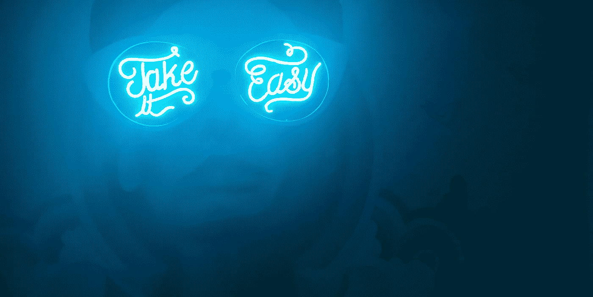
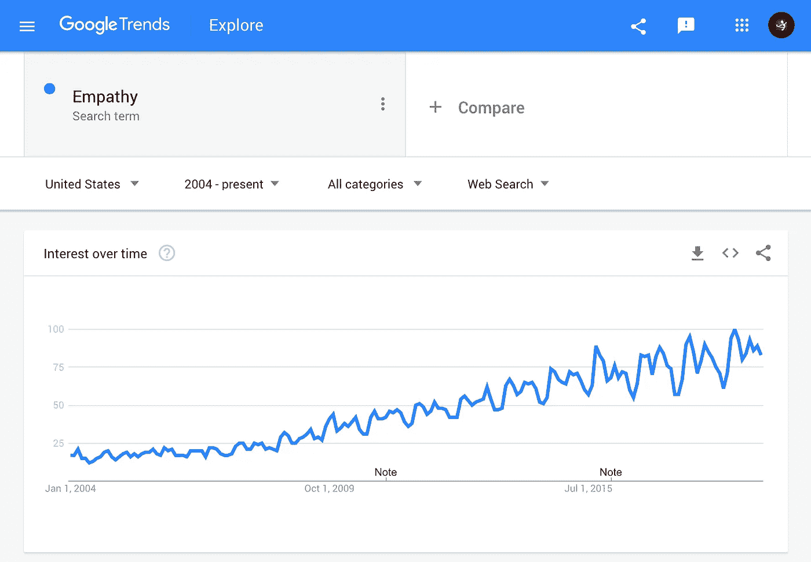

# 人性化设计中的移情

> 原文：<https://medium.com/swlh/objectivity-is-the-most-important-design-skill-part-1-54a927c7adc3>

## 设计移情

## 客观性是最重要的设计技巧——第一部分

在几乎所有关于日常移情的概念、实践或哲学观点中，流行文化都是正确的。同理心非常好。

沿着流行设计理论的兔子洞，同理心变得更加微妙。

# 移情作为一种设计态度

谁是设计方案的受益者？

因为以人为中心的设计过程的“成功”最有效地通过设计解决方案对其*人类*参与者的受益程度来衡量，所以以人为中心的设计实践者必须理解陈述的人类需求，以及需求的*激励* *性质，以有效地响应设计解决方案，代表参与者创造有意义的有影响力的产品、服务和体验。*

人的感觉是什么？人类的思维是什么？人类需要什么？人类想要什么？人类的理想结果是什么？人类的动机和期望是什么？人类衡量成功的标准是什么？我们如何创造直接造福人类的系统？我们如何为系统中的所有人创造有意义的利益？

我们如何更好地理解人类需求、理想结果或成功衡量标准的激励性质、环境和背景？

**因感同身受。**

假设从设计解决方案中受益的人的视角，为以人为中心的设计实践者提供了一种理解所收集的设计研究、以人为中心的系统观察和定性的人类反馈的上下文和意义的方法。

> 在以人为中心的设计过程中，同理心是一种态度、方法和实践，在设计有意义的有影响力的服务、产品或体验时，假设一个确定的人类参与者的观点，以更好地理解他们的需求、结果和成功的衡量标准。

# 为什么共情令人困惑

根据设计文化，移情就是一切。

随着“同理心”这个词的概念用法和行业态度在设计哲学和实践的交叉中不断发展，找到一个清晰的、有意义的定义作为团队期望的基础变得越来越困难。

同理心[日常](/mule-design/everyday-empathy-6a475e03fd81)。移情作用是[同情心](/@auldyn.matthews/from-empathy-to-compassion-an-evolution-in-ux-3a56d4b31be9)。移情[作品](/@auldyn.matthews/from-empathy-to-compassion-an-evolution-in-ux-3a56d4b31be9)。换位思考是一个[阶段](https://www.interaction-design.org/literature/article/stage-1-in-the-design-thinking-process-empathise-with-your-users)。换位思考是一个[基础](https://uxplanet.org/empathy-the-foundation-of-a-great-design-9b1887497c09)。移情是一种强有力的销售技巧。同理心是一种生活方式。同理心是一个关键。移情是一个[框架](https://blog.growthhackers.com/the-complete-guide-to-building-a-framework-for-customer-empathy-ca4407f928f)。

Google Trends: “Empathy” — January, 2004 to May, 2019

随着每一个新的哲学观点强调移情的概念价值，它在以人为中心的设计中的实际目的经常会被误解。这种误解导致对人类参与者的情感上的主观解释，导致设计的解决方案不符合客观确定的需求、目标和理想结果。

因为每个协作设计贡献者都带来了不同的视角(或文章),来说明共情作为一种世界观、商业实践或技术哲学有多么重要，所以在参与实际的、真实世界的解决方案的设计时，对于共情的解释和使用可能会有*许多*分歧。

> 同理心在设计领域之外有如此广泛的解释和情感考虑，以至于当设定对合作设计团队的态度的期望时，它成为一个很难处理的主题。

# 以人为中心的设计框架中的移情

如何对人类演员产生共鸣来驱动设计过程。

当设计从业者强调协作团队和功能中人类参与者的观点时，参与的贡献者围绕一个共同的以人为中心的目标。

以人为中心的设计将一个确定的人为因素置于一系列情境问题陈述的中心，设计实践者围绕这些问题陈述构建发现研究、测试假设和协作设计练习，以确定“人为驱动”的设计解决方案。

> 以人为中心的设计团队的目标是，在做出影响“人类演员”体验的决策时，从他们的角度看待设计挑战，从而为“人类演员”创造有意义的利益。

移情作为理解设计团队问题陈述中“人”的部分的有效方法，实践者能够在整个设计规划、创建和实现阶段更有效地衡量解决方案的“成功”。这种“基于视角的决策”的态度在任何过程、功能或服务的迭代创建中指导设计从业者，为系统中的人类参与者提供接触点。

阐明人类参与者的观点为设计团队提供了参与者需求背景的参考框架，将原本分散的事实和反馈汇集在一起，以创建设计问题和解决方案的清晰视图。

在创建各种各样的设计或研究工件、可交付成果或解决方案时，将同理心作为团队哲学来推动设计态度和讨论。

同理心设计意味着团队观察、假设、讨论和解决方案集中于创造利益，或改善人类参与者的条件、关系或体验。

> 直接回应人类的需求，以人类的利益为中心做出选择，并融入有意义的人类反馈，所有这些都代表了移情在以人为本的设计哲学中的实际应用。

# 移情应用

*没有一个有意义的目标，移情是没有意义的。*

随着“同理心”一词的不同流行用法继续改变其战术、专业用法，当参与以人为中心的设计过程时，合作设计从业者将同理心重新定位为一种客观态度变得越来越重要。

当设计从业者客观地假设一个人类演员的观点时，移情在以人为中心的设计框架中有一个实际的、有益的目的。

在以人为中心的设计过程中，移情的目标是创造一种基于视角的对人类需求、理想结果和成功衡量的理解。通过理解行动者的视角，设计从业者构建客观的假设和观察来创建解决方案*，用于进一步的反馈和测试*。

以人为中心的设计工具包包括各种集体建立的练习、态度和技术，以客观地建立对人类参与者需求的深刻理解，然后*通过测试和评估不同的面向人类的假设来有意义地响应*，以识别和部署最有益的以人为中心的解决方案。

> 在以人为中心的设计实践中运用同理心为设计从业者提供了一种方法，通过**客观地**从人的角度观察设计解决方案的条件或好处，更好地理解人类参与者的动机，并将其融入环境中。

# 移情设计的利与弊——第二部分

[继续阅读>](/@AlupaCreative/objectivity-is-the-most-important-design-skill-part-2-d76c151d6481)

本文是一个系列的第二部分，从更长的文章中浓缩而来:[客观性是最重要的设计技巧。](/swlh/objectivity-is-the-most-important-design-skill-863aa6de5c78?source=friends_link&sk=3206441727a366f70012ef07c559788c)

 [## 移情设计的利弊——第二部分

### 以人为中心的设计实践中情感共鸣的常见问题。情感共鸣驱动的设计选择…

medium.com](/@AlupaCreative/objectivity-is-the-most-important-design-skill-part-2-d76c151d6481)  [## 人性化设计中的客观移情——第三部分

### 分离依恋的微妙平衡。客观共情是有目的的。客观移情是战略性的、战术性的，而且…

medium.com](/@AlupaCreative/objectivity-is-the-most-important-design-skill-part-3-546a8a719e76)