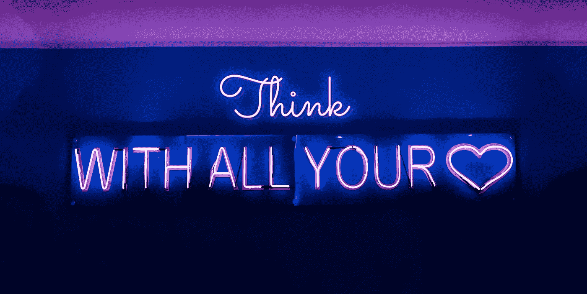

# 目标设计移情

> 原文：<https://medium.com/swlh/objectivity-is-the-most-important-design-skill-part-3-546a8a719e76>

## 设计移情

## 客观性是最重要的设计技巧——第三部分

# 客观移情

*分离依恋的微妙平衡。*

客观共情是有目的的。客观移情是战略性的、战术性的、有意义的。客观同理心理解人类的需求，同时也平衡“系统”的固有知识，在现实世界的约束条件下，为人类参与者提供最大可能的利益。

共情对设计过程的成功贡献取决于设计从业者在设计解决方案的背景下客观理解、表现和响应人类行动者观点的有效性。

在任一移情功能模型中，*客观地表现*人类行动者的视角是其在以人为中心的设计框架中的应用和功能使用的核心考虑因素。

> 当基于以人为中心的设计实践制定解决方案时，设计从业者必须学会客观地运用移情作为一个步骤和一种团队态度。

## 人性化设计中的客观移情

> *以人为中心的设计实践高度强调移情，将其作为理解人类参与者的需求、目标和结果的一种方式，因为设计解决方案“成功”的确定是通过其对人类参与者的直接利益* ***的程度来衡量的。***

在组建以人为中心的协作设计团队时，应该清楚地阐明建立客观的同理心作为驱动团队的态度。设计者通过了解系统的所有变量，包括可能不是由人类自己直接驱动的变量，创造出最有益的解决方案*。*

许多创造成功设计方案的决策点并不为人类参与者所知。“同理心理解”的价值在于设计从业者能够从用户的角度看待问题，同时从专业设计从业者的角度做出回应。这种双重目的必须客观地应用于在人的需求和服务、产品或技术之间找到平衡。

设计从业者有责任理解人类的需求，并给出有意义的设计解决方案，同时客观地平衡人类利益与“系统”的功能需求和限制

> 客观地平衡人的观点和解决方案的功能考虑是客观移情在以人为中心的设计过程中提供的众多好处之一。

## 专业化团队职能中的客观移情

当设计从业者接近和评估人类行动者的可能视角时，他们必须实践客观性以有效地最小化他们自己的相对偏好、偏见和世界观。

当协作设计参与者贡献高度专业化的技能或业务功能时，保持客观性可能特别困难。

虽然整个设计团队都面临着相同的客观性挑战，但那些拥有专业技能的团队通常受到不同于以人为中心的问题陈述的系统考虑的激励。专业化的团队考虑会带来更高的风险，促使决策成为“部门”需求的反映，而不是相关的以人为中心的利益。

客观地讨论专门的团队角色或功能对人类参与者的体验的影响，通过将团队对话集中在人类参与者对系统限制的响应上，促进了越来越成功的以人为中心的设计解决方案。

> 在评审专门的限制或机会时，考虑人类参与者的观点为协作设计团队提供了一个论坛，以解决满足人类参与者的需求以及专门团队功能贡献的需求的备选解决方案的问题。

# 设计研究的客观性

*客观上在设计研究过程中的作用。*

以人为中心的设计研究的功能性贡献是客观地观察、测试、测量或评估人类行为者的动机、需求、结果、态度或反应。

设计研究人员充当面向人的对话的推动者，目的是观察、测量或量化各种利益的决定因素，同时也评估或限定人对各种设计解决方案的反应。设计研究人员通过各种各样的方法、技术和练习来促进对话、反馈、观察、鉴定和量化人类演员。设计研究测试通常针对非法的特定类型的反馈，或成功的指标，从一个人类演员作为设计“成功”的反映

> 因为以人为中心的设计团队的许多决策将基于纳入从解决方案中受益的人的*直接反馈*，建立客观性、信任和透明度作为设计研究贡献者的核心特征变得越来越重要。

## 建立客观的研究基线

客观性最大限度地减少了不同设计研究人员的主观研究变量，有效地建立了一个比较基线，从中得出有意义的设计结论。

目标设计研究为设计从业者提供了一个中央团队知识库，由定性和定量研究结果汇编而成。经过编辑和评审，在评估测试和评估的设计解决方案时，跨职能团队可以对客观的研究结果进行有意义的比较、参考和分析。

当设计研究人员受到情感共鸣的影响时，随后的结果、观察、读数和发现就变成了对人类演员的解释，而不是客观的表现。这种偏见最终导致设计解决方案强调设计研究人员的主观观点或解释，而不是人类参与者的实际需求。

> 不准确的、有偏见的或“解释的”设计研究创造了一个错误的成功衡量标准，当根据人类参与者的实际需求、目标和结果来衡量时，显著地影响了设计解决方案响应的“准确性”。

## 交流设计研究结果。

有效地交流定性和定量结果是设计研究从业者的主要职责。

跨部门、角色和合作者交流以人为中心的设计研究结果提供了一个中心“人”的参考点，这有助于促进更大的组织和团队功能中的人类参与者的同理心。

随着实践者对客观设计研究的了解，跨职能团队更容易理解他们对人类体验的影响。当以人为中心的设计研究变得“过滤”时，当只呈现有限的研究结果时，可能对某些专业团队贡献者有意义的上下文细节可能被最小化或丢失。

由于不同设计贡献者的功能专业可能对人类参与者视角的不同解决方案影响方面感兴趣，基于研究者的解释限制或提炼设计研究最终会忽略或最小化研究结果中可以找到的不同功能专业机会。

> 定性和定量研究结果通过为跨部门解决方案的成功建立一个共同的参考框架，并促进团队功能，使整个跨协作设计团队受益。

# 客观移情——战术观点

当客观地平衡同理心时，以人为中心的设计实践者能够有效地识别因果需求，设计和评估理想的人类结果，并比传统的需求导向的设计过程更有效地为人类参与者提供有意义的利益。

1.  在发现、创新、迭代、评估和交付的整个以人为中心的设计阶段，以客观移情的专业态度进行设计。
2.  从认知同理心入手，理解受益于设计解决方案的人类参与者的视角需求。
3.  客观地确定需求、目标和结果，人类参与者将使用它们作为解决方案成功的感知度量。
4.  理解情感指标背后的人的心理观点、因果需要或心理模型，而不承担人类参与者的情感负担。
5.  强调人类演员视角的功能、战术或心理观察，而不是情感解释。
6.  通过精心设计解决方案，客观、直接地解决参与者的成功衡量标准，以反映和回应他们的需求、目标或理想结果。
7.  客观地运用移情作为一种方法，从心理上衡量人类演员对实际设计方案的预期反应。
8.  在设计研究中运用同理心，理解行动者的观点，同时也观察周围的条件、环境和场景，这些构成了行动者意图的背景。
9.  客观地思考设计解决方案的实际的、真实的好处，与人类参与者的需求相对照。
10.  即使在设计解决方案交付后，继续促进有意义的以人为中心的设计对话。

# 客观性是最重要的设计技巧

采用客观性作为其基本指导设计原则的设计从业者采用许多不同类型的技术、练习和方法来响应人类参与者的需求。作为一种普遍适用的态度，同理心必须有目的地导致客观的评价、结论和设计从业者的行动，以真正造福人类演员。

虽然移情确实为设计团队提供了态度、方法和理念，但预期人类利益的客观平衡必须与现实世界的环境和实际、可用和功能性设计解决方案的限制相权衡。

承担人类行为者情感负担的设计师破坏了以人为中心的设计过程的客观本质，交付的设计方案不能满足人类行为者的需求。

> 移情是许多练习、方法和态度中的一种，但是客观性仍然是最普遍最重要的设计技巧。

As facilitated by this kitten.

# …现在拥抱一下。

*移情不仅仅是一种态度、工具或设计销售术语。*

在设计框架之外的世界里，同理心、同情心和怜悯心构成了三重特征，表明了人类演员内心情感平衡的世界观。几乎在任何社会背景下，同理心都受到高度鼓励，大多数从概念上强调同理心价值的文章(尤其是在工作场所)都是在支持更大的社会文化“善”，这是即使是最咸的设计从业者也能轻易支持的东西。

同理心是一种尊重和承认的行为。同理心是足够关心，花时间去理解另一个人的观点。移情是一种倾听、感知和观察的行为，目的是更好地理解他人的观点。同理心是带着体谅去行动。同理心是当你和另一个人产生情感共鸣时的那种兴奋感。

感同身受是很多事情。在以人为中心的设计实践中，有很多事情*代表人类演员*。

本文是一个系列的第三部分，从更长的文章中浓缩而来:[客观性是最重要的设计技巧。](/swlh/objectivity-is-the-most-important-design-skill-863aa6de5c78?source=friends_link&sk=3206441727a366f70012ef07c559788c)

 [## 人性化设计中的移情——第一部分

### 在几乎所有关于日常移情的概念、实践或哲学观点中，流行文化都是正确的。同理心…

medium.com](/@AlupaCreative/objectivity-is-the-most-important-design-skill-part-1-54a927c7adc3)  [## 移情设计的利弊——第二部分

### 以人为中心的设计实践中情感共鸣的常见问题。情感共鸣驱动的设计选择…

medium.com](/@AlupaCreative/objectivity-is-the-most-important-design-skill-part-2-d76c151d6481)