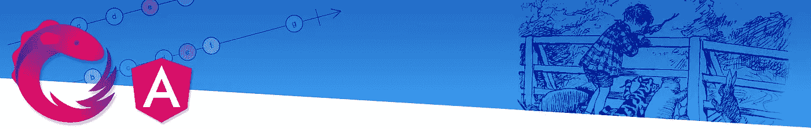

# RxJs 可观测量和角度🎓

> 原文：<https://medium.com/swlh/observables-angular-7e11ad612072>

## 第 1 部分:深入探究 RxJs 可观察对象和订阅

这是致力于理解 RxJS 和 Angular 系列的第一篇文章。本系列的目标是研究 RxJs Observables 内部是如何工作的，并看看我们是否可以利用这些知识来理解如何最好地将 RxJs Observables 与 Angular 一起使用。