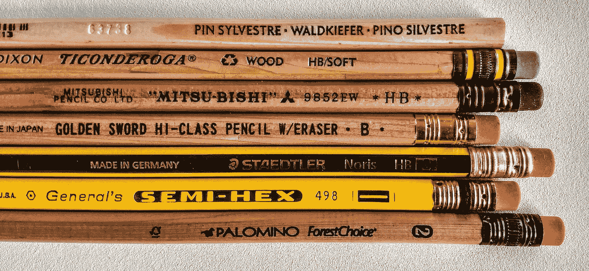

# 强迫症不是一个词

> 原文：<https://medium.com/swlh/ocd-aint-a-word-317551df7b28>

Sufferers of OCD don’t just like their pencils lined up a certain way.

我们都听人说过。可能是我们自己说的，也可能是有人说我们。“我太强迫症了。我不能穿不搭配的衣服。”“你太强迫症了。你需要放松。”"他有强迫症，只喝星巴克咖啡."当然，我们知道这些陈述意味着什么。但他们仍然都错了。

强迫症是一种心理疾病:强迫症。它不是形容词。D 代表*紊乱*。想象一下使用…