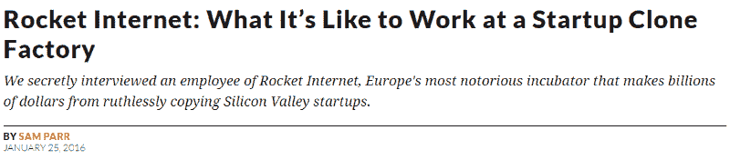
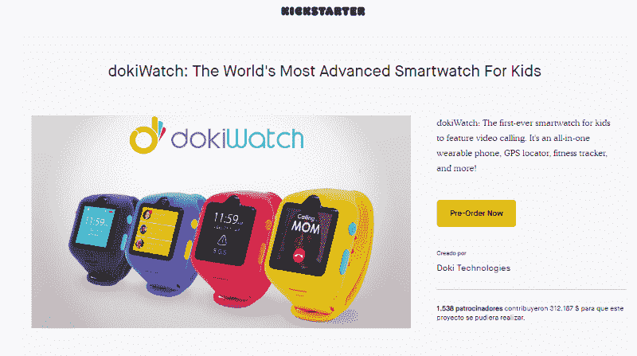
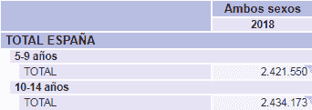
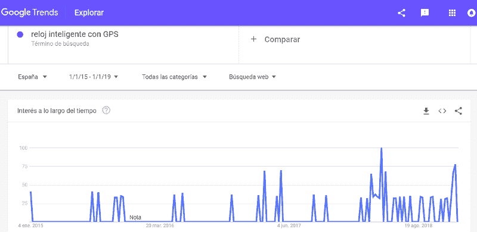
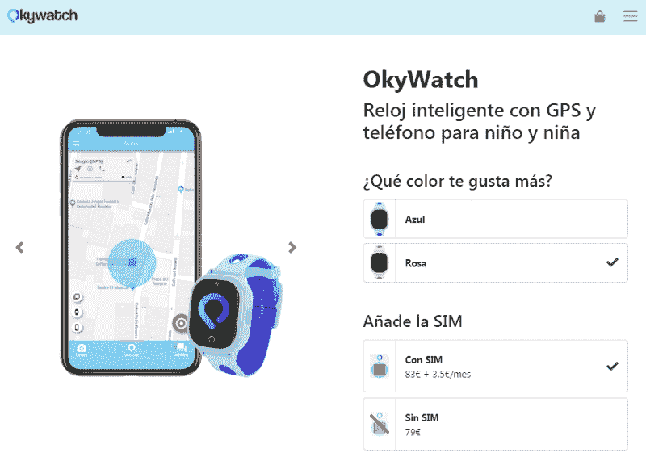
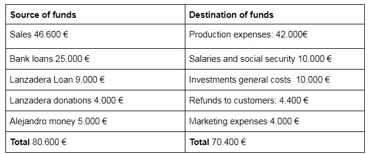
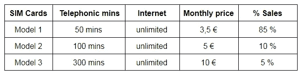

# OkyWatch 商业案例:从模仿到寻求牵引力

> 原文：<https://medium.com/swlh/okywatch-business-case-7ddbdc2a6669>

OkyWatch 是一家由 Lanzadera 支持的初创公司，销售带有 GPS 定位孩子的智能手表。2018 年，OkyWatch 验证了其通过预购降低风险的价值主张，并实现了产品市场适应性，销售了近 1000 只手表。2019 年，OkyWatch 将面临挑战，以将业务规模扩大到下一个级别，与新的竞争对手区分开来，并巩固团队。

# **1。创始人介绍**

在 Mercadona 工作了 10 年后，Alejandro Albiach 决定申请一所大学，以便在职业生涯中获得更多机会。后来，亚历杭德罗遇到了 EDEM 大学，这是一所创业型大学，由 Mercadona 董事长兼现任老板胡安·罗伊格先生创办。

他意识到这所大学是他要走的路。他尝试过，但起初 EDEM 不接受他。在这个艰难的时刻之后，为了利用他的时间，他决定开始在瓦伦西亚大学学习，他准备了所需的英语水平。在忙碌的一年后，他仍然在梅尔卡多纳工作，在威斯康辛大学学习 BBA 的第一年，提高英语水平，他决定再试一次……他最终被 EDEM 大学录取了。

**Figure 1:** Alejandro’s celebration after being accepted by EDEM.

在 EDEM 的四年里，亚历杭德罗学到了创业的基本知识，结识了许多企业家，他意识到自己想成为他们中的一员。

此外，他还进行了一些创业冒险。首先，他在夏天在阿利坎特开了一家**酒吧**。生意并不成功，但他学会了如何管理和激励员工，不把家人和朋友与生意混为一谈。在与**美发师市场**的另一次失败尝试后，他和他的妹夫一起创建了一个 **Youtube 子网络**。这个平台向 youtubers 提供内容、版权、网络和教程，以换取他们收入的百分比股份。他们能够获得 120 个 youtube 频道和每天 700 万的访问量。然而，Youtube 改变了这种商业模式，取消了所有子网。在此之后，他试图提高物流供应链的效率，但是有许多大的竞争者，如 Telit、IBM、微软等。与之竞争。因为这个原因，他决定不再继续这种商业模式。

在这个项目中，Alejandro 学会了如何对设备进行地理定位，以便在这些资产之间建立一些通信渠道。这些知识将帮助亚历杭德罗运行他的下一个创业项目。

尽管如此，他并没有气馁，从兰扎德拉的角度来看，我们知道他是一个优秀的企业家，但他的项目并没有实现产品与市场的契合。

# **2** 。**方法论**

为了支持 Alejandro 走上创业之路，Lanzadera 教给了他一种在创业生态系统中非常流行的方法。

**模仿方法**包括分析在其他地理区域表现良好的不同项目，目的是将它们引入另一个市场。这些项目应该很容易被复制并带到我们的市场，而不考虑个人偏好，以避免分析决策中的偏见。

成功的关键是非常有条理地分析不同的趋势。需要耐心，因为这是一个漫长的过程，企业家应该制定自己的标准来选择项目。在这之后，企业家必须能够通过创造更多的客户价值来**改进**选定的项目，并**使之适应**选定的市场。

**标准准则:**

*   容易克隆
*   顾客愿意付钱
*   该领域的一些参与者

还有，建议不要选择科技项目，因为会耽误上市。亚历杭德罗说，这是推出 OkyWatch 最艰难的部分。

一个很好的例子就是不断增长的小型摩托车市场，许多公司在很短的时间内就发展起来了。

**Figure 2:** Different urban mobility companies originated recently.

这与传统的思维模式相反，传统的思维模式是在一个你有公认专业知识的领域创业。这种方法是为纯粹的企业家设计的，他们知道如何吸引合适的人，尽快推出和改进 MVP 以验证所选的想法，他们知道如何以有利可图的**方法方式**扩大业务规模。

这种模式通常由一系列科技企业家实施，比如 La Nevera Roja 的创始人伊尼戈·胡恩特吉(Iñ igo Juantegui)，该公司于 2015 年以 8000 万€的价格出售。inigo 最近开发了 On Truck 来解决传统托盘运输中的所有低效问题。他们没有这方面的经验，但他们非常清楚如何启动创业公司，筹集资金，使用和创造技术工具，以提高效率。他们发现了一个效率低下的部门，他们正在利用他们的技术和企业家专长来消除浪费的开支和改进流程。

我没有证据表明 On Tuck 是由模仿者创造的，但可以肯定的是，他们使用了精益方法，因为他们知道如何以无限的方法进行扩展和改进。La Nevera Rojas 是 Just Eat(英国)和 Grub Hub(美国)等公司的模仿者。

Rocket Internet 是一家位于德国的创业克隆工厂。他们使用模仿的方法来分析世界范围内最好的创业公司，这些公司大多来自硅谷。自 2007 年以来，火箭互联网已经支持了超过 75 家公司，每年创造超过 30 亿美元的收入。

**Figure 3:** Online newspaper article explaining Rocket Internet.

为了确定 copycat 的想法、趋势、商业模式和有用的工具，我准备了这个动态资源列表:

**Figure 4:** Dynamic list of copycat resources. **Source:** Own elaboration.

# **3。模仿分析**

2016 年 2 月，首批玩家之一 dokiWatch 在 kickstarter 上实现了 20.000 美元的目标，预购销售额达到 312.000 美元。

**Figure 5:** DokiWatch kickstarter campaign. **Source:** [Kisktarter](https://www.kickstarter.com/projects/dokiwatch/dokiwatch-the-worlds-most-advanced-smartwatch-for).

除了 Xplora(正在投资电视广告)这样的国际公司，一些西班牙公司已经出现，如 Watchimp 和亚马逊和速卖通中的许多亚洲智能手表品牌。

根据 INE 的数据，大约有 500 万 5 到 14 岁的孩子。这是关于 OkyWatch **买家角色**最准确的信息，尽管真正的目标是在 6 到 12 年之间。这是因为根据 *Net Children Go Mobile* 的研究，0-6 岁的儿童接触科技，但他们没有任何设备，他们中的大多数人在 12 岁时获得了他们的第一部智能手机。

这个数据突出了**瞄准的利基市场。** OkyWatch 允许孩子们拥有自己的小工具，包括一些游戏、电话、朋友之间的互动，但没有当前智能手机无法控制的互联网接入问题。与此同时，父母让他们的孩子满意，他们对控制他们的位置和有可能联系他们感到舒适。

**Figure 6:** Demographical statistics from INE.

此外，INE 指出，80%的 10 岁西班牙儿童可以访问互联网，那么我们可以假设，6 至 12 岁的儿童或多或少会有 70%的互联网接入。这意味着**总潜在市场**是 340 万儿童。需要这些数据来确认你选择的市场足够大，可以开始运营。

计算 TAM 后，下一步是分析西班牙客户趋势。正如我们在下图中看到的，2018 年 Okywatch 开始活动时，谷歌上的搜索量有了显著增加。

**Figure 7:** Google Trend analytics.

# **4。走向市场**

为了创办公司，亚历杭德罗面临着创建软件和硬件的问题，如漫长的进口过程和筹集资金以满足最低数量的订单。然后，为了降低风险，他决定发起一项由未来客户出资的预购活动。

**Figure 8:** Alejandro launching pre-order campaign.

在投入任何资金进行生产之前，他能够卖出 350 个单位，相当于 28000€的营业额。这是在**精益启动方法**之后**验证解决方案**的一个很好的例子。经过一些收集后，OkyWatch 改进了它的软件和硬件，同时 OkyWatch 获得了足够多的付费客户来维持这种增量改进的投资。

我专门制作了一张关于预购的 GIF 图，因为这是一个重要的里程碑。这些销售数字给了 OkyWatch 足够的信誉来吸引人才，筹集银行贷款，并被 Lanzadera 接受。

最初的商业模式是以 79 €的价格出售设备的交易型电子商务，但 Oky Watch 最近已经迭代提供 SIM 卡，并从客户那里获得 3.5€到 10€的每月经常性收入。

**Figure 9:** OkyWatch Website.

# **5。团队**

所有这些成就都归功于 OkyWatch 团队，除了首席执行官亚历杭德罗之外，该团队还包括首席技术官 CMO 和兼职客户助理。

此时此刻，关键角色正在向亚历杭德罗索要公司的股份，因为他们参与了公司的成长，而他们得到的报酬却很低。

# **6。2018 Oky 手表性能**

亚历杭德罗是该公司的唯一股东，以下是他开始时面临的一些主要问题:

*   预购活动出现了延迟，他不得不向 55 名不满意的客户退款，损失了 4.440 €的收入。
*   他以 OkyDoki 品牌开始运营，但为了避免与一些竞争对手混淆，他不得不将公司更名为 Okywatch，这导致了时间和成本的损失。

这些是他 2018 年的一些成就和数字:

**Figure 10:** Source and destination of funds.

**一些相关指标:**

手表数量:860

门票数量:670 张

Sim 卡数量:280 张

**Figure 11:** SIM card pricing model.

**成本明细**

手表价格:31 €

关税和税收:26%

国际运输费用:每 500 件 650 英镑。

混合碳酸钙:19.5€

交货和提货:7€

回报率:1.1%

SIM 卡服务的预计客户生命周期月数:12 个月。

**目前 Alejandro 在 2019 年面临一些挑战，他需要你的帮助。你愿意支持他吗？**

1.  OkyWatch 的潜在威胁有哪些？你会怎么解决呢？
2.  基于[单位经济学](/swlh/unit-economics-is-growth-the-ultimate-goal-of-a-startup-b319df9c45f)的营销策略是什么？如果你不熟悉这个术语，请阅读这篇文章。考虑交易性和经常性收入。
3.  Oky 手表应该开始在亚马逊上销售吗？
4.  亚历杭德罗如何在 Oky Watch 留住人才？

在本期播客中，你可以听到亚历杭德罗·阿尔比奇对 OkyWatch 的解释。

**免责声明:**所有案例均基于 OkyWatch 提供的真实和虚构数据，并为教学目的而改编。如果您有任何意见，我们很乐意发送电子邮件至 jdetoro@marinadeempresas.es，主题为“Oky Watch 业务案例”。

[Lanzadera](https://lanzadera.es/) 是一家位于巴伦西亚的创业加速器和孵化器，每年为 100 多名创业者提供支持。兰扎德拉有不同的项目，涵盖从 MVP 到成熟企业家的范围。

*   如果你想了解更多关于 Lanzadera 的信息，你可以发邮件给我
*   你想知道更多关于我们的计划和标准吗？👉[这里](/@jdetoro/cómo-asegurar-tu-entrada-en-lanzadera-47e9059a2581)
*   给我们的采访一些建议？👉[这里](/@jdetoro/claves-para-tener-éxito-en-las-entrevistas-de-lanzadera-6daeb46df414)
*   单位经济学👉[此处](/swlh/unit-economics-is-growth-the-ultimate-goal-of-a-startup-b319df9c45f)

阅读我们的博客:[https://lanzadera.es/blog/](https://lanzadera.es/blog/)

## 这篇文章发表在 [The Startup](https://medium.com/swlh) 上，这是 Medium 最大的创业刊物，拥有+433，678 名读者。

## 在此订阅接收[我们的头条新闻](https://growthsupply.com/the-startup-newsletter/)。

