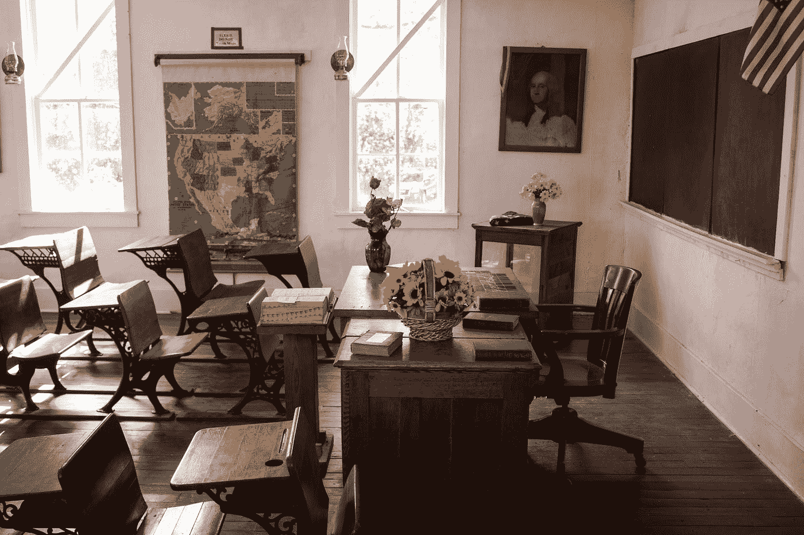

# 守旧派没有死

> 原文：<https://medium.com/swlh/old-school-isnt-dead-22bd4fc82ee0>

谷歌教室和其他数字平台很棒，但它们无法击败旧学校的教育实践。

Photo by [Jeffrey Hamilton](https://unsplash.com/@pistos?utm_source=medium&utm_medium=referral) on [Unsplash](https://unsplash.com?utm_source=medium&utm_medium=referral)

在我当老师的 15 年里，技术在教室和学生家中变得越来越普遍。当我开始的时候，我们点名并把分数记录在纸质的成绩簿上，我并不后悔。这很乏味，计算必须手工完成。