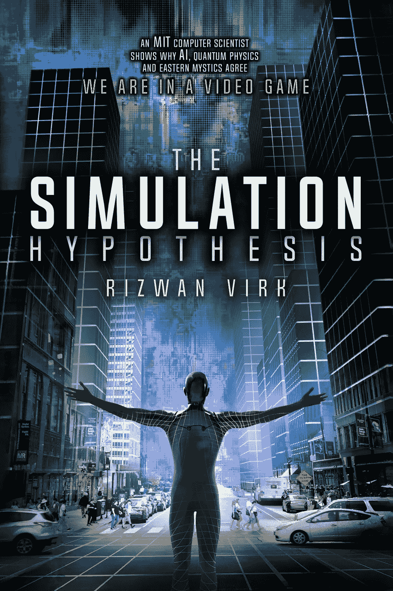

# 在《黑客帝国》20 周年之际，麻省理工学院游戏行业资深人士发布“模拟假说”

> 原文：<https://medium.com/swlh/on-20th-anniversary-of-the-matrix-mit-game-industry-veteran-to-release-the-simulation-hypothesis-4e451e2ebf68>

注:**该书现已接受预购，将于 2019 年 3 月 31 日发售。******，或登陆作者网站**[**【www.zenentrepreneur.com】**](http://www.zenentrepreneur.com/)**。****

****加州三藩市——2019 年 3 月 21 日**——在游戏开发者大会(GDC)上，畅销书作家、著名麻省理工学院计算机科学家和硅谷视频游戏设计师 Rizwan Virk 宣布，他的书 [*《模拟假设*](https://www.amazon.com/Simulation-Hypothesis-Rizwan-Virk/dp/0983056900/) 、*一位麻省理工学院计算机科学家展示了为什么人工智能、量子物理学和东方神秘主义者同意我们在一个视频游戏*中，将在电影上映 20 周年之际发布*《黑客帝国》。这是第一本由视频游戏行业资深人士撰写的严肃书籍，解释了我们这个时代最重要的理论之一，即我们生活在一个复杂的视频游戏中。***

**“当《黑客帝国》在 1999 年问世时，它还只是科幻小说的范畴，”维尔克说。“在此后的 20 年里，随着 MMORPGs、虚拟现实、AR、AI 和神经科学的发展，我们越来越接近了。在这本书里，我描绘了一条从今天的技术到构建矩阵的清晰道路。”**

**Virk 是麻省理工学院游戏实验室视频游戏创业孵化器 Play Labs @ MIT 的创始人，也是许多视频游戏创业公司的联合创始人、顾问和投资者，包括 Discord、Telltale Games、Funzio、Gameview、Tapjoy 和 silver . TV。**

****

**The Simulation Hypothesis will be released on the 20th anniversary of the Matrix**

**Virk 将计算机科学、人工智能、视频游戏、量子物理以及古代东方和西方宗教文献的概念结合在一起，展示了所有这些传统如何结合在一起，指向我们可能在模拟现实中的想法，如 *The Matrix。***

**像菲利普·K·蒂克这样的科幻作家已经探索了模拟现实的想法。最近，像埃隆·马斯克这样的杰出人物，以及像尼尔·德格拉斯·泰森这样的科学家和其他人都谈到了这个想法。像谷歌的 Ray Kurzweil 这样的未来学家已经普及了下载意识的想法，牛津大学的 Nick Bostrom 在 2003 年发表了一篇论文，得出结论说我们生活在一个模拟中。**

**这本书探索了视频游戏发展的历史，并汇集了这些不同思想家的观点。模拟假说是为计算机科学家、科幻迷、视频游戏爱好者和寻求理解现实本质的精神探索者准备的。**

**这本书包括诺亚·法尔斯坦、苔莎·b·迪克、雅克·瓦莱、丹尼翁·布林克利、布伦特·布什内尔、亚当·库里和戴安娜·沃尔什·帕苏尔卡以及拉杰夫·苏拉蒂博士的背书。**

**注:**该书现已接受预购，将于 2019 年 3 月 31 日发售。******，或登陆作者网站**[**【www.zenentrepreneur.com】**](http://www.zenentrepreneur.com/)**。******

******为 Rizwan Virk 的书代言:*模拟假说*******

****Riz Virk 的模拟假说展示了计算机模拟的技术方面，以及当菲利普·K·蒂克提出我们生活在计算机生成的现实中时，我们为什么能够认真对待他的神秘原因。他认为这个世界并不真实，这一观点贯穿了他的许多科幻小说。这本书从科学和宗教的角度解释了这个观点。****

****~ **苔莎·b·迪克**，*与菲利普·K·蒂克的对话的作者，*菲利普·K·蒂克的妻子****

****模拟假说为当前的现实模型提供了一个激进的替代方案。依靠计算机科学的最新见解和作者对数字游戏设计的独特经验，许多被现代科学拒绝或忽视的人类经验领域可以纳入 Riz Virk 提出的框架下。其结果是对人类在无限宇宙中的意义进行了惊人的重新评估。”****

****~ **Jacques Vallée** ，风险投资家，*禁忌科学*的作者，前美国宇航局和斯坦福研究所科学家****

****“在*的模拟假设中，*里兹·维克提供了一个灵巧而有见识的视频游戏历史、硬科学推测和科幻参考的混合体。不管你是否相信我们都存在于一个模拟中，我发现它既迷人又有趣。”****

****~ **诺亚·法尔斯坦**，前 IGDA 主席，前谷歌首席游戏设计师****

****“在*的模拟假设*中，Riz Virk 将当前沉浸于视频游戏和个性化娱乐的趋势归结为他们的逻辑结论:如何建立一个与我们日常生活中所经历的一样真实的模拟。虽然没有人能确切地说出我们有多少条命，但我的建议是假设这是一个“一命游戏”，并充分利用它！”****

****~ **Brent Bushnell** ，Two Bit Circus 创始人兼 CEO，****

****“我自己的经历告诉我，我们在虚拟世界中生活、教学、学习和热爱。在《T4》的《模拟假设》中，里兹·维克将科学家的头脑和神秘主义者的心灵结合在一起，用电子游戏来解释我们生活的虚拟现实****

****~ **Dannion Brinkley** ，畅销书《被光明拯救的*和《在光明中平静的*】的作者******

*****“Rizwan Virk 的书*模拟假说*是为数不多的可以让我相信我可能生活在一个模拟宇宙中的作品之一。Virk 的知识广度涵盖了宗教史、哲学、流行文化、现代物理学和计算机技术，他的理论不仅可行，而且可能是正确的。*****

*****如果这听起来令人兴奋，那就是！这本书也非常有趣和吸引人，引用了流行文化和视频游戏来保持哲学和科学的趣味性。我强烈推荐这本书——它拓展了我的思维。"*****

*****~ **戴安娜·沃尔什·帕苏尔卡**，北卡罗来纳大学威尔明顿分校哲学和宗教教授，著有*美国宇宙:不明飞行物、宗教、技术******

*******关于作者:*******

*****rizwan(“Riz”)Virk 是一位成功的企业家、天使投资人、畅销书作家、视频游戏行业先驱和独立电影制片人。Virk 目前运营着 Play Labs @ MIT([www . Play Labs . TV](http://www.playlabs.tv/)))和 Bayview Labs([www.bayviewlabs.com](http://www.bayviewlabs.com/)))这是一个在麻省理工学院游戏实验室和 bay view Labs 的校园内举办的有趣技术的创业加速器。他是游戏化娱乐市场 Bitmovio([www . bit mov . io](http://www.bitmo.vio))的联合创始人。*****

*****Virk 的书有:*创业神话与模式:斯坦福商学院不教你的秘密*，来自哥伦比亚大学出版社(2020)；*禅创业:走职业战士的路*(2013)；*寻宝:跟随你内心的线索找到真正的成功* (2017)。拜访 www.zenentrepreneur.com，了解更多关于维克和他的书。*****

*****数百万人玩过 Virk 的视频游戏，包括 *Tap Fish* ，以及基于电视节目的游戏，如《可怕的便士》和《格林》。Virk 已经投资了许多视频游戏公司，包括 Telltale Games(基于*行尸走肉*和*权力的游戏*的叙事游戏的创造者)，Disruptor Beam(星际迷航:时间线游戏的创造者*)，Pocket Gems，Tapjoy，Sliver.tv/Theta,不和，以及 Bitmovio。******

*****Virk 为许多领先的技术和精神博客撰写文章，包括 TechCrunch、Venture Beat、Hacker Noon、Startup Grind。他曾在麻省理工学院、500 家创业公司、新生活博览会、Coast to Coast AM 等各种关于技术、创业精神和视频游戏的会议上发表演讲，他甚至被乔恩·斯图尔特的*每日秀讽刺过。******

********模拟假设*，作者 Rizwan Virk | bay view Books | 2019 年 3 月 31 日*******

*******平装 ISBN: 9780983056904 | $12.95 | 300 页*******

**********

## *****这篇文章发表在 [The Startup](https://medium.com/swlh) 上，这是 Medium 最大的创业刊物，拥有+436，678 名读者。*****

## *****在这里订阅接收[我们的头条新闻](https://growthsupply.com/the-startup-newsletter/)。*****

**********