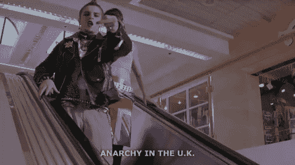

# 关于装腔作势

> 原文：<https://medium.com/swlh/on-being-a-poser-38b21386a96d>

20 年前，我决定要做一个朋克。我今天想不起做出这个决定的细节了。我一直是一个坚定且天生的孤独者，到了八年级，我鼓起了个人勇气成为了一名潜伏者。起初我的潜伏范围很广，但很快就缩小到坐在自助餐厅最远角落的朋克人群，那里没有其他人，也没有窗户。奇怪的是，在那之前我没有听过真正的朋克专辑，没有意识到…