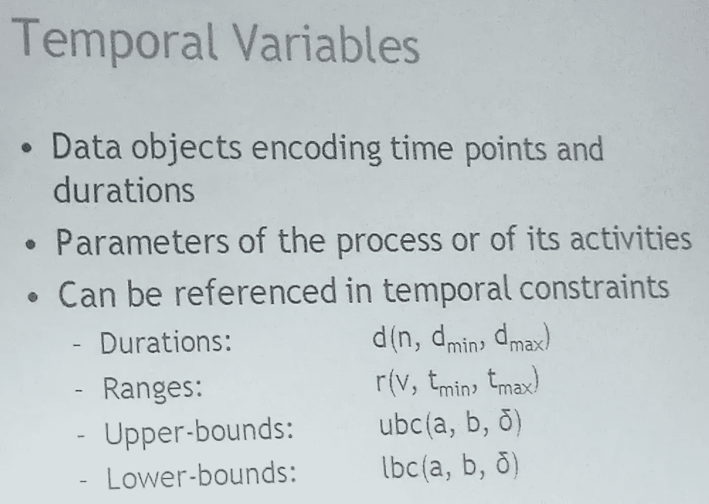
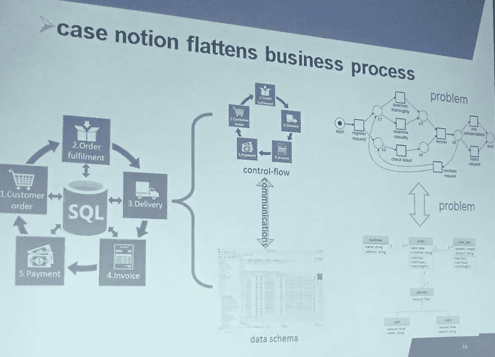
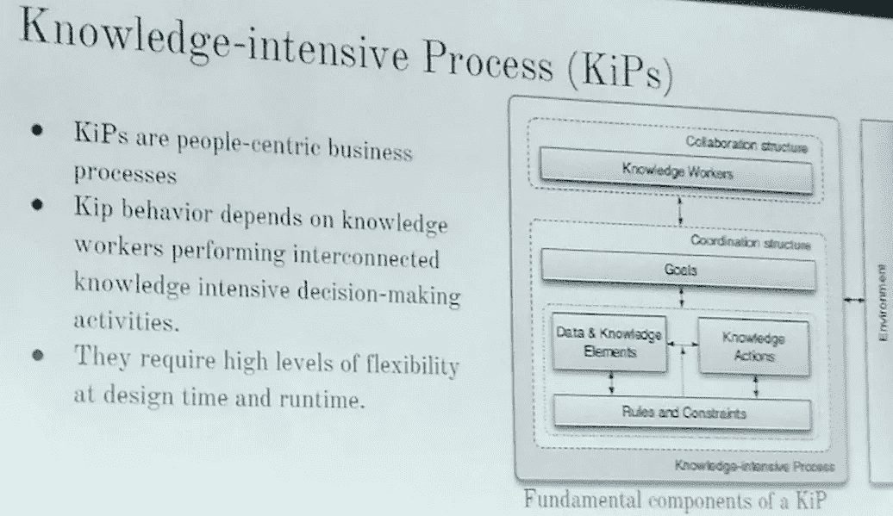
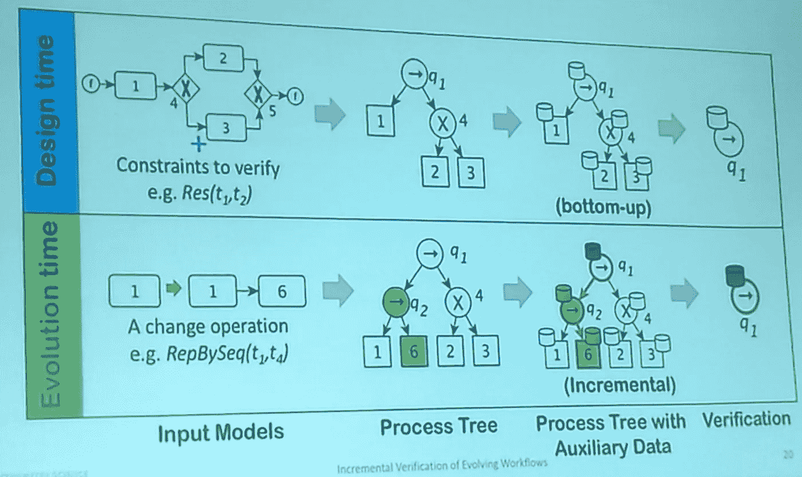

# 关于 BPM 和企业(再次)

> 原文：<https://medium.com/swlh/on-bpm-and-the-enterprise-again-ed9c66079934>

## 流程和架构如何让公司受益

Photo by [dylan nolte](https://unsplash.com/@dylan_nolte?utm_source=medium&utm_medium=referral) on [Unsplash](https://unsplash.com?utm_source=medium&utm_medium=referral)

连续第三年， [ACM SAC 会议](https://www.sigapp.org/sac/sac2019/)上的 [BPM-EA 专题](http://www.cs.unibo.it/sacbpmea19/)共同主持了业务流程管理(BPM)和企业架构(EA)领域的一系列有趣贡献。

我们的理由是，管理公司的信息资产比仅仅应用一种方法要困难得多。应该考虑多种观点。建立解决企业问题的方法、解决方案和技术的适当组合是一个时间和经验的问题。

业务流程、企业架构、系统和软件建模无疑是设计和执行公司行为的重要方面。我们声称这些贡献没有得到最大限度的利用，因为它们的互补性和结合很少被使用。这样做的目的是收集能够跨这些学科和方法进行集成和协作的贡献。

我在这里报告一个对赛道贡献的快速总结。

# 业务流程的可靠预测监控

Photo by [pixpoetry](https://unsplash.com/@blackpoetry?utm_source=medium&utm_medium=referral) on [Unsplash](https://unsplash.com?utm_source=medium&utm_medium=referral)

我们希望预测一个 PPI(流程性能指标)来报告流程的正确执行，我们希望评估这些预测的可靠性，同时考虑场景的可变性。我们希望预测尽快到来，例如在流程执行的开始。代替使用基于 ML 的可靠性定义(例如，用于成功和不成功的过程执行的二元分类器的准确性)，我们考虑可靠性作为在过程执行中仍然可能的可能路径的数量的函数，或者从开始相对于整个过程执行的估计总时间流逝的时间。

# 使用时间变量的业务流程的可控性

我们想知道可满足性(存在:至少存在一个满足约束的执行？)和可控性(普遍性:能否证明所有执行都满足约束？)相对于过程(或任务)执行的现有时间约束。在时间约束的表达能力和它们的可控性之间有一个折衷。

该提案引入了一种基于时间和时态约束的简化过程语言。这种语言允许指定时态规则和模式，并允许检查强可控性(基于精确的时间戳定义规则)和动态可控性(较弱但更现实的可控性)。

# 行为和数据视角的混合模型

我们的目标是将过程约束与数据相关的建模特征结合起来。这是对企业进行多角度分析的一个步骤。传统的流程挖掘方法并不关注数据方面。即使在 ERP 系统中，你也会错过可能需要的分离和模型清晰。流程案例数据(即执行)也是不充分的，因为它们将流程扁平化为一系列事件，忘记了结构:

因此，我们引入了一个混合模型，它明确地考虑了流程模型和数据模型(作为一个实体关系或者一个 UML 类图)，并且我们展示了如何将它们绑定在一起。

# 利用流程挖掘和序列感知推荐优化客户旅程

Photo by [Richard Kasperowski](https://unsplash.com/@rkasper?utm_source=medium&utm_medium=referral) on [Unsplash](https://unsplash.com?utm_source=medium&utm_medium=referral)

我们希望将客户之旅作为一个故事，描述客户与公司提供的服务之间的互动。现有的方法没有考虑端到端的过程。因此，我们将注意力集中在(从每个案例中)提取构成客户旅程中重要步骤的所有相关事件，然后通过应用 kNN 算法，我们为用户提供进一步的服务或购买建议。

# 流程驱动的应用程序的静态分析

我们所说的过程驱动的应用程序是指任何具有一组内在的基于过程的步骤和任务之间的条件依赖的软件应用程序。静态分析被广泛用于流程和代码。但在这里，我们讨论的是两者之间的联系。我们可能会遇到这样的情况，BPMN 过程的静态分析是正确的，代码分析也返回肯定的结果。反之亦然，不一致可能发生在两者之间的映射中。例如，代码版本与流程版本、数据类型、值、数据流异常。集成的工具套件最适合让流程设计人员和软件开发人员一起工作。

# 知识密集型过程的元模型

知识密集型流程是协作和目标导向的、事件驱动的、突发的和不可预测的、灵活的，并且通常是不可重复的。

我们如何使过程建模对这些过程有用呢？它们不能在设计时完全指定，也因为大多数知识是隐含的，并且在许多情况下，用户做出决策步骤的原因是未知的。这种环境中最重要的资产是案例，即与执行相关的状态、上下文和环境方面以及行为。行为是在运行时定义的，因为您不能静态地实施它。第二个重要的资产是知识本身，它必须涵盖目标、度量、策略和业务规则。其他一些组件也很重要，它们组成了一个全面的元模型，可以帮助规范这种通常很难评估的情况。

Photo by [Ani Kolleshi](https://unsplash.com/@anikolleshi?utm_source=medium&utm_medium=referral) on [Unsplash](https://unsplash.com?utm_source=medium&utm_medium=referral)

# 不断发展的工作流的增量验证

流程的工作流程随着时间的推移而演变，这一事实给验证带来了有趣的挑战。过程发展的方式可以变化:对象、任务、流程的变化。我们可以为演化定义一组可能的约束，并使用不同的策略来验证模型:自底向上的构造(从根节点开始传播更改)、基于旋转的和增量的。增量技术可以从输入流程中自动构建流程树模型，然后通过更新树模型和仅验证流程的受影响部分来管理流程的演变(见下图)。

增量验证在活动数量上更有效，因为只有新的变更需要被验证。相反，旋转在时间和边缘方面更有效。

# 总之…

我认为，从这些不同的贡献和他们提出的相关讨论中得到的最重要的信息是，尚待开发的技术有很多机会为企业运营和业务的优化做出贡献。

我期待着收集更多，并在未来与大家分享。同时，如果你发现有用的技术想要分享，请随意评论这个故事，我会联系你的。

## 这篇文章发表在 [The Startup](https://medium.com/swlh) 上，这是 Medium 最大的创业刊物，拥有+445，678 名读者。

## 订阅接收[我们的头条新闻](https://growthsupply.com/the-startup-newsletter/)。

