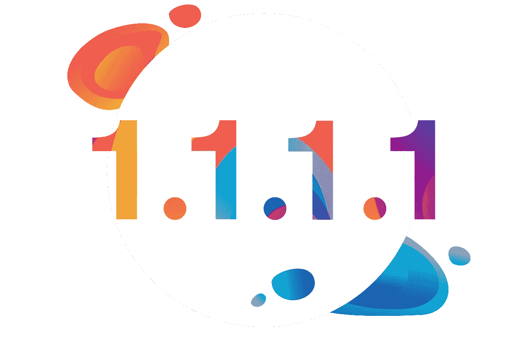

# 关于 Cloudflare Warp 和隐私

> 原文：<https://medium.com/swlh/on-cloudflare-warp-privacy-bb88cb838e8d>

[Cloudflare](https://www.cloudflare.com/) 最近[宣布 Warp](https://blog.cloudflare.com/1111-warp-better-vpn/) ，他们的性能和安全聚焦 [VPN](https://en.wikipedia.org/wiki/Virtual_private_network) 。Warp 将被添加到[1.1.1.1 应用](https://1.1.1.1/)中，到目前为止，这是一种在你的移动设备上设置[“隐私优先消费者 DNS 服务”](https://blog.cloudflare.com/announcing-1111/)，也称为[1.1.1.1](https://1.1.1.1/dns/)的简单方法:

> *说实话，到今天为止，1.1.1.1 的应用真的只是一个领先。我们有一个如何从根本上改善*的性能、安全性和隐私的计划…